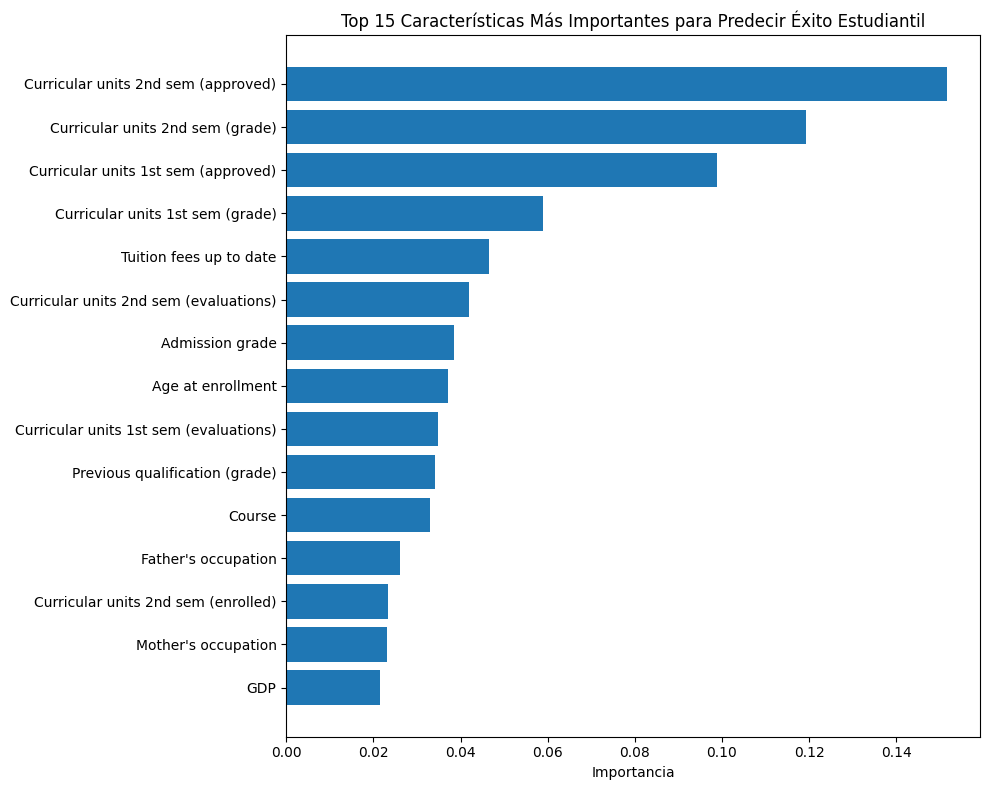
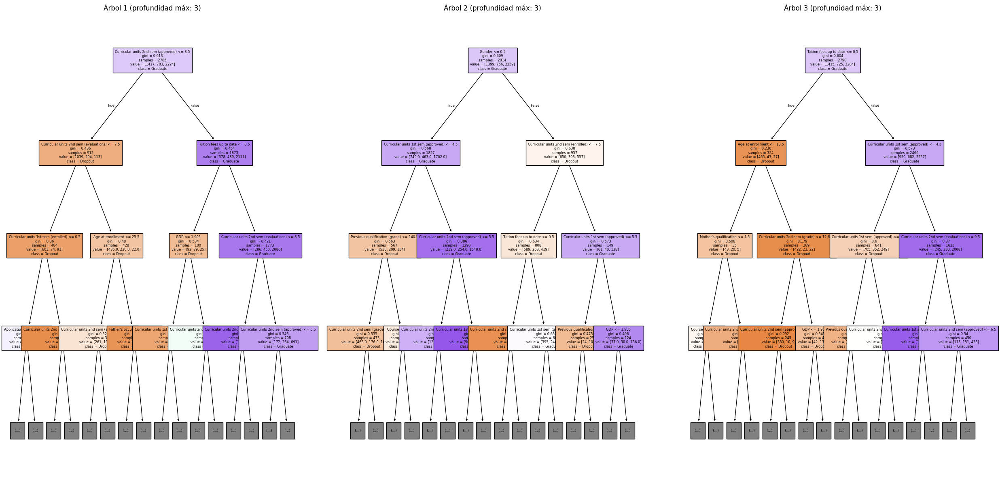

# Tarea: Validación y Selección de Modelos - Fill in the Blanks


## Contexto
En esta tarea se trabaja con **técnicas de validación y selección de modelos** dentro del flujo de *Machine Learning*.  
El objetivo es aplicar métodos como **train/test split, validación cruzada y selección de hiperparámetros** para evaluar de manera justa distintos algoritmos y escoger el mejor en función de métricas de desempeño.  
También se busca comprender cómo evitar el **sobreajuste (overfitting)** y garantizar que el modelo generalice correctamente a nuevos datos.

## Objetivos
- Aprender a prevenir data leakage usando pipelines
- Implementar validación cruzada (cross-validation) robusta
- Comparar múltiples modelos de forma sistemática
- Interpretar métricas de estabilidad y selección de modelos

## Actividades (con tiempos estimados)
| Actividad                                      | Tiempo estimado |
|------------------------------------------------|:---------------:|
| Repaso teórico de validación y data leakage    | 30 min |
| Implementación de *pipelines* con scikit-learn | 45 min |
| Validación cruzada con diferentes modelos      | 45 min |
| Comparación de resultados y selección final    | 30 min |
| Redacción de reflexión y documentación final   | 20 min |

## Desarrollo
### 🔧 Paso 1: Setup Inicial

```python
!pip install ucimlrepo
```
#### Salida:
```text
Collecting ucimlrepo
  Downloading ucimlrepo-0.0.7-py3-none-any.whl.metadata (5.5 kB)
Requirement already satisfied: pandas>=1.0.0 in /usr/local/lib/python3.12/dist-packages (from ucimlrepo) (2.2.2)
Requirement already satisfied: certifi>=2020.12.5 in /usr/local/lib/python3.12/dist-packages (from ucimlrepo) (2025.8.3)
Requirement already satisfied: numpy>=1.26.0 in /usr/local/lib/python3.12/dist-packages (from pandas>=1.0.0->ucimlrepo) (2.0.2)
Requirement already satisfied: python-dateutil>=2.8.2 in /usr/local/lib/python3.12/dist-packages (from pandas>=1.0.0->ucimlrepo) (2.9.0.post0)
Requirement already satisfied: pytz>=2020.1 in /usr/local/lib/python3.12/dist-packages (from pandas>=1.0.0->ucimlrepo) (2025.2)
Requirement already satisfied: tzdata>=2022.7 in /usr/local/lib/python3.12/dist-packages (from pandas>=1.0.0->ucimlrepo) (2025.2)
Requirement already satisfied: six>=1.5 in /usr/local/lib/python3.12/dist-packages (from python-dateutil>=2.8.2->pandas>=1.0.0->ucimlrepo) (1.17.0)
Downloading ucimlrepo-0.0.7-py3-none-any.whl (8.0 kB)
Installing collected packages: ucimlrepo
Successfully installed ucimlrepo-0.0.7
```
---
```python
# Importar librerías que vamos a usar
import pandas as pd
import numpy as np
import matplotlib.pyplot as plt

# Para validación y selección de modelos
from sklearn.linear_model import LogisticRegression, RidgeClassifier
from sklearn.ensemble import RandomForestClassifier
from sklearn.model_selection import train_test_split, cross_val_score, KFold, GridSearchCV
from sklearn.preprocessing import StandardScaler
from sklearn.pipeline import Pipeline
# Para cargar datos desde UCI ML Repository
from ucimlrepo import fetch_ucirepo
from sklearn.metrics import accuracy_score, classification_report
```
#### Salida:
```text
Setup completo!
```
### 🎓 Paso 2: Cargar y Explorar Datos de Estudiantes
### 📖 Respuestas a las preguntas de investigación

**1. ¿Cuántas muestras y características tiene el dataset?**  
- El dataset contiene **4,424 estudiantes** y **36 características** (features) que incluyen datos académicos, demográficos y socioeconómicos.  

---

**2. ¿Qué tipos de variables incluye?**  
- **Demográficas:** edad al ingresar, estado civil, ocupación y nivel educativo de los padres.  
- **Académicas:** modo de aplicación, curso, calificaciones en asignaturas, asistencia diurna/nocturna.  
- **Socioeconómicas:** becas, ayudas sociales, estatus laboral, entre otras.  

---

**3. ¿Las clases están balanceadas o desbalanceadas?**  
- La variable objetivo (Target) está **moderadamente desbalanceada**:  
  - **Dropout (abandono):** 32.1%  
  - **Graduate (graduado):** 41.8%  
  - **Enrolled (matriculado aún):** 26.1%  
- Aunque no hay una clase minoritaria extrema, es importante tener en cuenta este desbalance para la evaluación de modelos.  

---

**4. ¿Qué significan las 3 categorías objetivo?**  
- **Dropout:** el estudiante abandonó los estudios universitarios antes de terminar.  
- **Enrolled:** el estudiante sigue matriculado en la universidad.  
- **Graduate:** el estudiante completó con éxito la carrera y se graduó.  

```python
# Cargar dataset de estudiantes desde UCI
student_data = fetch_ucirepo(id=697)

# Preparar datos
X = student_data.data.features
y = student_data.data.targets

print("Dataset: Student Dropout and Academic Success")
print(f"Estudiantes: {X.shape[0]}, Características: {X.shape[1]}")
print(f"Objetivo: Predecir {len(y.columns)} variable(s)")

# Explorar variable objetivo
target_col = y.columns[0]  # Primera columna objetivo
y_series = y[target_col]
print(f"\nVariable objetivo: {target_col}")

# Mapear valores para mejor interpretación
target_mapping = {0: 'Dropout', 1: 'Enrolled', 2: 'Graduate'}
y_mapped = y_series.map(target_mapping)

# Distribución de clases
print("\nDistribución de resultados académicos:")
value_counts = y_mapped.value_counts()
for outcome, count in value_counts.items():
    percentage = (count / len(y_mapped)) * 100
    print(f"  {outcome}: {count} estudiantes ({percentage:.1f}%)")

# Ver algunas características
print(f"\nPrimeras características:")
print(X.columns.tolist()[:10], "...")

# Estadísticas básicas
print(f"\nAge at enrollment:")
if 'Age at enrollment' in X.columns:
    age_col = X['Age at enrollment']
    print(f"  Promedio: {age_col.mean():.1f} años")
    print(f"  Rango: {age_col.min():.0f}-{age_col.max():.0f} años")
```

#### Salida:
```text
Dataset: Student Dropout and Academic Success
Estudiantes: 4424, Características: 36
Objetivo: Predecir 1 variable(s)

Variable objetivo: Target

Distribución de resultados académicos:

Primeras características:
['Marital Status', 'Application mode', 'Application order', 'Course', 'Daytime/evening attendance', 'Previous qualification', 'Previous qualification (grade)', 'Nacionality', "Mother's qualification", "Father's qualification"] ...

Age at enrollment:
  Promedio: 23.3 años
  Rango: 17-70 años
```
 📌 Interpretación:

- El dataset **Student Dropout and Academic Success** contiene **4,424 estudiantes** y **36 características** que abarcan factores **demográficos, académicos y socioeconómicos**.  
- La **variable objetivo (`Target`)** busca clasificar a los estudiantes en tres categorías:  
  - **Dropout** → estudiantes que abandonaron.  
  - **Enrolled** → estudiantes que continúan matriculados.  
  - **Graduate** → estudiantes que lograron graduarse.  
- Las **primeras características** incluyen variables relevantes como estado civil, modo de aplicación, orden de aplicación, curso, calificaciones previas, nacionalidad y nivel educativo de los padres.  
- En cuanto a la edad, el promedio de ingreso es de **23.3 años**, con un rango que va desde los **17 hasta los 70 años**, mostrando una **alta diversidad en la población estudiantil**.  

Este análisis inicial confirma que el dataset es **rico en variables heterogéneas** y plantea un **problema de clasificación multiclase** que requerirá manejar posibles desbalances y considerar tanto métricas de desempeño como la interpretación de factores de riesgo estudiantil.


### 🔬 Parte 1: Cross-Validation - Validación Robusta
#### 🔧 Paso 3: Preparar datos para validación
```python
# Preparar variable objetivo como serie simple
# Convertir strings a números para sklearn
target_mapping = {0: 'Dropout', 1: 'Enrolled', 2: 'Graduate'}
reverse_mapping = {'Dropout': 0, 'Enrolled': 1, 'Graduate': 2}

# Si y_series contiene strings, convertir a números
if y_series.dtype == 'object':
    y_target = y_series.map(reverse_mapping)
else:
    y_target = y_series

X_features = X       # Features del dataset

print("Datos preparados para validación:")
print(f"X shape: {X_features.shape}")
print(f"y shape: {y_target.shape}")
print(f"Clases únicas: {sorted(y_target.unique())}")
print(f"Mapeo: {target_mapping}")
```
#### Salida:
```text
Datos preparados para validación:
X shape: (4424, 36)
y shape: (4424,)
Clases únicas: [np.int64(0), np.int64(1), np.int64(2)]
Mapeo: {0: 'Dropout', 1: 'Enrolled', 2: 'Graduate'}
```
 📌 Interpretación:

- Se prepararon los datos para el proceso de **validación de modelos**.  
- La matriz de características **X** contiene **4,424 registros** con **36 variables explicativas**.  
- La variable objetivo **y** fue convertida a valores numéricos (`0`, `1`, `2`) para ser compatible con *scikit-learn*.  
- Las clases únicas corresponden al mapeo:  
  - `0 → Dropout`  
  - `1 → Enrolled`  
  - `2 → Graduate`  
- Este preprocesamiento asegura que los algoritmos de Machine Learning puedan trabajar con los datos sin problemas de codificación.  


#### 📊 Paso 4: Implementar Validación Cruzada
```python
# === VALIDACIÓN CRUZADA PARA ESTABILIDAD ===

print("🔬 VALIDACIÓN CRUZADA: ¿Qué tan estable es nuestro modelo?")

# 1. Crear pipeline robusto para usar en CV
pipeline_robust =  Pipeline([
    ('scaler', StandardScaler()),
    ('classifier', LogisticRegression(max_iter=1000, random_state=42))
])

print("Pipeline creado para validación cruzada")

# 2. Crear KFold básico
kfold = KFold(n_splits=5, shuffle=True, random_state=42)

# 3. Evaluar con KFold usando cross_val_score
scores_kfold = cross_val_score(
    pipeline_robust, X_features, y_target, cv=kfold, scoring='accuracy'
)

print(f"\nKFOLD RESULTS:")
print(f"   Scores individuales: {scores_kfold}")
print(f"   Media: {scores_kfold.mean():.4f}")
print(f"   Desviación estándar: {scores_kfold.std():.4f}")
print(f"   Resultado: {scores_kfold.mean():.4f} ± {scores_kfold.std():.4f}")

# 4. Crear StratifiedKFold (mantiene proporción de clases)
stratified_kfold = StratifiedKFold(n_splits=5, shuffle=True, random_state=42)

# 5. Evaluar con StratifiedKFold
scores_stratified = cross_val_score(
    pipeline_robust, X_features, y_target, cv=stratified_kfold, scoring='accuracy'
)

print(f"\nSTRATIFIED KFOLD RESULTS:")
print(f"   Scores individuales: {scores_stratified}")
print(f"   Media: {scores_stratified.mean():.4f}")
print(f"   Desviación estándar: {scores_stratified.std():.4f}")
print(f"   Resultado: {scores_stratified.mean():.4f} ± {scores_stratified.std():.4f}")

# 6. Comparar estabilidad (menor desviación = más estable)
print(f"\nCOMPARACIÓN DE ESTABILIDAD:")
if scores_stratified.std() < scores_kfold.std():
    print("   StratifiedKFold es MÁS ESTABLE (menor variabilidad)")
    mejor_cv = "StratifiedKFold"
else:
    print("   KFold es MÁS ESTABLE (menor variabilidad)")
    mejor_cv = "KFold"

print(f"   Recomendación: Usar {mejor_cv} para este dataset")

# 7. Visualizar la distribución de scores
import matplotlib.pyplot as plt
plt.figure(figsize=(10, 6))
plt.boxplot([scores_kfold, scores_stratified], labels=['KFold', 'StratifiedKFold'])
plt.title('Distribución de Scores - Validación Cruzada')
plt.ylabel('Accuracy')
plt.grid(True, alpha=0.3)
plt.show()
```
#### Salida:
```text
🔬 VALIDACIÓN CRUZADA: ¿Qué tan estable es nuestro modelo?
Pipeline creado para validación cruzada

KFOLD RESULTS:
   Scores individuales: [0.75254237 0.76610169 0.76836158 0.77740113 0.78054299]
   Media: 0.7690
   Desviación estándar: 0.0098
   Resultado: 0.7690 ± 0.0098

STRATIFIED KFOLD RESULTS:
   Scores individuales: [0.76836158 0.76836158 0.76271186 0.75480226 0.75452489]
   Media: 0.7618
   Desviación estándar: 0.0061
   Resultado: 0.7618 ± 0.0061

COMPARACIÓN DE ESTABILIDAD:
   StratifiedKFold es MÁS ESTABLE (menor variabilidad)
   Recomendación: Usar StratifiedKFold para este dataset
/tmp/ipython-input-1194036424.py:55: MatplotlibDeprecationWarning: The 'labels' parameter of boxplot() has been renamed 'tick_labels' since Matplotlib 3.9; support for the old name will be dropped in 3.11.
  plt.boxplot([scores_kfold, scores_stratified], labels=['KFold', 'StratifiedKFold'])
  ```


 📌 Interpretación

- Se evaluó un **pipeline** (escalado + regresión logística) con dos esquemas de validación:
  - **KFold (5 folds)** → **accuracy medio 0.7690** con **desv. std. 0.0098**.
  - **StratifiedKFold (5 folds)** → **accuracy medio 0.7618** con **desv. std. 0.0061**.
- **Estabilidad**: StratifiedKFold muestra **menor variabilidad** entre folds (mejor estabilidad), aunque KFold obtuvo un promedio ligeramente mayor.
- En problemas de **clasificación multiclase** (y potencial desbalance), **StratifiedKFold** es preferible porque **mantiene la proporción de clases** en cada fold.
- La comparación sugiere:
  - Si priorizas **estabilidad y representatividad de clases**, usa **StratifiedKFold**.
  - Si solo miras el **promedio de accuracy**, KFold fue marginalmente superior en esta corrida.
-------------
💭 **¿Cuál método mantiene la proporción de clases en cada fold?**  
El método **StratifiedKFold** mantiene la **misma proporción de clases** en cada fold, lo que lo hace más adecuado en problemas de clasificación desbalanceada.

---

📊 **¿Cuál parámetro especifica el tipo de validación cruzada en `cross_val_score`?**  
El parámetro es **`cv`**, donde puedes pasar:  
- Un entero → número de folds (ej. `cv=5` usa KFold simple).  
- Un objeto de validación → como `KFold`, `StratifiedKFold`, `LeaveOneOut`, etc.  
Esto determina **cómo se divide el dataset** durante la validación cruzada.

```python
# Cargar dataset de estudiantes desde UCI
student_data = fetch_ucirepo(id=697)

# Preparar datos
X = student_data.data.features
y = student_data.data.targets

print("Dataset: Student Dropout and Academic Success")
print(f"Estudiantes: {X.shape[0]}, Características: {X.shape[1]}")
print(f"Objetivo: Predecir {len(y.columns)} variable(s)")

# Explorar variable objetivo
target_col = y.columns[0]  # Primera columna objetivo
y_series = y[target_col]
print(f"\nVariable objetivo: {target_col}")

# Mapear valores para mejor interpretación
target_mapping = {0: 'Dropout', 1: 'Enrolled', 2: 'Graduate'}
y_mapped = y_series.map(target_mapping)

# Distribución de clases
print("\nDistribución de resultados académicos:")
value_counts = y_mapped.value_counts()
for outcome, count in value_counts.items():
    percentage = (count / len(y_mapped)) * 100
    print(f"  {outcome}: {count} estudiantes ({percentage:.1f}%)")

# Ver algunas características
print(f"\nPrimeras características:")
print(X.columns.tolist()[:10], "...")

# Estadísticas básicas
print(f"\nAge at enrollment:")
if 'Age at enrollment' in X.columns:
    age_col = X['Age at enrollment']
    print(f"  Promedio: {age_col.mean():.1f} años")
    print(f"  Rango: {age_col.min():.0f}-{age_col.max():.0f} años")
```
### 🏆 Parte 3: Comparación de Modelos - ¡El Torneo!
#### 🥊 Paso 5: Competencia de Múltiples Modelos
```python
# === COMPETENCIA DE MODELOS ===

print("🏆 TORNEO: ¿Cuál modelo funciona mejor para diagnóstico médico?")

# 1. Definir candidatos (diferentes algoritmos)
models = {
    'Logistic Regression': Pipeline([
        ('scaler', StandardScaler()),
        ('classifier', LogisticRegression(max_iter=1000, random_state=42))
    ]),

    # 2. Ridge Classifier (regresión logística con regularización L2)
    'Ridge Classifier': Pipeline([
        ('scaler', StandardScaler()),
        ('classifier', RidgeClassifier(alpha=1.0, random_state=42))
    ]),

    # 3. Random Forest (ensemble, no necesita escalado)
    'Random Forest': Pipeline([
        ('classifier', RandomForestClassifier(n_estimators=100, random_state=42))
    ])
}

print(f"Modelos en competencia: {list(models.keys())}")

# 4. Evaluar cada modelo con validación cruzada
print(f"\nEVALUANDO MODELOS CON 5-FOLD CV...")

results = {}
for name, model in models.items():
    print(f"   Evaluando {name}...")

    # Usar StratifiedKFold para mantener balance de clases
    scores = cross_val_score(
        model, X_features, y_target,
        cv=StratifiedKFold(n_splits=5, shuffle=True, random_state=42),
        scoring='accuracy'
    )

    results[name] = scores

    print(f"   {name}: {scores.mean():.4f} ± {scores.std():.4f}")
    print(f"      Scores: {[f'{s:.3f}' for s in scores]}")

# 5. Encontrar el mejor modelo
print(f"\nRESULTADOS FINALES:")

# Encontrar modelo con mayor accuracy promedio
best_mean_score = 0
best_model_name = ""

for name, scores in results.items():
    if scores.mean() > best_mean_score:
        best_mean_score = scores.mean()
        best_model_name = name

print(f"GANADOR: {best_model_name}")
print(f"Score: {best_mean_score:.4f}")

# 6. Análisis detallado de estabilidad
print(f"\nANÁLISIS DE ESTABILIDAD:")
for name, scores in results.items():
    stability = scores.std()

    if stability < 0.02:
        status = "MUY ESTABLE"
    elif stability < 0.05:
        status = "ESTABLE"
    else:
        status = "INESTABLE"

    print(f"   {name}: {status} (std: {stability:.4f})")

# 7. Visualización comparativa
plt.figure(figsize=(12, 6))

# Boxplot de distribución de scores
plt.subplot(1, 2, 1)
plt.boxplot([results[name] for name in models.keys()],
           labels=[name.split()[0] for name in models.keys()])
plt.title('Distribución de Accuracy por Modelo')
plt.ylabel('Accuracy')
plt.grid(True, alpha=0.3)

# Barplot de medias con error bars
plt.subplot(1, 2, 2)
names = list(models.keys())
means = [results[name].mean() for name in names]
stds = [results[name].std() for name in names]

plt.bar(range(len(names)), means, yerr=stds, capsize=5)
plt.xticks(range(len(names)), [name.split()[0] for name in names])
plt.title('Accuracy Promedio ± Desviación Estándar')
plt.ylabel('Accuracy')
plt.grid(True, alpha=0.3)

plt.tight_layout()
plt.show()
```
#### Salida:
```text
🏆 TORNEO: ¿Cuál modelo funciona mejor para diagnóstico médico?
Modelos en competencia: ['Logistic Regression', 'Ridge Classifier', 'Random Forest']

EVALUANDO MODELOS CON 5-FOLD CV...
   Evaluando Logistic Regression...
   Logistic Regression: 0.7618 ± 0.0061
      Scores: ['0.768', '0.768', '0.763', '0.755', '0.755']
   Evaluando Ridge Classifier...
   Ridge Classifier: 0.7509 ± 0.0032
      Scores: ['0.755', '0.746', '0.754', '0.749', '0.751']
   Evaluando Random Forest...
   Random Forest: 0.7658 ± 0.0064
      Scores: ['0.775', '0.764', '0.771', '0.763', '0.757']

RESULTADOS FINALES:
GANADOR: Random Forest
Score: 0.7658

ANÁLISIS DE ESTABILIDAD:
   Logistic Regression: MUY ESTABLE (std: 0.0061)
   Ridge Classifier: MUY ESTABLE (std: 0.0032)
   Random Forest: MUY ESTABLE (std: 0.0064)
/tmp/ipython-input-1230983371.py:79: MatplotlibDeprecationWarning: The 'labels' parameter of boxplot() has been renamed 'tick_labels' since Matplotlib 3.9; support for the old name will be dropped in 3.11.
  plt.boxplot([results[name] for name in models.keys()],
```


 Interpretación

- **Modelos evaluados:** Logistic Regression, Ridge Classifier y Random Forest, todos validados con **StratifiedKFold (5 folds)** dentro de un **Pipeline** (evita data leakage).
- **Desempeño (accuracy medio ± std):**
  - Logistic Regression: **0.7618 ± 0.0061**
  - Ridge Classifier: **0.7509 ± 0.0032**
  - Random Forest: **0.7658 ± 0.0064**  ← **mejor promedio**
- **Ganador:** *Random Forest* por un margen pequeño sobre Logistic Regression (~0.4 puntos porcentuales).
- **Estabilidad:** los tres modelos muestran **muy baja variabilidad** entre folds (std ≈ 0.003–0.006), por lo que los resultados son **consistentes**.
- **Lectura práctica:** la diferencia entre Random Forest y Logistic Regression es **modesta**; con ajuste de hiperparámetros (p. ej., `n_estimators`, `max_depth` en RF; `C`, `penalty` en LR) el orden podría cambiar.

💭 **Random Forest no necesita escalado, ¿por qué no incluir StandardScaler?**  
Porque Random Forest y otros modelos basados en árboles (como Decision Trees o Gradient Boosting) **no dependen de la magnitud de las variables**. Dividen el espacio en base a umbrales, no a distancias.  
👉 Incluir `StandardScaler` no daña el modelo, pero es **innecesario** y solo añade complejidad extra al pipeline.  

---

📊 **¿Cuál métrica es mejor para clasificación: 'accuracy', 'precision', o 'f1'?**  
Depende del problema:  
- **Accuracy**: útil si las clases están **balanceadas**.  
- **Precision**: prioriza reducir falsos positivos (ejemplo: diagnóstico de enfermedad grave).  
- **Recall**: prioriza reducir falsos negativos (ejemplo: detectar fraudes o cáncer).  
- **F1-score**: balance entre precisión y recall; mejor cuando hay **desbalance de clases** y se necesitan ambas.  

👉 En este dataset multiclase con cierto desbalance, **macro-F1** o **balanced accuracy** son más informativas que accuracy.  

---

🔍 **Los métodos `.mean()` y `.std()` funcionan con arrays de numpy**  
Correcto ✅.  
- `scores.mean()` calcula el **promedio** de los resultados de validación cruzada.  
- `scores.std()` mide la **variabilidad (desviación estándar)** entre los folds.  
Esto permite cuantificar no solo el rendimiento promedio, sino también la **estabilidad** del modelo.  

### 📚 BONUS: ¿Qué significan las métricas de validación?

- **Cross-Validation**: técnica que divide los datos en *k folds* para entrenar y evaluar el modelo múltiples veces, reduciendo el riesgo de sobreajuste y ofreciendo una mejor estimación del desempeño en datos nuevos.  

- **Accuracy promedio**: la media de los resultados de accuracy en los distintos folds; refleja el rendimiento esperado del modelo en datos no vistos.  

- **Desviación estándar**: mide la variabilidad del accuracy entre folds.  
  - **Baja desviación** → modelo estable y consistente.  
  - **Alta desviación** → modelo sensible a cómo se dividen los datos.  

- **StratifiedKFold**: variante de validación cruzada que asegura que la **proporción de clases** se mantenga en cada fold, siendo especialmente útil cuando el dataset está **desbalanceado**.  

💡 **PISTAS**

📊 **Un modelo estable tiene baja o alta variabilidad?**  
Un modelo estable tiene **baja variabilidad** (desviación estándar pequeña entre folds).  

🩺 **En medicina, ¿prefieres un modelo consistente o uno que varía mucho?**  
En contextos médicos es preferible un modelo **consistente y estable**, ya que las decisiones clínicas deben ser confiables y no depender demasiado de cómo se dividan los datos de entrenamiento.  

### 🚀 BONUS: Optimización de Hiperparámetros
#### Paso 6: GridSearchCV vs RandomizedSearchCV

```python
from sklearn.model_selection import GridSearchCV , RandomizedSearchCV

# Seleccionar el mejor modelo de la competencia anterior
best_model_base = models[best_model_name]

print(f"Optimizando hiperparámetros para: {best_model_name}")

# Definir espacio de búsqueda de hiperparámetros
if 'Random Forest' in best_model_name:
    param_grid = {
        'classifier__n_estimators': [50, 100, 200],
        'classifier__max_depth': [None, 10, 20, 30],
        'classifier__min_samples_split': [2, 5, 10]
    }
elif 'Logistic' in best_model_name:
    param_grid = {
        'classifier__C': [0.1, 1, 10, 100],
        'classifier__max_iter': [1000, 2000]
    }
else:  # Ridge
    param_grid = {
        'classifier__alpha': [0.1, 1, 10, 100]
    }

# MÉTODO 1: GridSearchCV (búsqueda exhaustiva)
print("\nMétodo 1: GridSearchCV (búsqueda exhaustiva)")
grid_search = GridSearchCV(
    best_model_base,
    param_grid,
    cv=5,
    scoring='accuracy',
    n_jobs=-1,
    verbose=1
)

grid_search.fit(X_features, y_target)

print(f"Mejores parámetros (Grid): {grid_search.best_params_}")
print(f"Mejor score (Grid): {grid_search.best_score_:.4f}")

# MÉTODO 2: RandomizedSearchCV (búsqueda aleatoria, más eficiente)
print("\nMétodo 2: RandomizedSearchCV (búsqueda aleatoria)")
random_search = RandomizedSearchCV(
    best_model_base,
    param_grid,
    n_iter=20,  # Solo 20 combinaciones aleatorias
    cv=5,
    scoring='accuracy',
    n_jobs=-1,
    random_state=42,
    verbose=1
)

random_search.fit(X_features, y_target)

print(f"Mejores parámetros (Random): {random_search.best_params_}")
print(f"Mejor score (Random): {random_search.best_score_:.4f}")

# Comparar eficiencia
print(f"\nComparación de eficiencia:")
print(f"GridSearch probó: {len(grid_search.cv_results_['params'])} combinaciones")
print(f"RandomSearch probó: {len(random_search.cv_results_['params'])} combinaciones")

# Evaluar modelo final optimizado
final_model = grid_search.best_estimator_
final_scores = cross_val_score(final_model, X_features, y_target, cv=5)
print(f"\nModelo final optimizado: {final_scores.mean():.4f} ± {final_scores.std():.4f}")
```

#### Salida:

```text
Optimizando hiperparámetros para: Random Forest

Método 1: GridSearchCV (búsqueda exhaustiva)
Fitting 5 folds for each of 36 candidates, totalling 180 fits
Mejores parámetros (Grid): {'classifier__max_depth': None, 'classifier__min_samples_split': 5, 'classifier__n_estimators': 100}
Mejor score (Grid): 0.7783

Método 2: RandomizedSearchCV (búsqueda aleatoria)
Fitting 5 folds for each of 20 candidates, totalling 100 fits
Mejores parámetros (Random): {'classifier__n_estimators': 100, 'classifier__min_samples_split': 5, 'classifier__max_depth': 30}
Mejor score (Random): 0.7783

Comparación de eficiencia:
GridSearch probó: 36 combinaciones
RandomSearch probó: 20 combinaciones

Modelo final optimizado: 0.7783 ± 0.0067
```

📌 Interpretación (GridSearchCV vs RandomizedSearchCV)

- **Modelo objetivo:** Random Forest (ganador previo del torneo).
- **Resultados:**
  - **GridSearchCV** (búsqueda exhaustiva): probó **36** combinaciones → **best score = 0.7783** con `n_estimators=100`, `min_samples_split=5`, `max_depth=None`.
  - **RandomizedSearchCV** (búsqueda aleatoria): probó **20** combinaciones → **best score = 0.7783** con `n_estimators=100`, `min_samples_split=5`, `max_depth=30`.
  - **Eficiencia:** Randomized alcanzó el **mismo mejor score** con **44% menos** de combinaciones evaluadas.
  - **Validación final:** modelo optimizado → **0.7783 ± 0.0067** (5-fold CV), desempeño **consistente**.

- **Lectura práctica:**
  - Cuando el **espacio de hiperparámetros es pequeño**, **GridSearchCV** es viable y garantiza cubrir todo el grid.
  - Cuando el **espacio es grande** o hay **poco presupuesto** de cómputo/tiempo, **RandomizedSearchCV** suele ser **más eficiente** y encuentra configuraciones competitivas.
  - Las dos configuraciones ganadoras son **muy cercanas** (profundidad ilimitada vs 30). La diferencia práctica es mínima dentro de la variabilidad de CV.
  - Mantener el **Pipeline** en la búsqueda evita *data leakage* (aunque RF no necesita escalado, el pipeline estándar es correcto y homogéneo para comparar modelos).

### 📝 Guía de decisión

- **GridSearchCV** cuando tienes **pocos hiperparámetros** y **suficiente tiempo de cómputo**.  

- **RandomizedSearchCV** cuando tienes **muchos hiperparámetros** o **tiempo limitado**.  

- **Pipeline + SearchCV** siempre previene **data leakage** automáticamente.  

- **cross_val_score** en el resultado final valida que la optimización no causó **sobreajuste (overfitting)**.  

### 🔍 BONUS 2: Explicabilidad del Modelo

#### Paso 7: ¿Por qué el modelo toma esas decisiones?
```python
# Usar Random Forest para explicabilidad (si no ganó, crearlo)
if 'Random Forest' not in best_model_name:
    # Crear Random Forest específico para explicabilidad
    # Random Forest no necesita escalado, así que lo omitimos para simplicidad
    rf_model = Pipeline([
        ('classifier', RandomForestClassifier(n_estimators=100, random_state=42))
    ])
    rf_model.fit(X_features, y_target)
    print("Creado Random Forest específico para análisis de explicabilidad")
else:
    rf_model = final_model
    print("Usando el modelo ganador para explicabilidad")

# Verificar estructura del pipeline
print(f"Componentes del pipeline: {list(rf_model.named_steps.keys())}")

# 1. FEATURE IMPORTANCE - ¿Qué características son más importantes?
feature_names = X_features.columns
importances = rf_model.named_steps['classifier'].feature_importances_

# Crear DataFrame para mejor visualización
feature_importance_df = pd.DataFrame({
    'feature': feature_names,
    'importance': importances
}).sort_values('importance', ascending=False)

print("\nTOP 10 CARACTERÍSTICAS MÁS IMPORTANTES:")
for i, row in feature_importance_df.head(10).iterrows():
    print(f"{row['feature']}: {row['importance']:.4f}")

# Visualizar importancia de características
plt.figure(figsize=(10, 8))
top_features = feature_importance_df.head(15)
plt.barh(range(len(top_features)), top_features['importance'])
plt.yticks(range(len(top_features)), top_features['feature'])
plt.xlabel('Importancia')
plt.title('Top 15 Características Más Importantes para Predecir Éxito Estudiantil')
plt.gca().invert_yaxis()
plt.tight_layout()
plt.show()

# 2. ANÁLISIS POR CATEGORÍAS - Agrupar características relacionadas
academic_features = [col for col in feature_names if any(word in col.lower()
                    for word in ['grade', 'units', 'curricular', 'semester'])]
demographic_features = [col for col in feature_names if any(word in col.lower()
                       for word in ['age', 'gender', 'nationality', 'marital'])]
economic_features = [col for col in feature_names if any(word in col.lower()
                    for word in ['scholarship', 'debt', 'fee', 'tuition'])]

def calculate_category_importance(features, importance_df):
    if not features:
        return 0
    category_importance = importance_df[importance_df['feature'].isin(features)]['importance'].sum()
    return category_importance

academic_importance = calculate_category_importance(academic_features, feature_importance_df)
demographic_importance = calculate_category_importance(demographic_features, feature_importance_df)
economic_importance = calculate_category_importance(economic_features, feature_importance_df)

print(f"\nIMPORTANCIA POR CATEGORÍAS:")
print(f"Factores académicos: {academic_importance:.4f}")
print(f"Factores demográficos: {demographic_importance:.4f}")
print(f"Factores económicos: {economic_importance:.4f}")

# 3. INTERPRETACIÓN PRÁCTICA - ¿Qué significa esto?
print(f"\nINTERPRETACIÓN PARA INTERVENCIONES:")
print(f"La característica más importante es: {feature_importance_df.iloc[0]['feature']}")
print(f"Esto sugiere que para reducir abandono estudiantil debemos enfocarnos en:")

# Generar recomendaciones basadas en las top features
top_3_features = feature_importance_df.head(3)['feature'].tolist()
for i, feature in enumerate(top_3_features, 1):
    print(f"{i}. Monitorear y mejorar: {feature}")

# 4. PREDICCIÓN INDIVIDUAL - ¿Por qué un estudiante específico está en riesgo?
print(f"\nANÁLISIS DE ESTUDIANTE INDIVIDUAL (ejemplo):")
student_idx = 0
student_data = X_features.iloc[student_idx:student_idx+1]
prediction = rf_model.predict(student_data)[0]
prediction_proba = rf_model.predict_proba(student_data)[0]

# Definir mapeo localmente para esta sección
outcome_mapping = {0: 'Dropout', 1: 'Enrolled', 2: 'Graduate'}

# Manejar si prediction es string o número
if isinstance(prediction, str):
    predicted_outcome = prediction
else:
    predicted_outcome = outcome_mapping[prediction]

print(f"Estudiante #{student_idx}:")
print(f"Predicción: {predicted_outcome}")
print(f"Probabilidades:")
for i, prob in enumerate(prediction_proba):
    outcome_name = outcome_mapping[i]
    print(f"  {outcome_name}: {prob:.3f}")

# Mostrar las características más importantes de este estudiante
student_features = pd.DataFrame({
    'feature': feature_names,
    'value': student_data.iloc[0].values,
    'importance': importances
}).sort_values('importance', ascending=False)

print(f"\nTop 5 características que influyen en esta predicción:")
for i, row in student_features.head(5).iterrows():
    print(f"{row['feature']}: {row['value']:.2f} (importancia: {row['importance']:.4f})")

# 5. VISUALIZACIÓN DE ÁRBOLES INDIVIDUALES
print(f"\nVISUALIZACIÓN DE ÁRBOLES DEL RANDOM FOREST:")

# Instalar graphviz si no está disponible
try:
    from sklearn.tree import export_graphviz, plot_tree, export_text
    import matplotlib.pyplot as plt

    # Obtener algunos árboles del bosque
    forest = rf_model.named_steps['classifier']
    n_trees_to_show = min(3, len(forest.estimators_))

    print(f"Mostrando {n_trees_to_show} árboles de {len(forest.estimators_)} totales")

    # Visualizar árboles con plot_tree (más simple)
    fig, axes = plt.subplots(1, n_trees_to_show, figsize=(25, 12))
    if n_trees_to_show == 1:
        axes = [axes]

    for i in range(n_trees_to_show):
        tree = forest.estimators_[i]

        # Limitar profundidad para que sea legible
        plot_tree(tree,
                 ax=axes[i],
                 feature_names=list(feature_names),  # Usar todos los nombres de características
                 class_names=list(outcome_mapping.values()),
                 filled=True,
                 max_depth=3,  # Limitar profundidad
                 fontsize=6)  # Fuente más pequeña para que quepa

        axes[i].set_title(f'Árbol {i+1} (profundidad máx: 3)', fontsize=12)

    plt.tight_layout()
    plt.show()

    # Información sobre la estructura de los árboles
    print(f"\nESTADÍSTICAS DE LOS ÁRBOLES:")
    depths = [tree.get_depth() for tree in forest.estimators_[:5]]
    n_nodes = [tree.tree_.node_count for tree in forest.estimators_[:5]]

    print(f"Profundidad promedio (primeros 5 árboles): {sum(depths)/len(depths):.1f}")
    print(f"Número promedio de nodos (primeros 5): {sum(n_nodes)/len(n_nodes):.1f}")

    # Mostrar un árbol muy simple por texto
    print(f"\nEJEMPLO DE REGLAS DE DECISIÓN (Árbol 1, simplificado):")
    tree_rules = export_text(forest.estimators_[0],
                           feature_names=list(feature_names),
                           max_depth=2)
    print(tree_rules[:500] + "..." if len(tree_rules) > 500 else tree_rules)

except ImportError:
    print("Para visualizar árboles, instala: pip install graphviz")
    print("Alternativamente, mostramos la estructura del bosque:")

    forest = rf_model.named_steps['classifier']
    print(f"Random Forest contiene {len(forest.estimators_)} árboles")
    print(f"Cada árbol fue entrenado con {forest.max_features_} características aleatorias")

    # Estadísticas básicas sin visualización
    if len(forest.estimators_) > 0:
        depths = [tree.get_depth() for tree in forest.estimators_[:5]]
        print(f"Profundidad promedio: {sum(depths)/len(depths):.1f}")

# 6. DIVERSIDAD DEL BOSQUE
print(f"\nDIVERSIDAD EN EL RANDOM FOREST:")
print("El poder del Random Forest viene de la diversidad de sus árboles:")
print("- Cada árbol ve una muestra diferente de datos (bootstrap)")
print("- Cada split considera solo un subconjunto aleatorio de características")
print("- La predicción final es el voto mayoritario de todos los árboles")

# Mostrar diferencias en predicciones individuales
student_sample = X_features.iloc[0:1]
individual_predictions = []

# Preparar datos dependiendo de si el modelo tiene scaler o no
if 'scaler' in rf_model.named_steps:
    # Modelo con scaler
    scaled_sample = rf_model.named_steps['scaler'].transform(student_sample)
    print("Usando datos escalados para árboles individuales")
else:
    # Modelo sin scaler (ej: Random Forest sin preprocesamiento)
    scaled_sample = student_sample.values
    print("Usando datos sin escalar para árboles individuales")

for i, tree in enumerate(forest.estimators_[:5]):
    tree_pred = tree.predict(scaled_sample)[0]
    individual_predictions.append(tree_pred)

print(f"\nPredicciones de árboles individuales para el Estudiante #0:")
for i, pred in enumerate(individual_predictions):
    pred_name = outcome_mapping[pred] if isinstance(pred, int) else pred
    print(f"  Árbol {i+1}: {pred_name}")

final_pred = max(set(individual_predictions), key=individual_predictions.count)
final_pred_name = outcome_mapping[final_pred] if isinstance(final_pred, int) else final_pred
print(f"Predicción final (voto mayoritario): {final_pred_name}")
```

#### Salida:
```text
Usando el modelo ganador para explicabilidad
Componentes del pipeline: ['classifier']

TOP 10 CARACTERÍSTICAS MÁS IMPORTANTES:
Curricular units 2nd sem (approved): 0.1516
Curricular units 2nd sem (grade): 0.1193
Curricular units 1st sem (approved): 0.0987
Curricular units 1st sem (grade): 0.0589
Tuition fees up to date: 0.0466
Curricular units 2nd sem (evaluations): 0.0419
Admission grade: 0.0385
Age at enrollment: 0.0372
Curricular units 1st sem (evaluations): 0.0349
Previous qualification (grade): 0.0343
```

```text
IMPORTANCIA POR CATEGORÍAS:
Factores académicos: 0.6443
Factores demográficos: 0.0499
Factores económicos: 0.0769

INTERPRETACIÓN PARA INTERVENCIONES:
La característica más importante es: Curricular units 2nd sem (approved)
Esto sugiere que para reducir abandono estudiantil debemos enfocarnos en:
1. Monitorear y mejorar: Curricular units 2nd sem (approved)
2. Monitorear y mejorar: Curricular units 2nd sem (grade)
3. Monitorear y mejorar: Curricular units 1st sem (approved)

ANÁLISIS DE ESTUDIANTE INDIVIDUAL (ejemplo):
Estudiante #0:
Predicción: Dropout
Probabilidades:
  Dropout: 0.737
  Enrolled: 0.082
  Graduate: 0.181

Top 5 características que influyen en esta predicción:
Curricular units 2nd sem (approved): 0.00 (importancia: 0.1516)
Curricular units 2nd sem (grade): 0.00 (importancia: 0.1193)
Curricular units 1st sem (approved): 0.00 (importancia: 0.0987)
Curricular units 1st sem (grade): 0.00 (importancia: 0.0589)
Tuition fees up to date: 1.00 (importancia: 0.0466)

VISUALIZACIÓN DE ÁRBOLES DEL RANDOM FOREST:
Mostrando 3 árboles de 100 totales
```

```text
ESTADÍSTICAS DE LOS ÁRBOLES:
Profundidad promedio (primeros 5 árboles): 21.2
Número promedio de nodos (primeros 5): 1139.0

EJEMPLO DE REGLAS DE DECISIÓN (Árbol 1, simplificado):
|--- Curricular units 2nd sem (approved) <= 3.50
|   |--- Curricular units 2nd sem (evaluations) <= 7.50
|   |   |--- Curricular units 1st sem (enrolled) <= 0.50
|   |   |   |--- truncated branch of depth 10
|   |   |--- Curricular units 1st sem (enrolled) >  0.50
|   |   |   |--- truncated branch of depth 10
|   |--- Curricular units 2nd sem (evaluations) >  7.50
|   |   |--- Age at enrollment <= 25.50
|   |   |   |--- truncated branch of depth 16
|   |   |--- Age at enrollment >  25.50
|   |  ...

DIVERSIDAD EN EL RANDOM FOREST:
El poder del Random Forest viene de la diversidad de sus árboles:
- Cada árbol ve una muestra diferente de datos (bootstrap)
- Cada split considera solo un subconjunto aleatorio de características
- La predicción final es el voto mayoritario de todos los árboles
Usando datos sin escalar para árboles individuales

Predicciones de árboles individuales para el Estudiante #0:
  Árbol 1: 2.0
  Árbol 2: 0.0
  Árbol 3: 0.0
  Árbol 4: 0.0
  Árbol 5: 0.0
Predicción final (voto mayoritario): 0.0
```
```text
📌 Interpretación 

- **Importancias globales (Random Forest):** el modelo se apoya principalmente en el **rendimiento académico reciente**:
  - *Curricular units 2nd sem (approved / grade)* y *1st sem (approved / grade)* son las señales dominantes.
  - **Implicación:** la trayectoria de notas y aprobaciones por semestre es el predictor más fuerte de *Dropout / Enrolled / Graduate*.

- **Señales administrativas y de perfil:**
  - *Tuition fees up to date* aporta información útil (riesgo económico/administrativo).
  - *Admission grade*, *Previous qualification (grade)* y *Age at enrollment* también contribuyen (bagaje previo y momento de vida).

- **Importancia por categorías (suma de importancias):**
  - **Académicos:** 0.6443 → **mayor peso**.
  - **Económicos:** 0.0769 → riesgo operativo/financiero.
  - **Demográficos:** 0.0499 → efecto moderado.
```
#### 🤔 ¿Por qué es importante la explicabilidad?

- **Confianza:** Los educadores necesitan **entender claramente** por qué el modelo predice abandono.  
- **Intervenciones:** Knowing las características importantes permite crear **acciones de apoyo** específicas.  
- **Bias detection:** La explicabilidad ayuda a detectar **sesgos** en el modelo.  
- **Regulaciones:** Muchos contextos requieren modelos **transparentes y auditables** por ley.  
- **Mejora continua:** Entender el modelo ayuda a **ajustar y optimizar** futuras versiones.  
-----------------
### 🎯 Parte 4: Preguntas de Reflexión

**1. ¿Qué es *data leakage* y por qué es peligroso?**  
El *data leakage* ocurre cuando el modelo accede a información del conjunto de prueba o del futuro durante el entrenamiento.  
Es peligroso porque hace que el modelo tenga un rendimiento artificialmente alto en validación, pero falle al enfrentarse a datos reales.  

---

**2. ¿Cuándo usar KFold vs StratifiedKFold?**  
- **KFold:** útil cuando las clases están balanceadas o el problema es de regresión.  
- **StratifiedKFold:** preferible en clasificación, especialmente cuando una clase tiene pocas muestras, porque mantiene la proporción de clases en cada fold.  

---

**3. ¿Cómo interpretar "95.2% ± 2.1%" en cross-validation?**  
- **95.2%:** es el accuracy promedio esperado del modelo en datos nuevos.  
- **± 2.1%:** indica la variabilidad entre folds; mientras menor sea, más estable y confiable es el modelo.  

---

**4. ¿Por qué Random Forest no necesita StandardScaler?**  
Porque los árboles de decisión (y sus ensembles como Random Forest) dividen el espacio de datos en base a umbrales (ej. `edad > 20`).  
Estas divisiones no dependen de la escala de las variables, a diferencia de modelos basados en distancia como KNN o SVM.  

---

**5. En diagnóstico médico, ¿prefieres un modelo con 98% accuracy pero inestable, o 95% accuracy pero muy estable?**  
Es mejor un modelo **más estable (95% pero consistente)**.  
En medicina la confiabilidad es clave: un modelo inestable puede dar resultados impredecibles según la partición de los datos, lo que sería riesgoso en decisiones clínicas.  

---
## Evidencias
- Notebook en Google Colab con el desarrollo completo:  
  [](https://colab.research.google.com/drive/1IUB3APVkyk09Prkas42hy9PW92oNNS_8?usp=sharing)


## Reflexión


En esta práctica aprendí la importancia de usar pipelines para prevenir *data leakage* y asegurar un flujo de trabajo reproducible.  
También reforcé cómo la validación cruzada (especialmente con **StratifiedKFold**) permite evaluar la estabilidad de los modelos en datasets desbalanceados.  

Entendí que la comparación entre varios algoritmos no solo debe basarse en la métrica promedio, sino también en la **consistencia (desviación estándar)**.  
La optimización de hiperparámetros con GridSearchCV y RandomizedSearchCV me permitió ver las diferencias entre una búsqueda exhaustiva y otra más eficiente.  

Finalmente, la parte de explicabilidad con **Random Forest** mostró cómo identificar qué variables son más influyentes y cómo esto se traduce en decisiones prácticas para reducir el abandono estudiantil.  

Si volviera a repetir esta práctica, mejoraría la **visualización de resultados** (gráficas comparativas, reportes más claros) y exploraría más métricas además del *accuracy*, como el **F1-score o balanced accuracy**, para tener una visión más completa.  
El próximo paso sería aplicar estas técnicas en **otros datasets reales** y profundizar en métodos de interpretabilidad más avanzados como SHAP o LIME.
