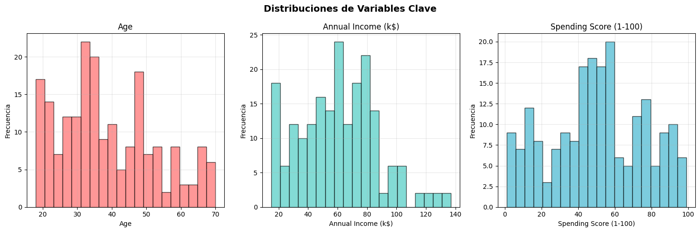

# Plantilla de entrada de portafolio

Usá esta plantilla como base para mantener un formato consistente en todo el portafolio.

!!! abstract "Ficha rápida"
    **Dataset:** Nombre del dataset o fuente principal.  
    **Notebook:** [Enlace a Colab o repositorio](https://...).  
    **Rol:** Breve descripción del foco de la práctica (EDA, modelado, visualización, etc.).

## 🚀 Resumen ejecutivo
- ¿Qué se hizo en esta práctica?
- ¿Cuáles fueron los principales resultados?
- ¿Qué decisión o aprendizaje clave surgió?

## 🎯 Objetivos
- Objetivo específico y medible 1.
- Objetivo específico y medible 2.

## 🕒 Agenda de trabajo

| Actividad | Propósito | Tiempo |
|-----------|-----------|:------:|
| Ejemplo de actividad | ¿Para qué se realiza? | 30 min |
| ... | ... | ... |

## 📚 Contexto
Breve descripción del tema o actividad. Explicá el problema que se aborda y por qué es relevante.

## 🔍 Insights destacados
- Insight 1.
- Insight 2.
- Insight 3.

## Desarrollo
Resumen de lo realizado, decisiones y resultados intermedios. Podés usar subsecciones, admoniciones o bloques de código.

## Evidencias
- Capturas, enlaces a notebooks/repos, resultados, gráficos.
- Incluí recursos en `docs/assets/` cuando corresponda.

## Reflexión
- Qué aprendiste, qué mejorarías, próximos pasos.

## Referencias
- Fuentes consultadas con enlaces relativos cuando corresponda


---

## Guía de formato y ejemplos (MkDocs Material)

Usá estos ejemplos para enriquecer tus entradas. Todos funcionan con la configuración del template.

### Admoniciones

!!! note "Nota"
    Este es un bloque informativo.

!!! tip "Sugerencia"
    Considerá alternativas y justifica decisiones.

!!! warning "Atención"
    Riesgos, limitaciones o supuestos relevantes.

### Detalles colapsables

???+ info "Ver desarrollo paso a paso"
    - Paso 1: preparar datos
    - Paso 2: entrenar modelo
    - Paso 3: evaluar métricas

### Código con resaltado y líneas numeradas

```python hl_lines="2 6" linenums="1"
def train(
    data_path: str,
    epochs: int = 10,
    learning_rate: float = 1e-3,
) -> None:
    print("Entrenando...")
    # TODO: implementar
```

### Listas de tareas (checklist)

- [ ] Preparar datos
- [x] Explorar dataset
- [ ] Entrenar baseline

### Tabla de actividades con tiempos

| Actividad           | Tiempo | Resultado esperado               |
|---------------------|:------:|----------------------------------|
| Revisión bibliográfica |  45m  | Lista de fuentes priorizadas     |
| Implementación      |  90m   | Script ejecutable/documentado    |
| Evaluación          |  60m   | Métricas y análisis de errores   |

### Imágenes con glightbox y atributos

Imagen directa (abre en lightbox):

{ width="420" }

Click para ampliar (lightbox):

[{ width="280" }](../assets/placeholder.png)

### Enlaces internos y relativos

Consultá también: [Acerca de mí](../acerca.md) y [Recursos](../recursos.md).

### Notas al pie y citas

Texto con una afirmación que requiere aclaración[^nota].

[^nota]: Esta es una nota al pie con detalles adicionales y referencias.

### Emojis y énfasis

Resultados destacados :rocket: :sparkles: y conceptos `clave`.
