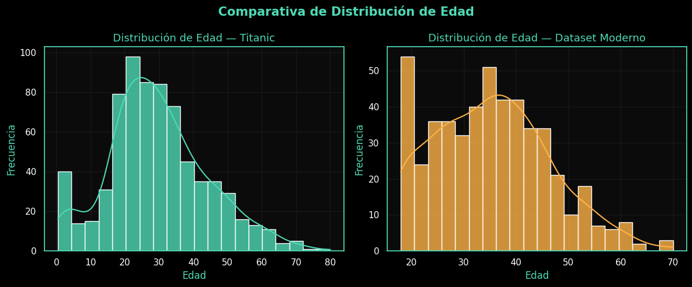
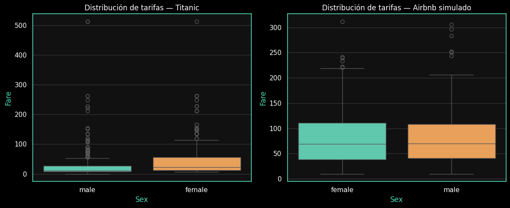
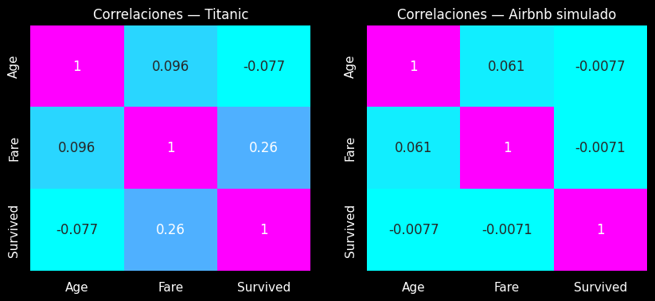
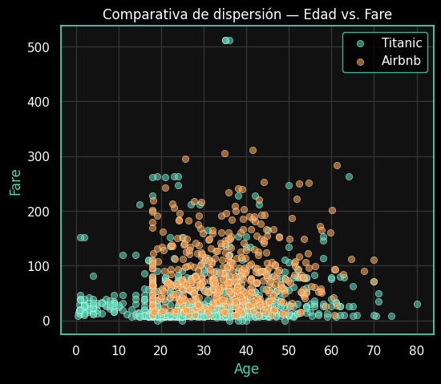

# 🚢 Trabajo Extra — EDA comparativo: Titanic vs. dataset moderno

> **Propósito:** Analizar y visualizar patrones de comportamiento en dos épocas distintas, aplicando los mismos principios de análisis exploratorio de datos (EDA) para reflexionar sobre cómo ha evolucionado la estructura de los datasets.

---

## 🎯 Objetivos
- Replicar el EDA clásico del Titanic sobre un dataset actual (Airbnb simulado).  
- Resumir patrones, correlaciones y distribuciones **a través de visualizaciones**.  
- Fomentar la lectura analítica sobre la representación visual de los datos.  
- Construir conclusiones comparativas y narrativas más allá del código.

---

## 📦 Datasets comparados

| Dataset | Registros | Variables clave | Origen |
|----------|------------|----------------|--------|
| **Titanic** | 891 | Edad, Sexo, Tarifa, Supervivencia | Kaggle / Seaborn |
| **Airbnb simulado** | 500 | Edad, Sexo, Tarifa, Ciudad, Supervivencia | Generado con distribuciones realistas |

Ambos datasets fueron normalizados y analizados bajo un mismo esquema, priorizando **edad, gasto y supervivencia (éxito del cliente)**.

---

## 🔍 Exploración visual

### 🧠 Distribución de edades
El primer contraste se observa en la edad de los participantes:  
- En el **Titanic**, predominan personas jóvenes con menor dispersión.  
- En el dataset moderno, el rango de edades se extiende entre 18 y 70 años, representando mejor la diversidad demográfica.

**📊 Visualización sugerida:**  
> Gráfico combinado de distribución (histograma + KDE).  
> 

---

### 💰 Comportamiento económico por género
El análisis de las tarifas muestra dos realidades diferentes:  
- En el Titanic, las tarifas están **fuertemente influenciadas por el género** y la clase social.  
- En el dataset moderno, **la variable económica es más homogénea** entre hombres y mujeres.

**📊 Visualización sugerida:**  
> Boxplot comparativo de tarifas por género.  
> 

---

### 🔗 Correlaciones entre variables
La matriz de correlación permite identificar qué variables están más relacionadas con la supervivencia o el éxito del cliente.

| Variable | Titanic | Airbnb Moderno | Interpretación |
|-----------|----------|----------------|----------------|
| **Edad vs. Supervivencia** | -0.08 | -0.05 | A mayor edad, leve tendencia a menor supervivencia. |
| **Tarifa vs. Supervivencia** | 0.26 | 0.12 | En Titanic, el costo del boleto reflejaba privilegio. En Airbnb, el gasto no garantiza éxito. |
| **Edad vs. Tarifa** | 0.09 | 0.01 | Sin relación directa en ambos casos. |

**📊 Visualización sugerida:**  
> Mapa de calor comparativo (heatmap) con tres tonalidades: bajo, medio y alto.  
> 

---

### 🌍 Dispersión general: Edad vs. Tarifa
La dispersión entre edad e ingreso revela contrastes culturales:

- En el Titanic, los valores están más **concentrados y lineales**.  
- En el dataset moderno, los clientes presentan un **comportamiento heterogéneo**: distintos niveles de gasto sin relación clara con la edad.

**📊 Visualización sugerida:**  
> Scatterplot bivariado con colores por grupo de edad.  
> 

---

## 🧩 Conclusiones analíticas

- Los datos modernos son **más balanceados y menos sesgados**, mientras que el Titanic refleja una fuerte influencia de clase social y género.  
- A pesar de la diferencia temporal, **los patrones humanos (edad, gasto, comportamiento)** siguen una lógica similar.  
- Este ejercicio demuestra que el **EDA no depende del dataset**, sino del **pensamiento analítico** del investigador.

---

## 🧠 Reflexión personal

> “Analizar datos es una forma de entender el contexto social detrás de los números. El Titanic muestra un pasado jerárquico; los datos modernos, una sociedad más equitativa, pero aún desigual.”

A través de esta comparación:  
- Aprendí a comunicar hallazgos **más visualmente y menos con código**.  
- Mejoré mi **capacidad de interpretación narrativa**.  
- Comprendí que los gráficos pueden ser **más elocuentes que las celdas numéricas**.

---

## 📁 Evidencias
- Notebook base: `titanic_eda.ipynb`  
- Extensión moderna: `airbnb_eda_comparison.ipynb`  
- Visualizaciones exportadas:  
  - `eda_age_distribution.png`  
  - `eda_fare_boxplot.png`  
  - `eda_correlation_heatmap.png`  
  - `eda_scatter_comparison.png`  
-  — Notebook completo en Google Colab.
---

## 🚀 Próximos pasos

1. Integrar un **tercer dataset real** (por ejemplo, Kaggle “Flight Delays” o “Health Insurance”).  
2. Automatizar el análisis con una función `compare_datasets(df1, df2)`.  
3. Generar una **infografía narrativa** con herramientas de storytelling de datos (*Canva, Flourish o Plotly Dash*).

---

> 🧭 *Este trabajo complementa la Práctica 01 y refuerza la habilidad de analizar, visualizar y comunicar datos de manera más humana y estratégica.*

---
