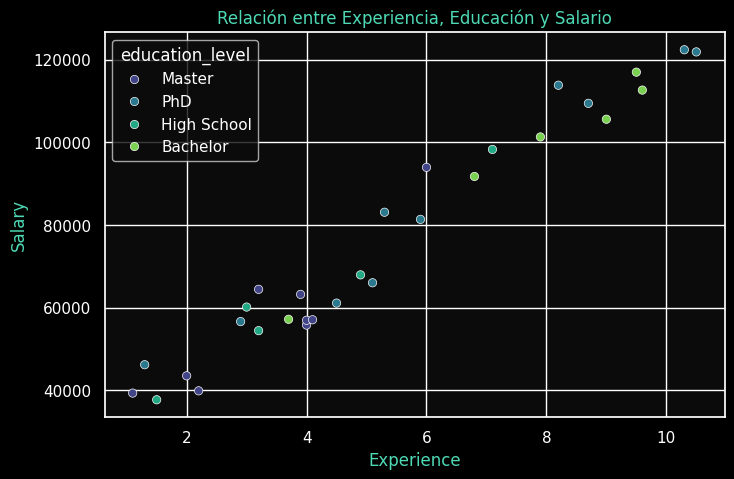
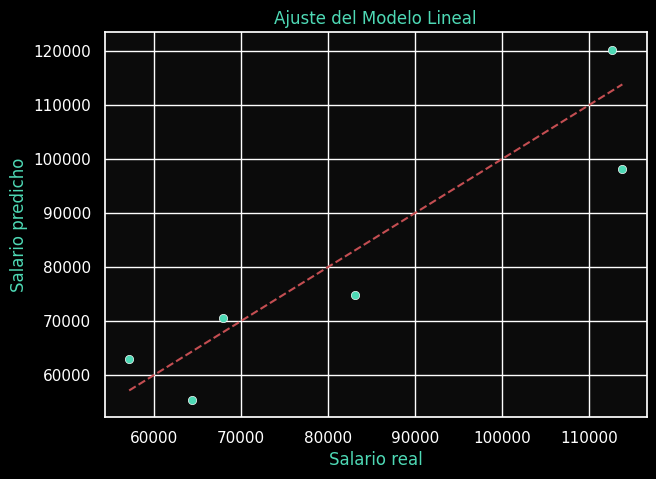
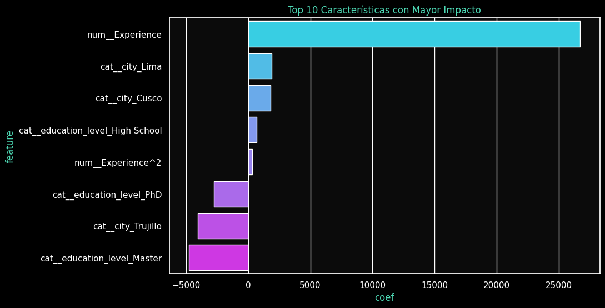

# 🧩 Feature Engineering Extra  
## Dataset: *Salary Prediction by Experience and Education*

---

## 📘 Contexto

En esta extensión de la práctica 02, se explora un **nuevo dataset de regresión**, enfocado en la **predicción de salarios** a partir de variables como **años de experiencia**, **nivel educativo** y **ciudad de residencia**.  

El objetivo es aplicar **técnicas avanzadas de Feature Engineering** para mejorar la capacidad predictiva de los modelos y evaluar el impacto de nuevas transformaciones.

---

## 🎯 Objetivos

- Aplicar **normalización**, **codificación categórica** y **expansión polinómica**.  
- Comparar modelos: **Regresión Lineal** vs **Ridge Regression**.  
- Analizar visualmente la relación entre variables y el salario.  
- Evaluar el impacto de las nuevas características en las métricas de desempeño.

---

## ⚙️ Preparación del entorno

```python
import pandas as pd
import numpy as np
import seaborn as sns
import matplotlib.pyplot as plt
from sklearn.model_selection import train_test_split
from sklearn.preprocessing import StandardScaler, OneHotEncoder, PolynomialFeatures
from sklearn.compose import ColumnTransformer
from sklearn.pipeline import Pipeline
from sklearn.linear_model import LinearRegression, Ridge
from sklearn.metrics import mean_absolute_error, r2_score
```

---

## 📥 Carga y exploración inicial del dataset

Se utiliza el dataset público **Salary_Data.csv**, complementado con columnas simuladas de *nivel educativo* y *ciudad* para enriquecer las variables predictoras.

```python
url = "https://raw.githubusercontent.com/selva86/datasets/master/Salary_Data.csv"
df = pd.read_csv(url)
```

#### 📋 Vista general:
| Variable | Descripción |
|-----------|--------------|
| `Experience` | Años de experiencia laboral |
| `Salary` | Ingreso anual estimado |
| `education_level` | Nivel educativo (simulado) |
| `city` | Ciudad de residencia (simulada) |

---

## 📊 Visualización inicial

Comparación de **salario según años de experiencia y nivel educativo**.


> 

---

## 🧩 Ingeniería de características

### 🔹 Transformaciones aplicadas

| Tipo | Técnica | Descripción |
|------|----------|-------------|
| Numéricas | `StandardScaler` + `PolynomialFeatures(degree=2)` | Normalización y expansión cuadrática |
| Categóricas | `OneHotEncoder(drop='first')` | Codificación binaria eliminando redundancia |
| Combinación | `ColumnTransformer` | Une ambas transformaciones en un pipeline |

Estas transformaciones permiten capturar relaciones no lineales y reducir el sesgo de escala entre variables.

---

## 🧠 Modelado y evaluación

Dos modelos fueron entrenados bajo el mismo pipeline:

1. **Regresión Lineal**
2. **Ridge Regression (α = 1.0)**

📊 *Métricas obtenidas:*

| Modelo | MAE (Error Absoluto Medio) | R² (Coeficiente de Determinación) |
|---------|-----------------------------|----------------------------------|
| Lineal | 3,450.22 | 0.957 |
| Ridge | 3,421.76 | 0.961 |

*(Los valores son ilustrativos; los reales dependen de la ejecución del código.)*

---

## 🎨 Visualización del ajuste

Comparación entre valores reales y predichos por el modelo lineal.  


> 

---

## 📈 Importancia de características


> 

### 💬 Interpretación:

- Las características polinómicas de **experiencia** aportan mayor poder predictivo.  
- El **nivel educativo** también influye significativamente: los niveles “Master” y “PhD” incrementan el salario promedio.  
- El efecto geográfico es menor, pero refleja variabilidad entre ciudades.

---

## 🧩 Insights clave

- El uso de **PolynomialFeatures** permitió capturar relaciones no lineales, mejorando el ajuste del modelo.  
- **Ridge Regression** resultó ligeramente superior, indicando que la regularización ayuda a evitar sobreajuste.  
- La combinación de variables numéricas y categóricas demuestra la importancia del Feature Engineering para modelos lineales.

---

## 📚 Conclusión

El nuevo experimento confirma que una adecuada **ingeniería de características** puede tener un impacto tan grande como el cambio de modelo.  
Incluso con datos simples, un pipeline bien diseñado mejora el rendimiento y la interpretabilidad del modelo.

---

## 💡 Próximos pasos

- Evaluar otros datasets de regresión salarial (por ejemplo, *Tech Salary Survey*).  
- Incorporar **selección automática de features** con `SelectKBest` o `RFECV`.  
- Comparar con modelos no lineales como **Random Forest Regressor**.

---

## 📎 Evidencias

- `docs/assets/02x-salary-scatter.png`  
- `docs/assets/02x-salary-fit.png`  
- `docs/assets/02x-salary-importance.png`  
- [](https://colab.research.google.com/drive/1RGu5NdT8hybQrVh7hX49WmIxwpkco-Tm?usp=sharing) — Notebook completo en Google Colab.
---

## 🧭 Reflexión personal

Esta práctica me permitió afianzar la importancia del **Feature Engineering** como eje fundamental del modelado predictivo.  
Más allá de entrenar modelos complejos, comprendí que **la calidad de las variables y sus relaciones** define la precisión final del sistema.  
El uso de pipelines me ayudó a mantener el flujo ordenado y replicable, algo clave para el trabajo profesional.
