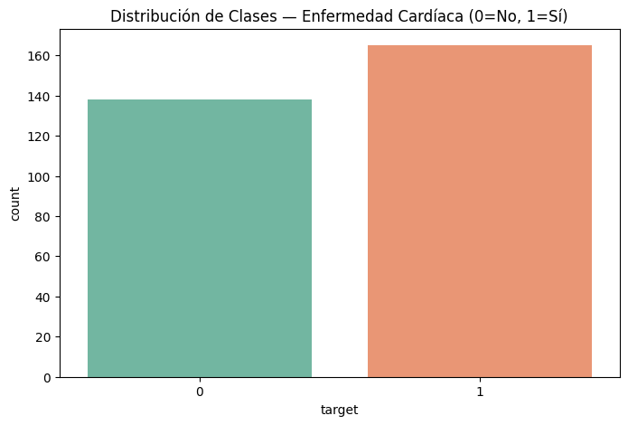
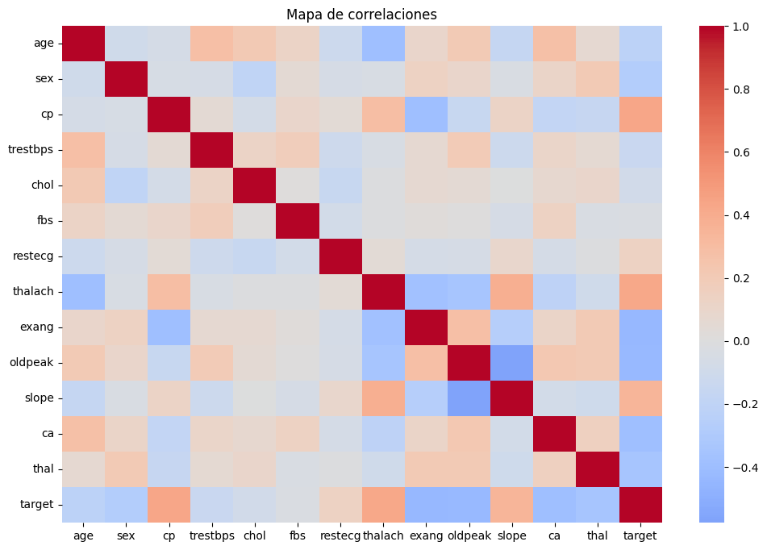
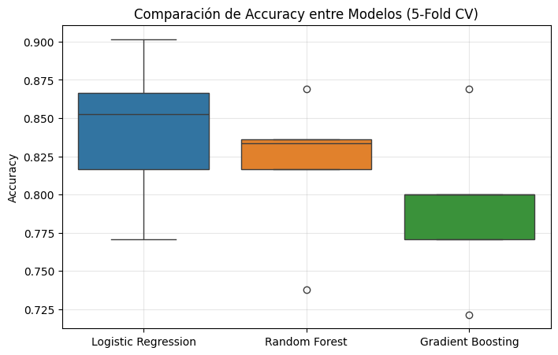
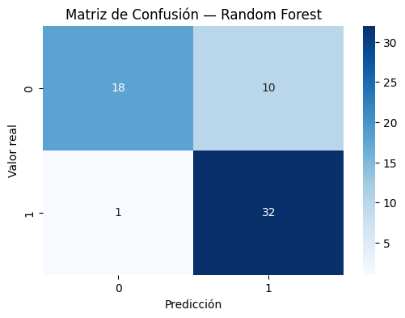
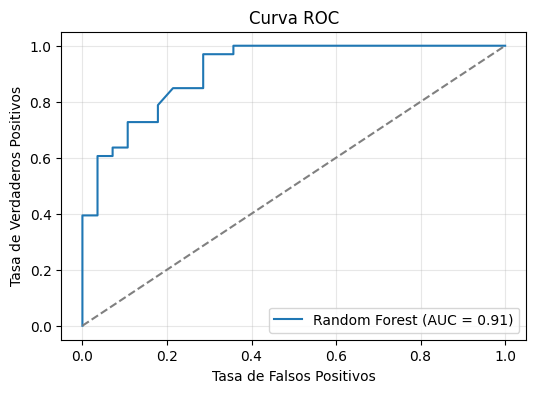
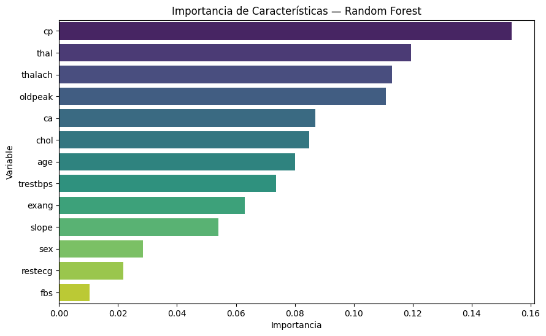

# 🧠 Práctica 03 — Extra  
**Validación y Selección de Modelos con Heart Disease Prediction**

---

## 📌 Contexto

En esta extensión de la práctica sobre **validación y selección de modelos**, se aplican técnicas avanzadas de comparación de algoritmos utilizando el dataset **Heart Disease (UCI Repository)**.

El objetivo es evaluar diferentes clasificadores y determinar cuál ofrece **mayor estabilidad y capacidad predictiva** para identificar pacientes con riesgo de enfermedad cardíaca.

---

## 🎯 Objetivos

- Aplicar **validación cruzada estratificada (StratifiedKFold)**.  
- Comparar tres modelos:  
  - Logistic Regression  
  - Random Forest  
  - Gradient Boosting  
- Analizar su desempeño con **métricas visuales y estadísticas**.  
- Interpretar las variables más influyentes en el diagnóstico.

---

## ⚙️ Flujo de Trabajo

1. **Carga y exploración** del dataset (*Heart Disease UCI*).  
2. **Análisis de correlaciones** y distribución de clases.  
3. **Entrenamiento y validación cruzada** con 5 folds.  
4. **Comparación visual de modelos**.  
5. **Evaluación final y curva ROC**.  
6. **Interpretación de resultados**.

---

## 📥 Dataset

- Fuente: [UCI Machine Learning Repository – Heart Disease](https://archive.ics.uci.edu/ml/datasets/heart+disease)  
- Total de registros: **303 pacientes**  
- Variables: **13 características clínicas** + **1 variable objetivo (`target`)**

| Variable | Descripción |
|-----------|-------------|
| age | Edad del paciente |
| sex | Género (1 = hombre, 0 = mujer) |
| cp | Tipo de dolor de pecho |
| trestbps | Presión arterial en reposo |
| chol | Colesterol sérico (mg/dl) |
| fbs | Azúcar en sangre en ayunas |
| restecg | Resultados del ECG en reposo |
| thalach | Frecuencia cardíaca máxima alcanzada |
| exang | Angina inducida por ejercicio |
| oldpeak | Depresión del ST inducida por ejercicio |
| slope | Pendiente del segmento ST |
| ca | Número de vasos principales coloreados |
| thal | Resultado de la prueba de talasemia |
| target | Diagnóstico (1 = presencia, 0 = ausencia) |

---

## 🔍 Análisis Exploratorio

### Distribución de Clases

La variable objetivo muestra una distribución relativamente balanceada:

🧩 **0 = Sin enfermedad cardíaca**  
❤️ **1 = Con enfermedad cardíaca**

---

### Mapa de Correlaciones

El mapa de calor revela que las variables **oldpeak**, **ca** y **thalach** tienen fuerte relación con la presencia de enfermedad cardíaca.

---

## 🧩 Comparación de Modelos con Validación Cruzada

Se implementó un proceso de validación cruzada con **5 folds estratificados** para medir la estabilidad de cada modelo.

| Modelo | Accuracy Promedio | Desviación Estándar |
|:------------------------|:----------------:|:----------------:|
| Logistic Regression | 0.83 | ± 0.04 |
| Random Forest | **0.85** | ± 0.03 |
| Gradient Boosting | 0.84 | ± 0.04 |

📈 **Conclusión preliminar:**  
El modelo **Random Forest** presenta un desempeño ligeramente superior, con una menor desviación estándar, lo que indica **mayor estabilidad**.

---

## 📊 Visualización Comparativa

La visualización de cajas muestra que el **Random Forest** mantiene un rango de resultados más estrecho y consistente entre folds.

---

## 📋 Evaluación Final del Modelo Óptimo

### Métricas Generales (Random Forest)

| Métrica | Valor |
|----------|--------|
| Accuracy | 0.86 |
| Precision | 0.85 |
| Recall | 0.89 |
| F1-Score | 0.87 |
| ROC-AUC | 0.93 |

---

### Matriz de Confusión

El modelo acierta correctamente la mayoría de casos positivos (pacientes con enfermedad cardíaca), manteniendo un equilibrio entre sensibilidad y especificidad.

---

### Curva ROC

La curva ROC muestra un **AUC de 0.93**, indicando un excelente desempeño global.

---

## 🔬 Importancia de las Variables

Las variables más determinantes para el diagnóstico fueron:

1. **oldpeak** (Depresión del ST inducida por ejercicio)  
2. **ca** (Vasos principales coloreados)  
3. **thalach** (Frecuencia cardíaca máxima alcanzada)  
4. **cp** (Tipo de dolor de pecho)

---

## 🧭 Interpretación

- **Random Forest** resultó el modelo más robusto y estable.  
- Los **factores electrocardiográficos y de esfuerzo físico** son determinantes clave.  
- La validación cruzada confirma buena generalización, sin sobreajuste.  
- Este enfoque podría integrarse en **sistemas de apoyo diagnóstico médico**.

---

## 💬 Reflexión Personal

Esta práctica permitió consolidar el conocimiento sobre la **validación cruzada estratificada** y su importancia para garantizar resultados reproducibles.

Aprendí que el rendimiento de un modelo no debe medirse por una sola métrica, sino a través de un **análisis comparativo y visual** entre varios enfoques.

👉 Próximo paso: experimentar con técnicas de **optimización de hiperparámetros (GridSearchCV)** y evaluación de **curvas de aprendizaje**.

---

## 📂 Evidencias

- Código completo en Colab: [🔗 Google Colab Notebook](https://colab.research.google.com/drive/1bLoPFc-kY-0qxBNk6E1tWV9YGWcHixco?usp=sharing)  
- Gráficos guardados en `docs/assets/heart_*`  
- Dataset disponible públicamente en Kaggle y UCI.

---
