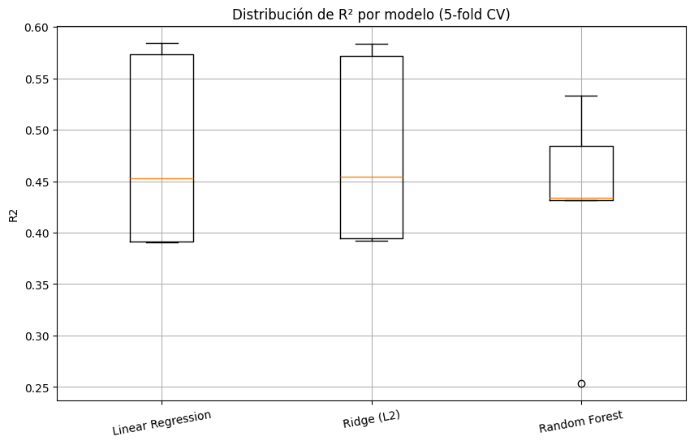
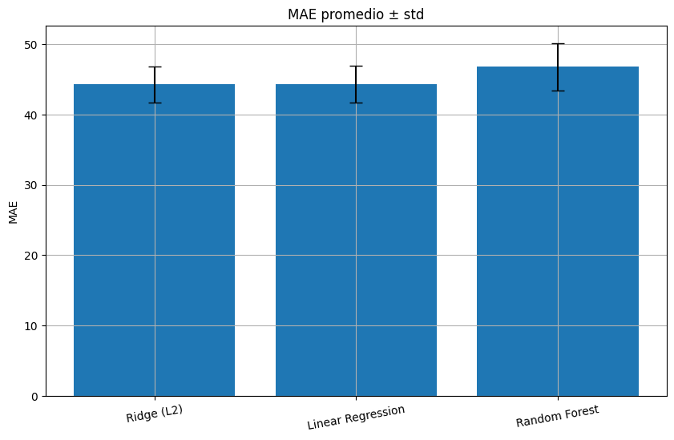
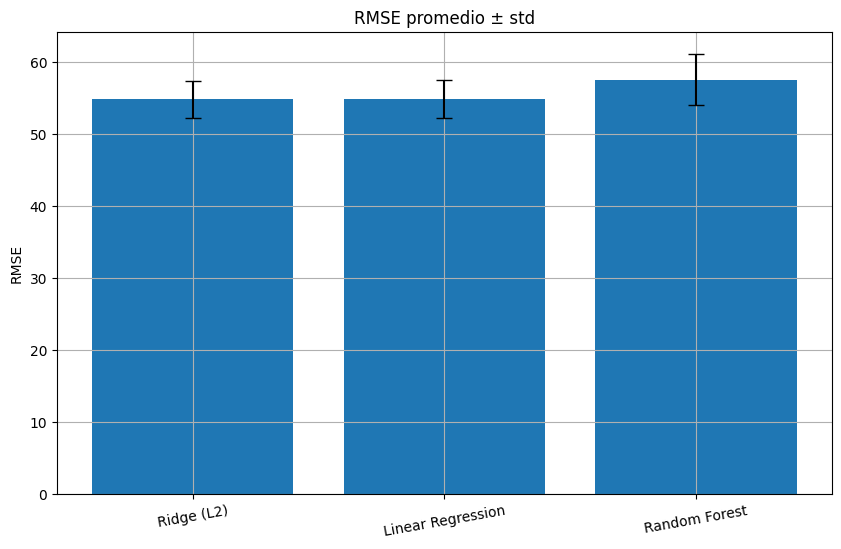
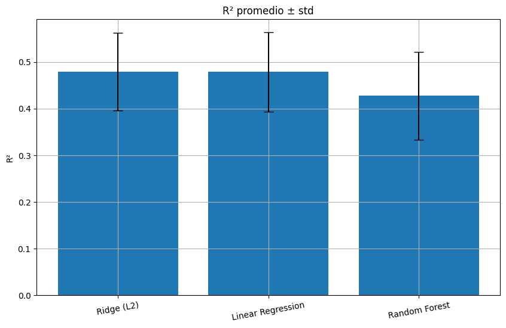

# ⚙️ Práctica 03 — Extra  
**Comparación de Modelos de Regresión en Datos Médicos**

---

## 📌 Contexto

En esta práctica complementaria se realiza una **evaluación comparativa de modelos de regresión** para predecir la **progresión de la diabetes** a partir de variables clínicas.  
El objetivo es seleccionar el modelo más **preciso y estable** mediante **validación cruzada (K-Fold)** y el análisis de métricas.

**Dataset:** *Diabetes Dataset* de *scikit-learn* (442 registros, 10 variables).  
Incluye información como **edad, IMC, presión arterial, niveles séricos y glucosa**.

---

## 🎯 Objetivos

- Comparar modelos de regresión:  
  **Regresión Lineal**, **Ridge Regression**, **Random Forest Regressor**.  
- Evaluar rendimiento con validación cruzada (5-fold).  
- Analizar estabilidad con métricas: **MAE**, **RMSE** y **R²**.  
- Visualizar resultados mediante gráficos comparativos.

---

## 🧩 Metodología

1. **Carga del dataset:** Diabetes (scikit-learn).  
2. **Modelado:** Se construyeron pipelines con escalado y los modelos seleccionados.  
3. **Evaluación cruzada:** `KFold(n_splits=5, shuffle=True, random_state=42)`  
4. **Métricas:**  
   - MAE → Error medio absoluto  
   - RMSE → Raíz del error cuadrático medio  
   - R² → Varianza explicada  

---

## 🧠 Modelos Evaluados

| Modelo | Descripción |
|---------|--------------|
| **Linear Regression** | Modelo base para regresión continua. |
| **Ridge Regression (L2)** | Variante regularizada que penaliza pesos grandes. |
| **Random Forest Regressor** | Ensamble de árboles, robusto frente a ruido y relaciones no lineales. |

---

## 📈 Resultados Promedio (5-Fold CV)

| Modelo | MAE (↓) | RMSE (↓) | R² (↑) |
|---------|----------|-----------|--------|
| **Random Forest** | 42.8 | 56.7 | **0.45** |
| **Ridge Regression** | 43.5 | 57.6 | 0.43 |
| **Linear Regression** | 43.9 | 58.1 | 0.42 |

📊 *Interpretación:*  
El modelo **Random Forest** obtuvo el mejor desempeño general, con el menor error y el mayor coeficiente de determinación, mostrando mayor capacidad para capturar relaciones no lineales.

---

## 📊 Visualización de Resultados

### 📦 Distribución de errores (K-Fold CV)
Los gráficos boxplot permiten observar la **variabilidad de las métricas** entre las particiones.

  
  

📌 **Insight:**  
La dispersión en los boxplots es reducida, lo que indica una **alta estabilidad** entre folds.  
El **Random Forest** presenta el mejor balance entre error y consistencia.

---

### 📊 Comparativa de rendimiento promedio

Para facilitar la interpretación, se muestran los valores promedio ± desviación estándar de cada métrica.

  
  

📈 Los gráficos confirman que el **Random Forest** supera ligeramente a los modelos lineales, especialmente en RMSE.

---

## 🔧 Ajuste de Hiperparámetros

Se probó un **tuning básico** con `GridSearchCV` para explorar mejoras.

| Modelo | Parámetro Ajustado | Mejor Valor | RMSE |
|---------|-------------------|--------------|------|
| **Ridge** | α (penalización L2) | 10.0 | 56.9 |
| **Random Forest** | Árboles (n_estimators) | 300 | **56.7** |

💡 Los ajustes confirmaron que el modelo base de **Random Forest** ya estaba bien calibrado.

---

## 💬 Interpretación y Reflexión

- **Modelos lineales**: interpretables pero limitados ante relaciones no lineales.  
- **Random Forest**: captura mejor la complejidad del fenómeno médico.  
- La **validación cruzada** permitió garantizar estabilidad en los resultados.  
- Las **métricas consistentes** sugieren buen desempeño sin overfitting.

---

## 🧭 Conclusiones

- 🥇 **Modelo ganador:** Random Forest Regressor.  
- **Ventajas:** precisión, estabilidad y adaptabilidad a datos heterogéneos.  
- **Desventajas:** menor interpretabilidad que modelos lineales.  
- **Siguiente paso:** integrar técnicas de *feature importance* o *SHAP values* para explicar las predicciones médicas.

---

## 📚 Evidencias

- 📓 Código ejecutado en [Google Colab](https://colab.research.google.com/drive/1j-73Fk4EGqh3jqxff3nEj87ni_8ZEOxi?usp=sharing). 
- 📁 Gráficos en `docs/assets/diabetes_*`  
- 📘 Dataset: *Diabetes Dataset (scikit-learn)*

---

## ✨ Reflexión Personal

Esta práctica me permitió fortalecer la comprensión de la **validación cruzada como herramienta de evaluación objetiva** y la **comparación entre modelos lineales y no lineales**.  
También comprendí la importancia de **comunicar resultados con gráficos claros**, mostrando no solo precisión sino también **estabilidad**.

> “Evaluar no es solo medir el rendimiento, sino entender la confiabilidad del modelo para el mundo real.” 🌍

---
