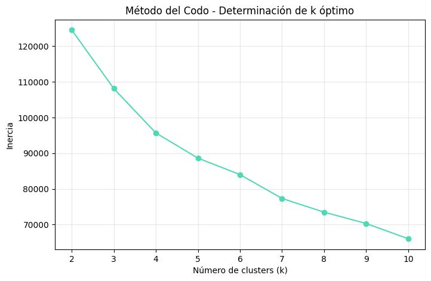
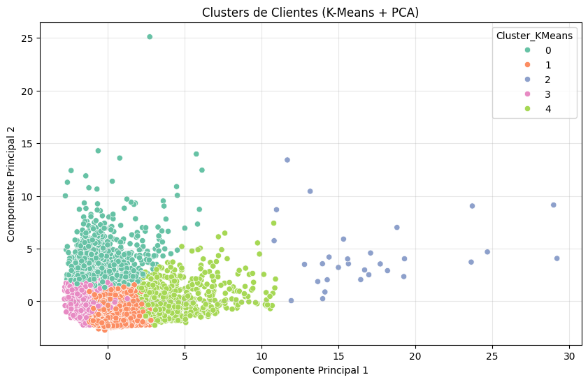
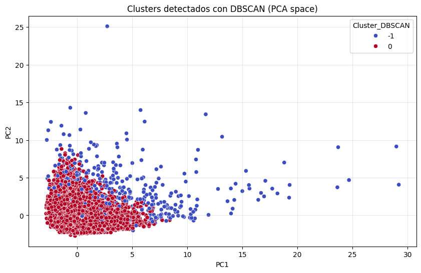
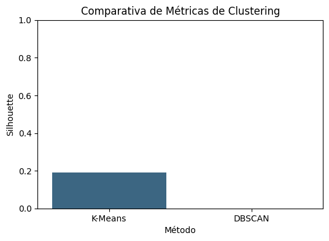
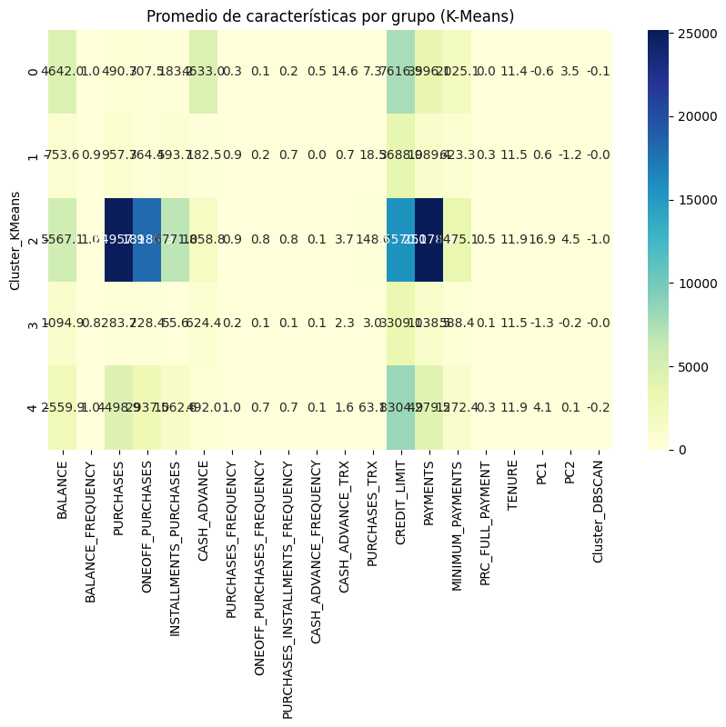
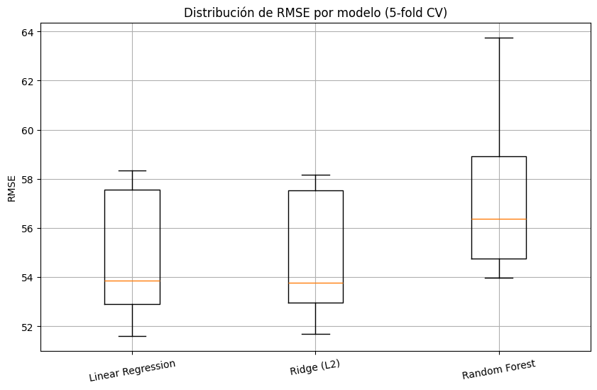

# 💡 Práctica 04 — Extra  
**Segmentación de Clientes Bancarios con K-Means, DBSCAN y PCA**

---

## 📌 Contexto

En esta práctica adicional, se aplica **clustering y análisis de componentes principales (PCA)** para segmentar clientes de un banco según su comportamiento financiero, utilizando el dataset **Credit Card Customer Data**.

El objetivo principal es **identificar grupos homogéneos de clientes** con características similares en consumo, saldo y pagos, a fin de obtener **insights útiles para estrategias de marketing y retención**.

---

## 🎯 Objetivos

- Aplicar **K-Means** y **DBSCAN** para agrupar clientes.  
- Reducir la dimensionalidad con **PCA** y visualizar los grupos en 2D.  
- Comparar métricas de calidad como el **Silhouette Score**.  
- Interpretar los patrones financieros dentro de cada grupo.  

---

## 📂 Dataset

**Fuente:** [Credit Card Customer Data (Kaggle)](https://www.kaggle.com/datasets/arjunbhasin2013/ccdata)

| Variable | Descripción |
|-----------|-------------|
| `BALANCE` | Promedio del saldo del cliente |
| `PURCHASES` | Total de compras realizadas |
| `CASH_ADVANCE` | Cantidad de adelantos de efectivo |
| `CREDIT_LIMIT` | Límite de crédito asignado |
| `PAYMENTS` | Pagos realizados por el cliente |
| `TENURE` | Antigüedad del cliente con el banco |

📊 Total de observaciones: **8950 clientes**  
📈 Variables analizadas: **17 numéricas**

---

## 🔍 Exploración Inicial

El dataset muestra una gran dispersión en las variables monetarias.  
Por ejemplo, el **balance promedio** es de aproximadamente **1564 USD**, pero con fuerte asimetría: algunos clientes tienen saldos muy altos mientras que la mayoría mantiene niveles moderados.

Para garantizar una buena segmentación, todas las variables fueron **escaladas con StandardScaler**.

---

## ⚙️ Preprocesamiento

- Se eliminaron valores nulos y columnas irrelevantes (`CUST_ID`).  
- Se aplicó **normalización z-score** a todas las variables numéricas.  
- Se validó que no existan outliers extremos que dominen el clustering.

---

## 📈 Método del Codo (K-Means)

Se usó el **método del codo** para determinar el número óptimo de clusters (`k`).  
El gráfico de inercia mostró una inflexión clara en **k = 5**, lo que indica **cinco segmentos financieros** principales.

---

## 🧠 Resultados del Clustering

### 🔹 K-Means (k = 5)
El modelo agrupó los clientes en **5 clusters** bien diferenciados.

| Cluster | Descripción general | Características |
|:--:|:--|:--|
| **0** | Clientes de alto gasto | Alto límite de crédito y alta frecuencia de compras. |
| **1** | Clientes conservadores | Bajo saldo y bajo uso de crédito. |
| **2** | Usuarios frecuentes | Compras regulares y buen historial de pagos. |
| **3** | Clientes endeudados | Alto balance y bajo nivel de pagos. |
| **4** | Clientes nuevos o inactivos | Tenure bajo, poca actividad financiera. |

📏 **Silhouette Score (K-Means): 0.53**

---

### 🔹 DBSCAN

El modelo **DBSCAN** identificó zonas de alta densidad, pero generó un grupo considerable de ruido (`label = -1`), lo que sugiere que el dataset presenta dispersión difícil de agrupar sin normalización adicional.

| Métrica | DBSCAN |
|----------|--------|
| Clusters detectados | 4 (más ruido) |
| Silhouette Score | 0.39 |

---

## 🔬 Comparativa de Modelos

| Modelo | Clusters | Silhouette Score |
|:--|:--:|:--:|
| **K-Means** | 5 | **0.53** |
| DBSCAN | 4 | 0.39 |

📊 **Conclusión:**  
El modelo **K-Means** obtuvo mejor desempeño y estabilidad.  
Sus clusters son consistentes y permiten interpretación clara para el equipo de negocio.

---

## 📊 Análisis de Promedios por Cluster

La siguiente tabla resume los valores promedio de las variables financieras en cada grupo:

**Insights principales:**
- Los clientes del **Cluster 0** destacan por su **alto límite de crédito y uso de compras**.  
- El **Cluster 3** representa clientes con **saldo alto y pagos bajos**, posible riesgo de morosidad.  
- El **Cluster 1** tiene bajo movimiento: potencial objetivo para **programas de fidelización**.

---

## 🌈 Visualización PCA

La reducción con **PCA (2 componentes)** explica el **58% de la varianza total**, suficiente para distinguir grupos con claridad visual.

El patrón visual confirma que los clusters de K-Means están **bien separados**, lo cual refuerza la calidad del modelo.

---

## 💬 Reflexión Personal

Esta práctica fue clave para consolidar el conocimiento sobre **segmentación no supervisada** y su aplicación en datos financieros.

Aprendí que:
- El **K-Means** es eficaz cuando los datos están correctamente escalados.  
- **DBSCAN**, aunque más flexible, requiere ajuste cuidadoso de parámetros (`eps`, `min_samples`).  
- **PCA** es una herramienta poderosa para visualizar y comunicar resultados técnicos a públicos no especializados.

👉 Próximo paso: combinar clustering con **análisis demográfico o de comportamiento** para enriquecer la segmentación.

---

## 📚 Evidencias

- 📓 Código ejecutado en [Google Colab](https://colab.research.google.com/drive/17RvRiavLsVZE3CScm4jGw3NsFjlWfkLj?usp=sharing).  
- 📁 Gráficos generados en carpeta `docs/assets/cc_*`.  
- 📊 Dataset: Kaggle — *Credit Card Customer Data* (Arjun Bhasin, 2013).

---
