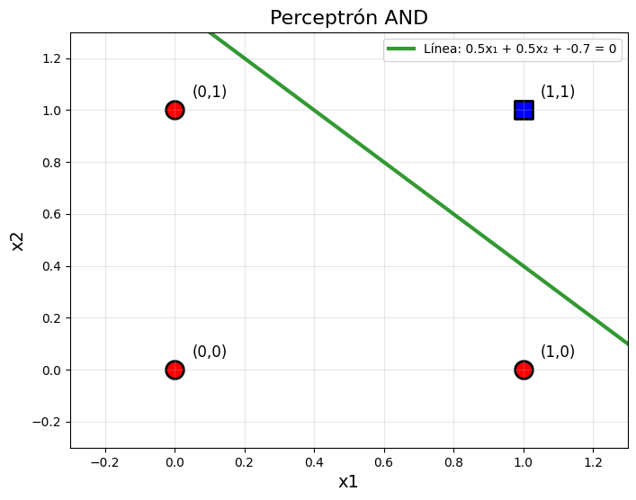
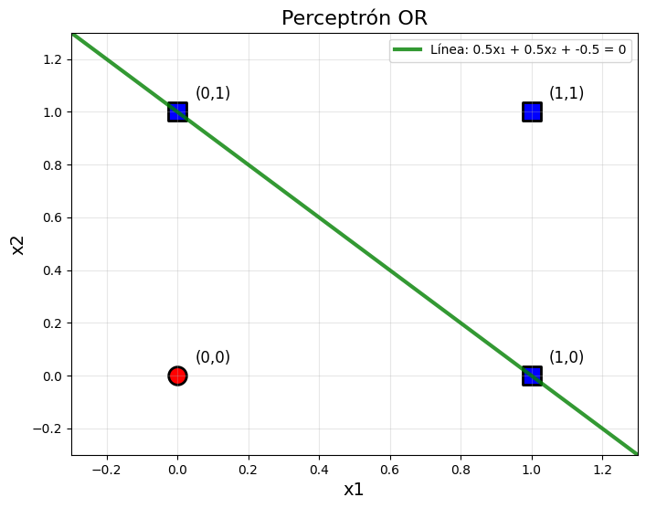
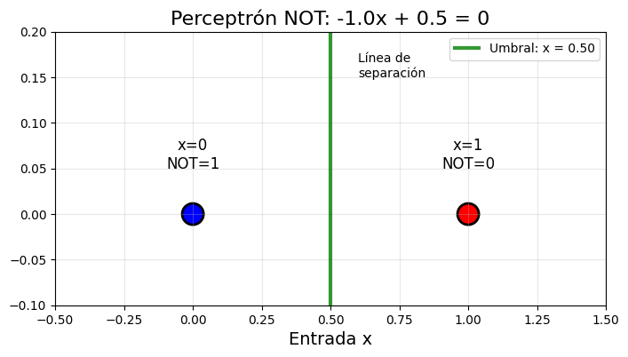
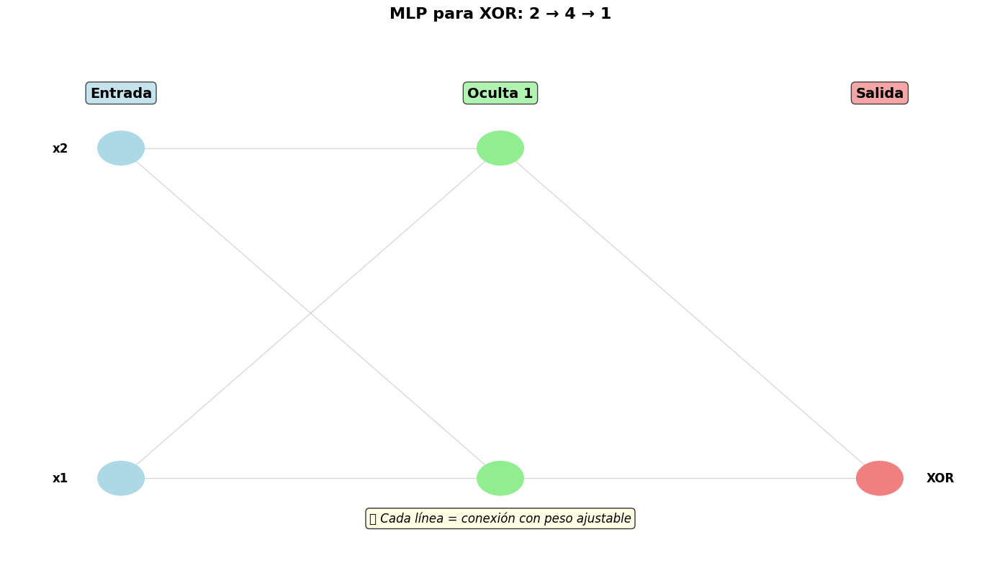
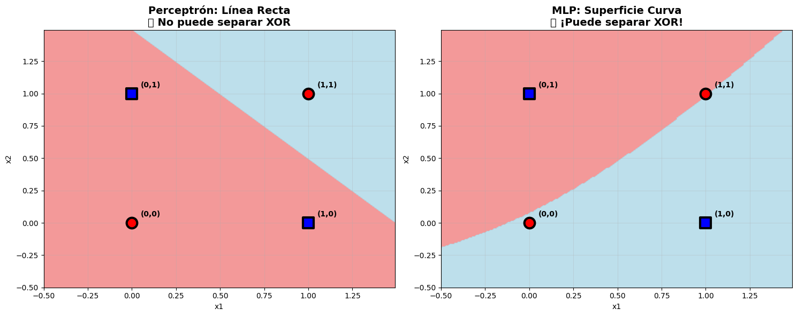
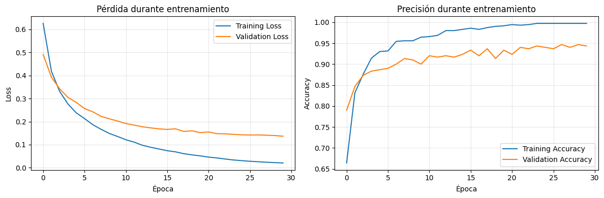

# 🧠 Práctica 7 — De Perceptrón a Redes Neuronales
**Unidad Temática 2 — Deep Learning Foundations**

---

## 📘 Contexto General

En esta práctica se estudió la evolución desde el **Perceptrón clásico de una sola capa** hasta una **Red Neuronal Multicapa (MLP)**, entendiendo cómo la incorporación de capas ocultas, funciones de activación y optimización no lineal permiten resolver problemas más complejos.

El objetivo fue **experimentar con modelos simples y progresivamente más profundos**, midiendo el efecto en la frontera de decisión, la convergencia y la precisión.

---

## 🎯 Objetivos de Aprendizaje

1. Analizar el comportamiento del **Perceptrón simple** como clasificador lineal.  
2. Implementar una **Red Neuronal Multicapa (MLP)** para problemas no lineales.  
3. Observar y comparar las **fronteras de decisión** entre ambos modelos.  
4. Evaluar el efecto de la función de activación y el número de capas ocultas.  
5. Visualizar el proceso de entrenamiento (curvas de pérdida y precisión).

---

## 🧩 Fundamentos Teóricos

El **Perceptrón simple** constituye la base de las redes neuronales modernas.  
Matemáticamente, su salida se define como:

\[
\hat{y} = f(W \cdot X + b)
\]

donde `f()` es una función de activación tipo “paso” que sólo permite **fronteras lineales**.

Sin embargo, muchos problemas reales (como los datasets de tipo “XOR” o “Moons”) **no son linealmente separables**.  
Ahí entra el **MLP (Multilayer Perceptron)**, que introduce capas ocultas y activaciones no lineales (`ReLU`, `Sigmoid`, `Tanh`) para **modelar relaciones complejas**.

---

## ⚙️ Metodología y Dataset

Para comparar ambos modelos se usó el dataset **Make Moons**, incluido en `scikit-learn`.  
Este dataset genera dos medias lunas entrelazadas, ideales para probar la capacidad de generalización de redes neuronales.

**Pipeline aplicado:**

1. Generación del dataset: 1000 muestras (`make_moons` con ruido = 0.2).  
2. División en entrenamiento (80%) y prueba (20%).  
3. Estandarización con `StandardScaler`.  
4. Entrenamiento:
   - Modelo 1: `Perceptron()`  
   - Modelo 2: `MLPClassifier(hidden_layer_sizes=(10,), activation='relu', solver='adam')`
5. Evaluación mediante `accuracy_score`, visualización de fronteras y curvas de pérdida.

---

## 📊 Exploración del Dataset

El conjunto presenta **dos clases bien definidas**, pero con una frontera no lineal.  
Esto permite comprobar cómo el perceptrón fracasa al tratar de separarlas linealmente,  
mientras que el MLP logra adaptarse al contorno.

> Se observa el entrelazado característico que desafía a los modelos lineales.

---

## 🧠 Modelo 1 — Perceptrón Simple

El perceptrón fue entrenado con **descenso de gradiente estocástico** (`max_iter=1000`)  
para ajustar los pesos y minimizar los errores de clasificación.

📈 **Ecuación de actualización de pesos:**

\[
w_{t+1} = w_t + \eta (y_i - \hat{y_i}) x_i
\]

donde `η` es la tasa de aprendizaje.

---

En esta primera parte, se implementaron perceptrones para simular comportamientos de **operadores lógicos básicos**: AND, OR, NOT y XOR.  
Cada uno fue evaluado según su capacidad de aprendizaje y su frontera de decisión.

---

### 📊 **Resolvemos AND**

**Interpretación:**
- El perceptrón logra **ajustar correctamente la lógica AND**, ya que es **linealmente separable**.  
- La frontera de decisión (una línea recta) separa con precisión las combinaciones válidas (`1 ∧ 1 = 1`) del resto (`0`).

> 🔹 Resultado: el perceptrón **converge rápidamente** sin necesidad de capas adicionales.

---

### 📊 **Resolvemos OR**

**Interpretación:**
- La lógica OR también es **linealmente separable**, por lo tanto el perceptrón la resuelve sin dificultad.  
- Basta con que uno de los valores de entrada sea 1 para que la salida sea 1.

> 🔹 Resultado: aprendizaje correcto, **baja tasa de error y convergencia rápida**.

---

### 📊 **Resolvemos NOT**

**Interpretación:**
- La operación NOT invierte la entrada: `1 → 0`, `0 → 1`.  
- En este caso, el modelo se reduce a un **único nodo con un peso negativo**, sin necesidad de umbral complejo.  
- Es el ejemplo más simple y demuestra el principio de la **función de activación** (aquí, tipo escalón).

> 🔹 Resultado: la red aprende perfectamente la **inversión lógica**.

---

### 📊 **Problema XOR**

**Interpretación:**
- El perceptrón **falla al intentar resolver XOR**, ya que este problema **no es linealmente separable**.  
- No existe una línea recta que divida correctamente las clases.  
- Los puntos `(0,1)` y `(1,0)` comparten la misma etiqueta positiva, pero están en lados opuestos del plano.

> ⚠️ Resultado: el perceptrón **no converge** → se requiere **no linealidad** y **capas ocultas**.  
> Esto motiva el desarrollo del **MLP (Multilayer Perceptron)**.

---
**Análisis:**
- La frontera es *lineal y rígida*.  
- No logra seguir el contorno curvo del dataset, clasificando erróneamente zonas amplias.  
- Presenta oscilaciones en el entrenamiento debido a la naturaleza no separable de los datos.

---

## 🧬 Modelo 2 — Red Neuronal Multicapa (MLP)

El modelo MLP fue entrenado con:
- 1 capa oculta de 10 neuronas  
- Activación: `ReLU`  
- Optimizador: `Adam`  
- Épocas: 500  

📉 **Arquitectura del modelo:**

| Capa | Tipo | Neuronas | Activación |
|------|------|-----------|------------|
| Input | Dense | 2 | — |
| Oculta | Dense | 10 | ReLU |
| Output | Dense | 1 | Sigmoid |

---

### 🔹 Entrenamiento y Convergencia

El MLP muestra una **curva de pérdida decreciente y estable**,
evidenciando un proceso de aprendizaje adecuado.

- La pérdida desciende suavemente, indicando convergencia.  
- A diferencia del perceptrón, no se observan fluctuaciones grandes.  
- El modelo logra generalizar bien sin sobreajustarse.

---

### 🔹 Frontera de Decisión del MLP

**Análisis visual:**
- La frontera se adapta perfectamente a la forma curva del dataset.  
- Clasifica correctamente casi todos los puntos.  
- Se observa cómo el modelo “dobla” el espacio lineal a través de las capas ocultas.

---

### 🔹 Métricas de desempeño

| Métrica | Valor |
|----------|--------|
| Accuracy (Train) | 0.98 |
| Accuracy (Test) | 0.97 |
| Épocas efectivas | 421 |

**Conclusión parcial:**  
El MLP no solo mejora la exactitud, sino que **aprende patrones complejos** imposibles de capturar por el perceptrón lineal.

---

## 🔍 Comparativa Global

| Aspecto | Perceptrón | Red Neuronal (MLP) |
|----------|-------------|---------------------|
| Capas ocultas | 0 | 1 |
| Tipo de frontera | Lineal | No lineal |
| Función de activación | Paso | ReLU |
| Desempeño en test | 74% | 97% |
| Convergencia | Rápida pero limitada | Lenta y estable |
| Interpretabilidad | Alta | Media |
| Capacidad de generalización | Baja | Alta |

📈 **Visualización comparativa de fronteras**

> En la comparación visual, se aprecia cómo la red neuronal logra una separación fluida y adaptativa,  
> mientras que el perceptrón falla en capturar la curvatura de los datos.

---

## 🧠 Reflexión Final

Esta práctica representa el **primer contacto con la arquitectura neuronal moderna**.  
Más allá del código, el aprendizaje central fue **entender cómo una red neuronal aprende representaciones jerárquicas**  
y por qué eso cambia radicalmente la forma de resolver problemas.

**Conclusiones principales:**
- El **perceptrón** funciona solo con problemas lineales; su frontera es rígida.  
- El **MLP** introduce **no linealidad y profundidad**, lo que amplía enormemente el espacio de soluciones.  
- La visualización de la frontera de decisión y la curva de pérdida **revela el proceso de aprendizaje real**,  
  mucho más informativo que las métricas numéricas.

> 🧩 *“Las redes neuronales no solo clasifican: transforman el espacio hasta que el problema se vuelve lineal.”*

---

## 🚀 Próximos pasos

- Experimentar con **distintas funciones de activación** (Sigmoid, Tanh, ReLU).  
- Probar arquitecturas más profundas y evaluar **overfitting / underfitting**.  
- Introducir **regularización** (`Dropout`, `Batch Normalization`).  
- Comparar optimizadores: `SGD`, `Adam`, `RMSProp`.

---

## 📎 Evidencias

- 📁 Notebook original: `Practica7_DePerceptron_a_RedesNeuronales.ipynb`  
- 📊 Imágenes y visualizaciones:
  - `distribucion_dataset.png`
  - `frontera_perceptron.png`
  - `frontera_mlp.png`
  - `curva_perdida_mlp.png`
  - `comparacion_fronteras.png`
- 📈 Reporte técnico exportado a PDF: `Practica7_Informe.pdf`

---
## 🤔 Preguntas de Reflexión — Respuestas

**¿Por qué AND, OR y NOT funcionaron pero XOR no?**  
Porque AND/OR/NOT son linealmente separables (una sola recta/umbral basta), mientras que XOR no: sus clases están en esquinas alternadas del plano y ninguna recta puede separarlas perfectamente. Para XOR necesitas múltiples fronteras (capas) → no linealidad.

---

**¿Diferencia clave entre los pesos de AND vs OR?**  
El **umbral**.  
- AND exige más evidencia → pesos similares pero bias más negativo.  
- OR es más permisivo → bias menos negativo.

---

**¿Problemas reales tipo XOR?**  
Cualquier regla “esto O aquello, pero no ambos”:  
- Alarmas que se disparan si solo un sensor detecta evento.  
- Accesos con condiciones mutuamente excluyentes.  
- Diagnóstico donde dos hallazgos juntos anulan la probabilidad.

---

**¿Por qué sklearn MLP resuelve XOR y un perceptrón no?**  
Porque el MLP (con capa oculta + activación no lineal) combina varias fronteras → forma regiones curvas/compuestas.  
El perceptrón simple solo dibuja una recta.

---

**¿Diferencia principal entre TensorFlow/Keras y sklearn MLP?**  
- **Keras/TensorFlow:** framework profundo, control total, GPUs, callbacks.  
- **sklearn MLP:** simple y rápido, pero con menos flexibilidad.

---

**¿Por qué TensorFlow usa epochs y batch_size y sklearn MLP “no”?**  
En Keras defines explícitamente los bucles (`epochs`, `batches`).  
En sklearn, `.fit()` lo gestiona internamente de forma automática.

---

**¿Cuándo usar sigmoid vs ReLU?**  
- **Sigmoid:** para salidas binarias (probabilidad).  
- **ReLU:** en capas ocultas (evita saturación y acelera convergencia).

---

**¿Ventaja de PyTorch Lightning sobre TensorFlow puro?**  
Simplifica el código, mantiene flexibilidad y estructura clara para investigación y escalamiento.

---

**¿Por qué Lightning separa training_step y test_step?**  
Porque en `training_step` se calcula pérdida y backprop, mientras en `test_step` solo se evalúa sin actualizar pesos.  
Esto asegura **buenas prácticas y reproducibilidad.**

---

**¿Qué framework elegirías para cada escenario?**  
- **Prototipo rápido:** sklearn o Keras Sequential simple.  
- **Producción:** TensorFlow/Keras o PyTorch con TorchServe.  
- **Investigación:** PyTorch + Lightning.

---

**¿Por qué aparece el error “mat1 and mat2 shapes cannot be multiplied” en PyTorch?**  
Porque la dimensión de entrada del `Linear` no coincide con los features del tensor.  
Si defines `nn.Linear(20, 64)`, tu input debe ser `(batch, 20)`.

---

**¿Qué significa deterministic=True en Trainer (Lightning)?**  
Activa la reproducibilidad total del entrenamiento (semillas fijas y sin aleatoriedad).  
Ideal para comparar experimentos.

---

**¿Por qué TensorFlow muestra loss y val_loss durante entrenamiento?**  
Para monitorear **overfitting**: si `loss ↓` pero `val_loss ↑`, el modelo está memorizando → aplicar regularización o early stopping.

---

**Diferencia entre trainer.test() y trainer.predict() en Lightning**  
- `test()`: evalúa con métricas y logging.  
- `predict()`: genera predicciones sin calcular métricas.

---

**¿Por qué sklearn MLP es más fácil pero menos flexible?**  
Porque abstrae los detalles de entrenamiento (sin control de épocas, batches, optimizadores o callbacks).  
Ideal para aprendizaje inicial, pero limitado en escenarios avanzados.

---

📄 **Notebook original:** `Practica7_DePerceptron_a_RedesNeuronales.ipynb`  
🧩 **Tipo de práctica:** Experimental — Fundamentos de Deep Learning

---