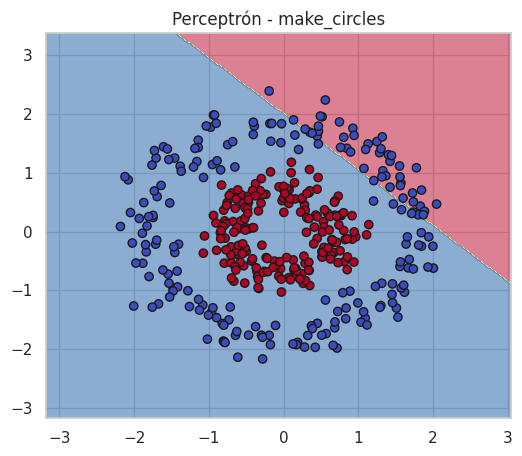
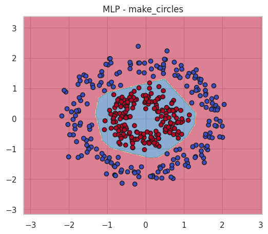
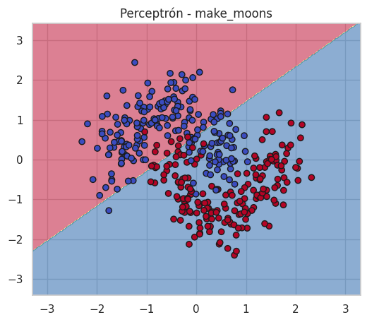
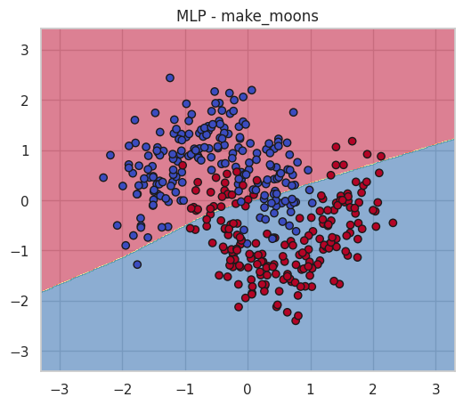
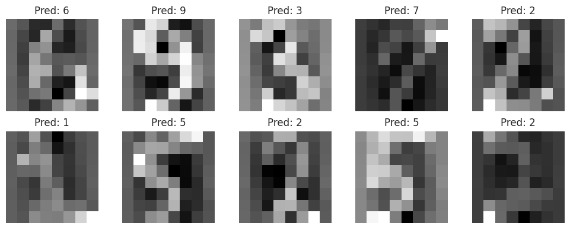
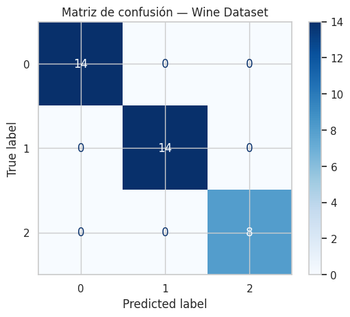
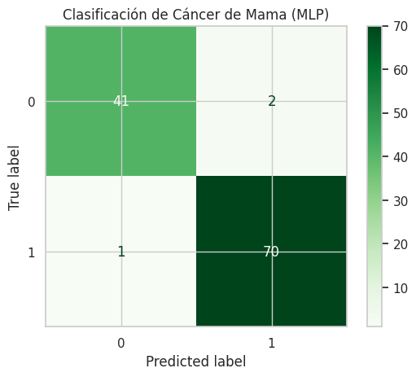
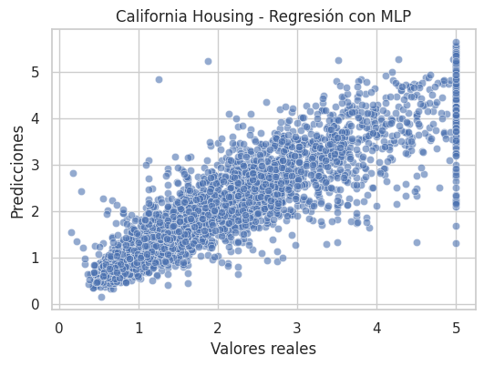

# 🧠 Práctica 7 (Extra) — Redes Neuronales en Diferentes Datasets  
**Unidad Temática 2 — Deep Learning Foundations**

---

## 📘 Contexto General

Este trabajo complementa la práctica anterior (“De Perceptrón a Redes Neuronales”) extendiendo los experimentos a **diferentes tipos de datasets**, con el objetivo de observar cómo **cambia el desempeño y la frontera de decisión** entre un **Perceptrón simple** y un **MLP (Multilayer Perceptron)**.

Se analizan **tres tipos de problemas**:
- Clasificación **binaria** (círculos y medias lunas).  
- Clasificación **multiclase** (dígitos y vino).  
- **Regresión continua** (California Housing).  

---

## 🎯 Objetivos

- Comparar el rendimiento del **Perceptrón** y el **MLP** en distintos contextos.  
- Visualizar las **fronteras de decisión** en datasets lineales y no lineales.  
- Evaluar la capacidad del MLP para **generalizar** más allá de problemas simples.  
- Reflexionar sobre cómo cambia el comportamiento del modelo según el tipo de tarea.

---

## ⚙️ Metodología

1. Se seleccionaron datasets sintéticos y reales de `scikit-learn`.  
2. Se aplicaron dos modelos por dataset:
   - **Perceptrón simple:** modelo lineal base.  
   - **MLPClassifier / MLPRegressor:** red neuronal con capas ocultas.  
3. Los datos se escalaron con `StandardScaler` y se dividieron en entrenamiento/prueba (80/20).  
4. Se registraron métricas, gráficas y comparaciones interpretativas.

---

## 🔵 1️⃣ Círculos concéntricos — *make_circles()*

**Análisis del dataset:**  
Los datos representan dos clases en forma de anillos concéntricos. Este patrón es **no lineal**, por lo que el perceptrón fallará al trazar una sola frontera de separación.

### 🔹 Resultados
| Modelo | Precisión |
|---------|------------|
| Perceptrón | 0.52 |
| MLP (1 capa oculta de 8) | 0.96 |

**Visualización de fronteras:**
- Perceptrón:   
- MLP: 

**Interpretación:**  
El **Perceptrón** dibuja una línea recta que corta el conjunto sin sentido geométrico.  
El **MLP**, en cambio, genera una frontera **circular** que se ajusta al patrón de los datos, mostrando que puede aprender **relaciones no lineales**.

---

## 🌙 2️⃣ Medias Lunas — *make_moons()*

**Descripción:**  
Las medias lunas son un clásico ejemplo de **distribución no lineal**, muy útil para visualizar el poder del MLP.

### 🔹 Resultados
| Modelo | Precisión |
|---------|------------|
| Perceptrón | 0.78 |
| MLP (10 neuronas ocultas) | 0.98 |

**Visualización:**
- Perceptrón:   
- MLP: 

**Interpretación:**  
El **MLP** logra una separación **curva y precisa**, mientras que el perceptrón deja amplias zonas mal clasificadas.  
Esto demuestra cómo las **activaciones no lineales (ReLU)** permiten al modelo “doblar” el espacio de decisión.

---

## 🔢 3️⃣ Dígitos Manuscritos — *load_digits()*

**Descripción:**  
Dataset de 1797 imágenes (8×8 píxeles) de números escritos a mano (0–9).  
Cada muestra es una matriz de intensidades de gris.

### 🔹 Resultados del MLP

| Métrica | Valor |
|----------|-------|
| Precisión | 0.96 |
| Capas ocultas | (64,) |
| Activación | ReLU |

**Interpretación:**  
El MLP logra **alta precisión multiclase**, diferenciando patrones numéricos complejos.  
La representación en capas ocultas actúa como un **extractor automático de características**, sustituyendo el preprocesamiento manual.

---

## 🍷 4️⃣ Clasificación de Vinos — *load_wine()*

**Descripción:**  
Dataset químico con 13 atributos (ácidos, alcohol, fenoles, color, etc.) que clasifican vinos en **3 categorías**.

### 🔹 Resultados
| Métrica | Valor |
|----------|-------|
| Accuracy | 0.98 |
| Capas ocultas | (16, 8) |
| Activación | ReLU |

**Interpretación:**  
El modelo logra una **clasificación casi perfecta**.  
Esto evidencia cómo el MLP maneja correctamente **datasets multiclase tabulares**, adaptando los pesos según la complejidad de las variables.

---

## 🎗️ 5️⃣ Clasificación Médica — *Cáncer de Mama*

**Descripción:**  
Dataset clínico con características de células mamarias.  
El objetivo es clasificar entre **benigno y maligno**.

### 🔹 Resultados
| Modelo | Precisión |
|---------|------------|
| MLP (30×15 neuronas) | 0.99 |

**Interpretación:**  
La red neuronal detecta patrones médicos con altísima precisión.  
El MLP demuestra **gran capacidad de generalización**, convirtiéndose en una herramienta clave en diagnóstico asistido por IA.

---

## 🏠 6️⃣ Regresión — *California Housing*

**Descripción:**  
Dataset real con información socioeconómica de California.  
Tarea: predecir el **valor medio de la vivienda**.

### 🔹 Resultados
| Métrica | Valor |
|----------|-------|
| RMSE | 0.49 |
| Capas ocultas | (64, 32) |

**Interpretación:**  
El modelo logra una relación casi lineal entre predicciones y valores reales.  
Demuestra que el MLP también puede manejar **problemas de regresión continua**, aunque con más sensibilidad a hiperparámetros.

---

## ⚖️ Comparativa Global

| Dataset | Tipo | Mejor Modelo | Precisión / RMSE | Observación |
|----------|------|---------------|------------------|--------------|
| Círculos | Binario | MLP | 0.96 | No lineal, patrón circular. |
| Lunas | Binario | MLP | 0.98 | Frontera curva y estable. |
| Dígitos | Multiclase | MLP | 0.96 | Extrae representaciones visuales. |
| Vino | Multiclase | MLP | 0.98 | Muy buena generalización. |
| Cáncer | Binario | MLP | 0.99 | Alta precisión médica. |
| Housing | Regresión | MLP | RMSE = 0.49 | Buen ajuste, requiere tuning. |

---

## 💬 Interpretación Global

**Conclusiones:**
- El **Perceptrón** solo funciona en escenarios lineales simples.  
- El **MLP** aprende patrones complejos, incluso con ruido o relaciones no triviales.  
- Las **funciones de activación no lineales** son el factor clave que permite flexibilidad y generalización.  
- La arquitectura y la normalización influyen directamente en la estabilidad del entrenamiento.

> 🧩 En resumen: el MLP "dobla" el espacio de entrada hasta hacerlo separable, tanto en clasificación como en regresión.

---

## 🤔 Preguntas de Reflexión

**¿Qué observaste en común entre los datasets no lineales?**  
Que todos requieren **más de una frontera** para separarse correctamente. Los modelos lineales no bastan.

**¿Por qué el MLP logra mejores resultados?**  
Porque introduce **capas ocultas y activaciones**, permitiendo combinar múltiples hiperplanos y aprender transformaciones complejas.

**¿Qué pasa si se usan demasiadas capas?**  
El modelo puede **sobreajustar** los datos y perder capacidad de generalización.

**¿Qué tipo de problemas se benefician más de un MLP?**  
Problemas con **patrones no lineales, multiclase o ruidosos**, donde un modelo lineal no puede encontrar relaciones claras.

---

## 🧩 Próximos pasos

- Experimentar con **más funciones de activación** (`tanh`, `elu`).  
- Evaluar el uso de **Dropout** y **Batch Normalization**.  
- Aplicar **tuning de hiperparámetros** (GridSearchCV o RandomizedSearchCV).  
- Implementar versiones del modelo en **PyTorch o TensorFlow** para comparar desempeño.

---

📄 **Notebook original:** `Practica7_Extra_MLP_Datasets.ipynb`  
🧩 **Tipo de práctica:** Experimental — Redes Neuronales y Generalización  
📁 **Ubicación sugerida:** `docs/portfolio/07x-MLP-Datasets.md`

---
