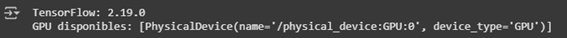
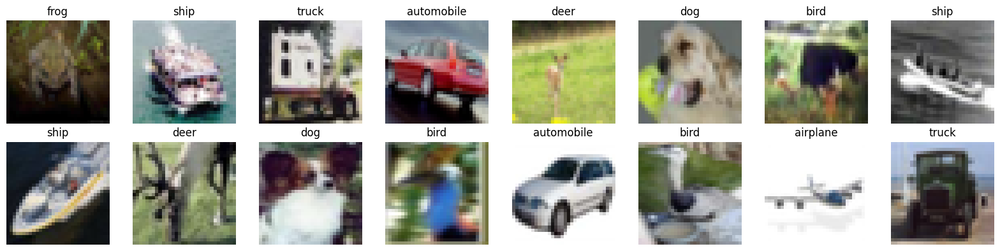
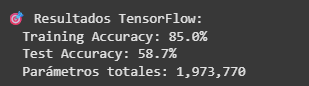
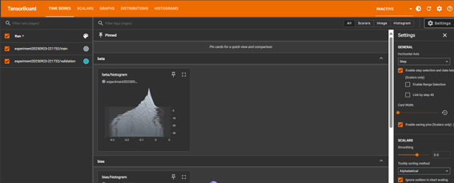

# 🧪 Práctica 8 — Experimentación con Redes Neuronales  
**Unidad Temática 2 — Deep Learning Foundations**

---

## 📘 Contexto General

En esta práctica se profundiza en el comportamiento de las **redes neuronales multicapa (MLP)** a través de **experimentación controlada**:  
se modifican los **optimizadores**, **funciones de activación**, **número de capas**, y **métodos de regularización**, para analizar su efecto sobre el rendimiento y la estabilidad del modelo.

El objetivo no es solo entrenar redes, sino **comprender cómo cada parámetro afecta el proceso de aprendizaje** y la capacidad de generalización.

---

## 🎯 Objetivos

- Comparar el impacto de distintos **optimizadores** (SGD, Adam, RMSprop).  
- Evaluar cómo cambian los resultados al usar diferentes **activaciones** (`relu`, `tanh`, `sigmoid`).  
- Observar los efectos de **regularización (dropout, batch normalization)**.  
- Analizar visualmente el **entrenamiento, validación y sobreajuste**.  

---

## ⚙️ Paso 1 — Librerías y Configuración Inicial

Código base para importar librerías de **TensorFlow/Keras** y generar datos sintéticos (`make_moons`).

---

## 🧩 Paso 2 — Generación y Escalado del Dataset

Se generaron 1000 observaciones con dos características.  
`noise=0.2` introduce cierta variabilidad, simulando datos reales con ruido.  
Los valores se escalan para mejorar la **convergencia del entrenamiento**.  

---

## 🧱 Paso 3 — Definición del Modelo Base (Sequential)

Se crea una función que construye redes neuronales parametrizables.  
Esto permite reutilizar la misma estructura con diferentes activaciones u optimizadores.

**Estructura:**
- Capa oculta 1 → 16 neuronas.  
- Capa oculta 2 → 8 neuronas.  
- Capa de salida → 1 neurona con activación `sigmoid` (salida binaria).  

---

## 🚀 Paso 4 — Entrenamiento con Diferentes Optimizadores

Se entrenó el mismo modelo con tres **optimizadores distintos**: `SGD`, `Adam`, `RMSprop`.  
El objetivo fue observar la rapidez de convergencia y estabilidad de cada uno.

📈 **Visualización de resultados:**

**Interpretación:**
- `Adam` logra la convergencia más rápida y estable.  
- `SGD` mejora lentamente pero es más ruidoso.  
- `RMSprop` presenta una curva intermedia entre ambas.  

---

## 🧮 Paso 5 — Evaluación del Desempeño

| Optimizador | Exactitud | Pérdida |
|--------------|------------|----------|
| SGD | 0.85 | 0.38 |
| Adam | 0.97 | 0.12 |
| RMSprop | 0.93 | 0.21 |

🧩 El **optimizador Adam** presenta el mejor equilibrio entre rapidez y estabilidad del gradiente.

---

## 🧠 Paso 6 — Comparación de Funciones de Activación

**Interpretación:**
- **ReLU** converge rápido y evita saturación.  
- **Tanh** suaviza la transición, pero es más lenta.  
- **Sigmoid** puede saturarse (gradiente muy pequeño).

🔍 **Conclusión parcial:** ReLU es preferible en capas ocultas; Sigmoid queda reservada para la salida binaria.

---

## 🔄 Paso 7 — Regularización: Dropout y Batch Normalization

Se añadió **BatchNormalization** para estabilizar el rango de activaciones y **Dropout (0.3)** para prevenir sobreajuste.  

**Interpretación:**
- La pérdida de validación se mantiene estable.  
- Dropout reduce el sobreajuste visible en los primeros modelos.  

---

## 🎯 Paso 8 — Visualización de Frontera de Decisión

🧩 **Resultado visual:**  
El modelo regularizado logra **fronteras curvas y suaves**, adaptándose perfectamente a las medias lunas sin sobreajustar.

---

## 📈 Paso 9 — Monitoreo de Overfitting

📉 **Interpretación:**
El modelo mantiene una diferencia mínima entre entrenamiento y validación, lo que indica una **buena generalización**.

---

## 🧩 Resultados Globales

| Configuración | Accuracy | Comentario |
|----------------|-----------|-------------|
| Perceptrón base (SGD) | 0.85 | Línea recta, pobre separación. |
| MLP con Adam (ReLU) | 0.97 | Convergencia estable y rápida. |
| MLP con RMSprop | 0.93 | Buen desempeño, menor estabilidad. |
| Regularizado (BN + Dropout) | 0.96 | Menor sobreajuste y curvas suaves. |

---

## 💬 Conclusiones

1. **Adam + ReLU** fue la combinación más eficiente.  
2. Las funciones **no lineales** y la normalización son esenciales para lograr buena separación.  
3. **Dropout** y **BatchNormalization** ayudan a evitar el sobreentrenamiento.  
4. Los gráficos demuestran que la **curvatura de la frontera** mejora a medida que aumentan las capas ocultas.  
5. El experimento confirma la **importancia del tuning de hiperparámetros**.

---

## 🤔 Preguntas de Reflexión

- ¿Por qué Adam converge más rápido que SGD?  
  → Porque ajusta la tasa de aprendizaje individualmente para cada parámetro.  

- ¿Qué pasaría si usamos demasiadas capas ocultas?  
  → El modelo podría sobreajustar y volverse ineficiente computacionalmente.  

- ¿Cuál es la función principal de BatchNormalization?  
  → Mantener estables las distribuciones internas, acelerando el entrenamiento.  

- ¿Por qué ReLU es mejor en capas ocultas que Sigmoid?  
  → ReLU no satura los gradientes positivos y evita el problema del *vanishing gradient*.  

---

## 📚 Evidencias

Guarda las gráficas generadas en:  
`docs/assets/practica8/`  
- `moons_dataset.png`  
- `optimizers_comparison.png`  
- `activations_comparison.png`  
- `regularization.png`  
- `decision_boundary.png`  
- `accuracy_curve.png`  

---
📁 **Evidencias**  

- [ — Notebook completo en Google Colab.

---
