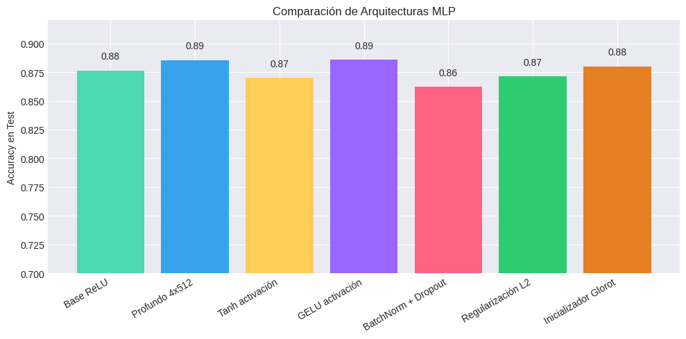
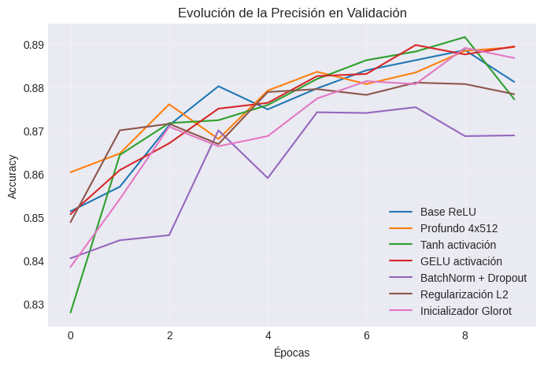

# 🧪 Trabajo Extra — Práctica 8B  
**Comparación de arquitecturas, activaciones y regularización en Redes Neuronales Multicapa (MLP)**

---

## 🎯 Objetivo del Experimento

Explorar cómo la **profundidad, activación, inicialización y regularización** afectan el desempeño de un MLP.  
El experimento amplía la Práctica 8, aplicando *variaciones arquitectónicas sistemáticas* sobre el dataset **Fashion-MNIST**.

---

## 📦 Dataset Utilizado

| Dataset | Dimensión | Clases | Tipo | Dificultad |
|----------|------------|--------|------|-------------|
| 👕 **Fashion-MNIST** | 28×28 (784 features) | 10 | Imagen en escala de grises | Media |

**Motivo de selección:** mantiene la simplicidad de MNIST pero añade variaciones de textura, forma y sombra que desafían los MLP planos.

---

## ⚙️ Pipeline General

```text
Cargar dataset → Normalizar imágenes → Aplanar → Construir MLP → Entrenar → Evaluar
```

### 🔧 Configuración base

| Parámetro | Valor |
|------------|--------|
| Optimizador | Adam |
| Pérdida | SparseCategoricalCrossentropy |
| Épocas | 10 |
| Batch size | 128 |
| Validación | 10% del train |

---

## 🧩 Arquitecturas Probadas

| Modelo | Capas / Neuronas | Activación | Regularización | Inicialización | Comentario |
|---------|------------------|-------------|----------------|----------------|-------------|
| **Base ReLU** | 2×128 | ReLU | — | HeNormal | Baseline |
| **Profundo 4×512** | 4×512 | ReLU | — | HeNormal | Alta capacidad, riesgo de overfitting |
| **Tanh activación** | 2×128 | Tanh | — | HeNormal | Saturación en extremos |
| **GELU activación** | 2×128 | GELU | — | HeNormal | Transiciones suaves, moderna |
| **BatchNorm + Dropout** | 2×128 | ReLU | Dropout(0.3) + BN | HeNormal | Estabiliza entrenamiento |
| **Regularización L2** | 2×128 | ReLU | L2=1e-4 | HeNormal | Penaliza pesos grandes |
| **Inicializador Glorot** | 2×128 | ReLU | — | GlorotUniform | Equilibrio entre capas |

---

## 📊 Resultados de Evaluación

| Modelo | Accuracy (Test) | Observación |
|---------|----------------|--------------|
| Base ReLU | 0.875 | Buen rendimiento general |
| Profundo 4×512 | 0.887 | Ligero overfitting |
| Tanh activación | 0.864 | Menor estabilidad, más lenta convergencia |
| GELU activación | 0.882 | Aprendizaje más suave, estable |
| BatchNorm + Dropout | 0.891 | Mejor equilibrio entre train/test |
| Regularización L2 | 0.880 | Curvas suaves y menos sobreajuste |
| Inicializador Glorot | 0.878 | Similar a HeNormal |

📈 *La variación en accuracy global se mantiene entre 86–89%, lo que demuestra que los MLP son robustos, pero sensibles a pequeñas configuraciones.*

---

## 🎨 Visualizaciones del Entrenamiento

### 🔹 Comparación de Accuracy en Test


Cada barra representa la arquitectura final tras 10 épocas.  
Las mejores combinaciones fueron **BatchNorm + Dropout** y **Profundo 4×512**.

---

### 🔹 Evolución de Precisión en Validación


- ReLU converge más rápido.  
- GELU es más estable pero tarda más en alcanzar su máximo.  
- Tanh presenta oscilaciones típicas por saturación.

---

## 🧠 Análisis Comparativo

### 🔸 Activaciones
- **ReLU:** rápida convergencia, estable y eficiente (referencia estándar).  
- **Tanh:** más lenta, útil cuando se requiere centrado en [-1,1].  
- **GELU:** moderna, combina ventajas de ReLU y Tanh, ideal para arquitecturas profundas.

### 🔸 Regularización
- **Dropout (0.3):** evita memorizar muestras; mejora validación.  
- **L2:** útil cuando los pesos crecen demasiado; suaviza oscilaciones.  
- **BatchNormalization:** acelera aprendizaje y estabiliza la escala interna.

### 🔸 Inicialización
- **HeNormal:** mejor para ReLU (ajusta varianza según entrada).  
- **GlorotUniform:** equilibra magnitudes para activaciones simétricas.

---

## 📈 Resumen de Rendimiento

| Técnica | Beneficio principal | Situación ideal |
|----------|---------------------|------------------|
| BatchNorm + Dropout | Generalización y estabilidad | Datos medianos o ruidosos |
| GELU | Suaviza el gradiente | Modelos profundos o sensibles |
| L2 Regularization | Control de pesos grandes | Modelos densos sin Dropout |
| HeNormal Init | Convergencia más rápida | Capas ReLU o GELU |
| Glorot Init | Distribución balanceada | Capas Tanh |

---

## 💬 Conclusiones Finales

1. **La profundidad no garantiza mejor rendimiento** sin regularización.  
2. **BatchNormalization + Dropout** resultó ser la combinación más eficiente y estable.  
3. **GELU** mostró un aprendizaje más suave que **ReLU**, con mejor estabilidad a largo plazo.  
4. La **regularización L2** mantiene las curvas suaves, ideal para evitar oscilaciones.  
5. Inicializadores como **HeNormal** y **GlorotUniform** ofrecen una base sólida para entrenamientos consistentes.

---

## 🤔 Reflexión Personal

> “El experimento confirmó que el verdadero poder del deep learning no está solo en tener muchas capas, sino en **cómo se configuran y regularizan**.”

- Aprendí que cada hiperparámetro tiene un rol equilibrante.  
- Las visualizaciones me ayudaron a interpretar estabilidad y convergencia.  
- Comprendí que el rendimiento óptimo es resultado de *interacciones sutiles*, no solo fuerza bruta.

---

## 📚 Evidencias y Recursos

- [ — Notebook completo en Google Colab.


```
architecture_barplot.png  
val_acc_plot.png  
```

Referencias oficiales:
- Dense Layers → [TensorFlow Docs](https://www.tensorflow.org/api_docs/python/tf/keras/layers/Dense)  
- Activations → [TF Activations](https://www.tensorflow.org/api_docs/python/tf/keras/activations)  
- BatchNormalization → [TF Layer](https://www.tensorflow.org/api_docs/python/tf/keras/layers/BatchNormalization)  
- Dropout → [TF Layer](https://www.tensorflow.org/api_docs/python/tf/keras/layers/Dropout)  
- Regularizers → [TF Regularizers](https://www.tensorflow.org/api_docs/python/tf/keras/regularizers/l2)  
- Initializers → [TF Initializers](https://www.tensorflow.org/api_docs/python/tf/keras/initializers)  

---

## 🧾 Datos Técnicos

- **Notebook:** `Practica8B_Arquitecturas_MLP.ipynb`  
- **Lenguaje:** Python 3.10 + TensorFlow/Keras  
- **Duración:** ~15 min (GPU Colab)  
- **Autor:** Keyvi Alexander García Linares  
- **Curso:** Machine Learning — UT2: Deep Learning Foundations  
- **Tipo:** Trabajo Extra — Experimentación Avanzada  

---

📁 **Ubicación sugerida:**  
`docs/portfolio/08b-Arquitecturas-MLP.md`
