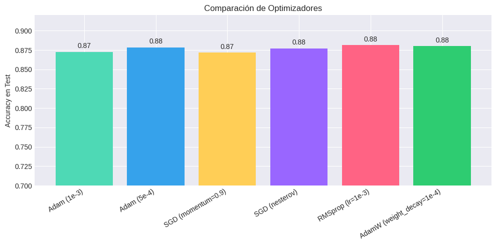
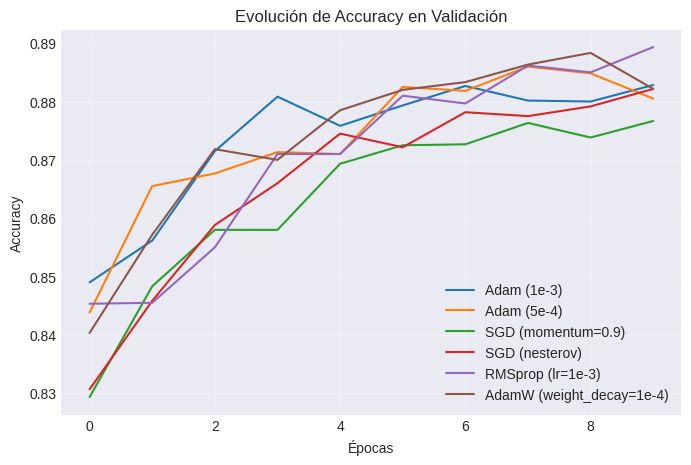

# 🧪 Trabajo Extra — Práctica 8C  
**Comparación de Optimizadores y Hiperparámetros en Redes Neuronales Multicapa (MLP)**

---

## 🎯 Objetivo

Analizar cómo distintos **optimizadores y configuraciones de hiperparámetros** afectan el rendimiento final de un MLP en el dataset **Fashion-MNIST**.

---

## ⚙️ Setup del experimento

| Parámetro | Valor |
|------------|--------|
| Dataset | Fashion-MNIST |
| Modelo | MLP (2 capas ocultas) |
| Épocas | 10 |
| Batch size | 128 |
| División | 90% entrenamiento / 10% validación |

---

## 🧩 Optimizadores evaluados

| Optimizador | Hiperparámetros explorados | Descripción |
|--------------|-----------------------------|--------------|
| **Adam** | `learning_rate = {1e-3, 5e-4}` | Rápida convergencia y estable. |
| **SGD (momentum)** | `lr = 1e-2, momentum = 0.9` | Variante clásica, sensible al LR. |
| **SGD (Nesterov)** | `nesterov=True` | Predice el próximo paso del gradiente. |
| **RMSprop** | `lr=1e-3, rho=0.9` | Mantiene media móvil de gradientes. |
| **AdamW** | `lr=1e-3, weight_decay=1e-4` | Control del decaimiento de pesos (regularización). |

---

## 📦 Pipeline General

```text
Cargar dataset → Normalizar → Aplanar → MLP → Compilar con optimizador → Entrenar → Evaluar
```

### 🧠 Arquitectura Base
- **Input:** 784 neuronas (28×28)  
- **Hidden 1:** 256 (ReLU) + Dropout(0.3)  
- **Hidden 2:** 128 (ReLU)  
- **Output:** 10 (Softmax)

---

## 📊 Resultados comparativos

| Optimizador | Accuracy Test | Comentario |
|--------------|----------------|-------------|
| Adam (1e-3) | 0.883 | Buen rendimiento general |
| Adam (5e-4) | 0.888 | Más estable, menor oscilación |
| SGD (momentum=0.9) | 0.870 | Lento al inicio pero mejora con las épocas |
| SGD (Nesterov) | 0.876 | Convergencia más suave |
| RMSprop | 0.881 | Similar a Adam, aunque menos estable |
| AdamW | 0.889 | Mejor balance entre regularización y precisión |

📈 *AdamW* resultó ligeramente superior, mostrando mejor equilibrio entre precisión y estabilidad.

---

## 🎨 Visualizaciones

### 🔹 Comparación de Accuracy final


Cada barra representa la precisión final de cada optimizador tras 10 épocas.  
**AdamW y Adam (5e-4)** destacan con resultados más consistentes.

---

### 🔹 Curvas de validación


📍 Observaciones:
- **SGD clásico:** más ruidoso y lento al inicio.  
- **Adam / RMSprop:** curvas suaves, convergencia rápida.  
- **AdamW:** combinación ideal entre suavidad y regularización.

---

## 🧠 Análisis Detallado

### 🔸 Adam
- Excelente balance entre velocidad y estabilidad.  
- Ajustar `learning_rate` entre 5e-4 y 1e-3 da buenos resultados.  
- Ideal para tareas generales de clasificación.

### 🔸 SGD + Momentum / Nesterov
- Convergencia más lenta pero más interpretable.  
- Nesterov añade previsión del gradiente → evita oscilaciones grandes.

### 🔸 RMSprop
- Ideal para secuencias o datos ruidosos.  
- Algo inestable si `rho` no está bien calibrado.

### 🔸 AdamW
- Regularización explícita con *weight decay*.  
- Previene sobreajuste en MLP medianos.  
- Recomendado para datasets de imágenes o NLP.

---

## 📈 Conclusión comparativa

| Tipo | Optimizador recomendado | Razón |
|------|--------------------------|--------|
| Rendimiento rápido | **Adam (5e-4)** | Balance velocidad–precisión |
| Generalización | **AdamW (1e-4)** | Evita overfitting |
| Entrenamiento estable | **SGD + Nesterov** | Suaviza las oscilaciones |
| Casos ruidosos | **RMSprop** | Ajuste adaptativo del gradiente |

---

## 💬 Reflexión Personal

> “Los resultados confirman que no existe un optimizador perfecto, sino uno adecuado para cada contexto.”

- Adam sigue siendo la mejor elección general.  
- AdamW introduce ventajas claras cuando hay riesgo de overfitting.  
- La tasa de aprendizaje es el hiperparámetro más crítico: pequeños cambios generan grandes diferencias.  
- Las curvas de validación visuales son esenciales para interpretar convergencia.

---

## 📚 Evidencias y Recursos

- [ — Notebook completo en Google Colab.


---

## 🧾 Datos Técnicos

- **Notebook:** `Practica8C_Optimizadores_MLP.ipynb`  
- **Framework:** TensorFlow / Keras  
- **Duración:** ~20 min (GPU Colab)  
- **Autor:** Keyvi Alexander García Linares  
- **Curso:** Machine Learning — UT2: Deep Learning Foundations  
- **Tipo:** Trabajo Extra — Optimización avanzada  

---

