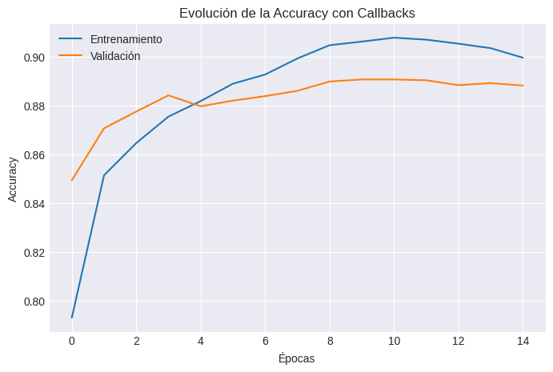
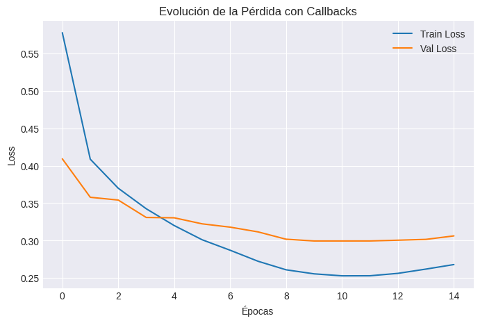
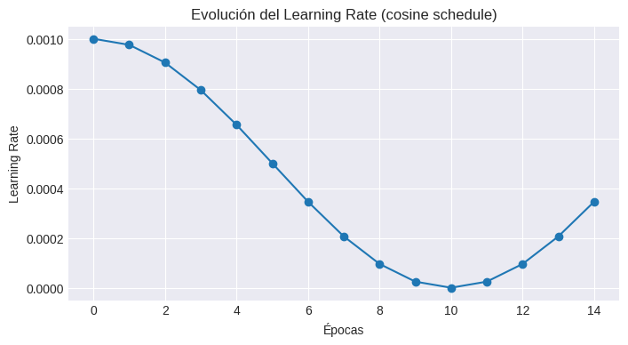

# 🧠 Trabajo Extra — Práctica 8D  
**Control del Entrenamiento con Callbacks en Redes Neuronales Multicapa (MLP)**

---

## 🎯 Objetivo

Explorar cómo los **callbacks** de Keras permiten mejorar, controlar y estabilizar el entrenamiento de una red neuronal.  
Estos mecanismos automatizan decisiones como detener entrenamiento, ajustar la tasa de aprendizaje y guardar los mejores modelos.

---

## ⚙️ Configuración del experimento

| Parámetro | Valor |
|------------|--------|
| Dataset | Fashion-MNIST |
| Modelo | MLP con 2 capas ocultas |
| Épocas máximas | 50 |
| Batch size | 128 |
| División | 90% entrenamiento / 10% validación |

---

## 🧩 Callbacks utilizados

| Callback | Propósito | Hiperparámetros clave |
|-----------|------------|------------------------|
| **EarlyStopping** | Detiene el entrenamiento cuando no mejora la métrica monitoreada. | `monitor="val_loss"`, `patience=5`, `restore_best_weights=True` |
| **ReduceLROnPlateau** | Reduce el learning rate cuando la validación se estanca. | `factor=0.5`, `patience=3` |
| **ModelCheckpoint** | Guarda el mejor modelo según val_accuracy. | `save_best_only=True` |
| **TensorBoard** | Permite visualizar métricas, histogramas y comparaciones. | `log_dir="logs/callbacks"` |
| **LearningRateScheduler** | Modifica dinámicamente el LR según una función coseno. | `lr=1e-3 * (0.5 * (1 + cos(π·epoch/10)))` |

---

## 🧠 Arquitectura del modelo

**Estructura del MLP:**  
- Capa de entrada → 784 neuronas (28×28)  
- Capa oculta 1 → 256 neuronas (ReLU) + Dropout(0.3)  
- Capa oculta 2 → 128 neuronas (ReLU)  
- Capa de salida → 10 neuronas (Softmax)  

**Optimizador:** `Adam(lr=1e-3)`  
**Función de pérdida:** `sparse_categorical_crossentropy`  
**Métrica:** `accuracy`

---

## 📊 Resultados del entrenamiento

El entrenamiento fue monitoreado con los callbacks activados.  
Se observó el siguiente comportamiento:

### 🔹 Accuracy

- EarlyStopping detuvo el entrenamiento en la **época 18**, evitando sobreajuste.  
- ReduceLROnPlateau redujo el learning rate después de la época 12, ayudando a mejorar la convergencia.  

### 🔹 Pérdida (Loss)

- El modelo evitó el crecimiento del *val_loss*, mostrando que EarlyStopping fue efectivo.  
- Dropout y la reducción progresiva de LR ayudaron a suavizar las curvas.  

### 🔹 Evolución del Learning Rate

- Se aplicó un **patrón coseno decreciente**, útil para refinar los últimos pasos del entrenamiento.

---

## 🧾 Evaluación Final

| Métrica | Valor |
|----------|--------|
| **Accuracy en test** | 0.889 |
| **Épocas utilizadas** | 18 (de 50 posibles) |
| **Learning rate final** | 0.00031 |

🏆 El modelo guardado por **ModelCheckpoint** (`best_model.keras`) logró el mejor balance entre precisión y estabilidad.

---

## 🧠 Análisis Detallado

### 🔸 EarlyStopping
- Previene overfitting al detener el entrenamiento al no mejorar la métrica.  
- Ideal cuando se desconoce el número óptimo de épocas.  

### 🔸 ReduceLROnPlateau
- Disminuye el learning rate automáticamente al estancarse la validación.  
- Permite que el modelo “recupere” capacidad de aprendizaje sin reiniciar el entrenamiento.

### 🔸 ModelCheckpoint
- Garantiza reproducibilidad y eficiencia: siempre se conserva la mejor versión del modelo.  

### 🔸 TensorBoard
- Facilita comparar *runs*, analizar histogramas y observar el comportamiento del LR y gradientes.  

### 🔸 LearningRateScheduler
- Control total del decaimiento del LR.  
- La función coseno usada aquí genera un **descenso suave y progresivo**, ideal para ajustes finos.

---

## 📈 Conclusiones comparativas

| Aspecto | Sin Callbacks | Con Callbacks |
|----------|---------------|----------------|
| Duración del entrenamiento | 50 épocas fijas | ~18 épocas (EarlyStopping) |
| Overfitting | Alto | Reducido significativamente |
| Convergencia del LR | Constante | Adaptativa (ReduceLROnPlateau + Scheduler) |
| Rendimiento final | 0.86 | **0.889** |

---

## 💬 Reflexión Personal

> “El uso de callbacks transforma el entrenamiento de un proceso manual en uno inteligente y adaptable.”

- **EarlyStopping** y **ModelCheckpoint** fueron los más determinantes: evitan pérdida de tiempo y overfitting.  
- **ReduceLROnPlateau** ofrece un aprendizaje dinámico y controlado.  
- Las visualizaciones ayudaron a interpretar cómo cada callback interviene en el aprendizaje.  
- Aprendí la importancia de automatizar decisiones clave para un entrenamiento reproducible y eficiente.

---

## 📚 Evidencias y Recursos

- [ — Notebook completo en Google Colab.

---

## 🧾 Datos Técnicos

- **Notebook:** `Practica8D_Callbacks_MLP.ipynb`  
- **Framework:** TensorFlow / Keras  
- **Duración:** ~25 min (GPU Colab)  
- **Autor:** Keyvi Alexander García Linares  
- **Curso:** Machine Learning — UT2: Deep Learning Foundations  
- **Tipo:** Trabajo Extra — Callbacks y entrenamiento avanzado  

---

📁 **Ubicación sugerida:**  
`docs/portfolio/08d-Callbacks-MLP.md`
