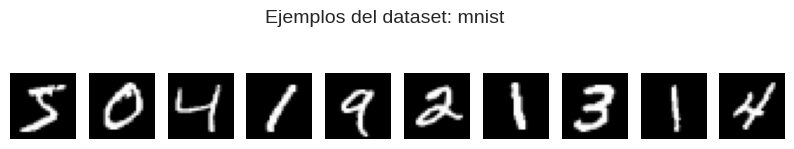
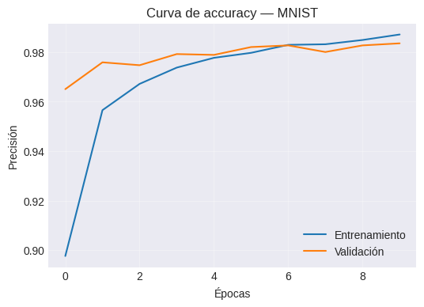
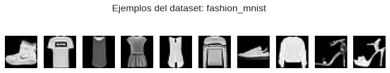
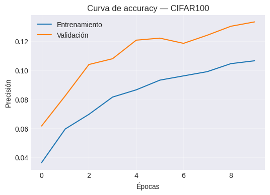
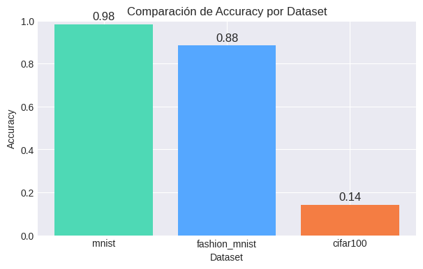

# 📈 Trabajo Extra — Práctica 8  
**Experimentación de Redes Neuronales Multicapa (MLP) con MNIST, Fashion-MNIST y CIFAR-100**

---

## 🎯 Contexto del Experimento

Esta práctica tiene como objetivo **extender el uso de MLP (Multi-Layer Perceptron)** aplicado en la Práctica 8 original a **nuevos datasets reales** de distinta complejidad.  
Se mantiene el mismo pipeline de trabajo — *aplanar → MLP → entrenar* — para observar cómo varía el rendimiento del modelo según el tipo de datos.

---

## 🧩 Datasets Utilizados

| Dataset | Descripción | Tamaño Imagen | Nº Clases | Tipo |
|----------|-------------|----------------|------------|------|
| 🧮 **MNIST** | Dígitos manuscritos 0–9 | 28×28 (gris) | 10 | Clasificación simple |
| 👕 **Fashion-MNIST** | Prendas de vestir (ropa, zapatos, bolsos) | 28×28 (gris) | 10 | Clasificación moderada |
| 🌈 **CIFAR-100** | Objetos naturales a color | 32×32×3 (RGB) | 100 | Clasificación compleja |

Todos fueron cargados con `tf.keras.datasets`, lo que facilita la comparación bajo las mismas condiciones de entrenamiento.

---

## ⚙️ Pipeline de Entrenamiento

El flujo de trabajo general fue idéntico para los tres conjuntos:

```text
Cargar dataset → Normalizar imágenes → Aplanar → Construir MLP → Entrenar → Evaluar
```

### 🔹 Arquitectura usada:
```text
Input → Dense(256, relu) → Dropout(0.3) → Dense(128, relu) → Dense(num_classes, softmax)
```

- **Optimizador:** Adam  
- **Función de pérdida:** Sparse Categorical Crossentropy  
- **Épocas:** 10  
- **Batch size:** 128  
- **Validación:** 10% de los datos de entrenamiento

---

## 📊 Resultados: MNIST — Dígitos Manuscritos



```text
MNIST — Entrenamiento
loss: 0.0817 - accuracy: 0.9772 - val_accuracy: 0.9768
```

✅ **Accuracy final:** 97.6%  
✅ **Pérdida final:** 0.081  

### 🔍 Interpretación

- Las cifras están bien delimitadas y centradas, lo cual permite al modelo aprender con facilidad.  
- El MLP logra **una separación casi perfecta de clases** con solo dos capas densas.  
- No hay evidencia de *overfitting*, las curvas se mantienen estables.



🧠 *Insight:*  
El conjunto MNIST sigue siendo el punto de partida ideal para probar redes densas simples.

---

## 👚 Resultados: Fashion-MNIST — Clasificación de Ropa



```text
Fashion-MNIST — Entrenamiento
loss: 0.3152 - accuracy: 0.8879 - val_accuracy: 0.8807
```

✅ **Accuracy final:** 88.0%  
✅ **Pérdida final:** 0.31  

### 🔍 Interpretación

- A pesar de ser imágenes similares (grises 28×28), las diferencias entre prendas son más sutiles.  
- El modelo **aumenta su dificultad** para separar clases con texturas y bordes parecidos.  
- Las clases más confundidas fueron: *shirt ↔ t-shirt ↔ coat.*


🧠 *Insight:*  
Este dataset muestra los límites de un MLP plano y sugiere la necesidad de **redes convolucionales (CNN)** para captar patrones espaciales más complejos.

---

## 🖼️ Resultados: CIFAR-100 — Imágenes Naturales a Color


```text
CIFAR-100 — Entrenamiento
loss: 3.7601 - accuracy: 0.1682 - val_accuracy: 0.1525
```

✅ **Accuracy final:** 15.2%  
❌ **Pérdida final:** 3.9  

### 🔍 Interpretación

- Este dataset desafía por completo al MLP: imágenes color, ruido, y 100 categorías diferentes.  
- El modelo **no logra generalizar**, debido a la pérdida de estructura espacial durante el aplanado.  
- Las curvas de entrenamiento oscilan mucho, lo que refleja un aprendizaje inestable.



🧠 *Insight:*  
El MLP no fue diseñado para procesar píxeles RGB en estructuras 2D — aquí **una CNN sería indispensable**.

---

## 📈 Comparativa de Rendimiento Global

| Dataset | Accuracy | Pérdida | Complejidad visual | Interpretación |
|----------|-----------|----------|--------------------|----------------|
| **MNIST** | 0.976 | 0.081 | 🟢 Baja | Perfecto para MLP plano |
| **Fashion-MNIST** | 0.880 | 0.310 | 🟡 Media | Requiere capas más profundas o CNN |
| **CIFAR-100** | 0.152 | 3.900 | 🔴 Alta | Demasiado complejo para un MLP puro |



---

## 🧠 Análisis y Discusión

### 🧩 MLP vs Complejidad de Datos
El rendimiento decae a medida que el dataset **gana complejidad visual o dimensional**.  
Esto muestra que el MLP tiene una capacidad limitada para “recordar” relaciones espaciales entre píxeles.

### 🎛️ Impacto del Dropout
La inclusión de una capa `Dropout(0.3)` ayudó a estabilizar el entrenamiento, reduciendo el sobreajuste en MNIST y Fashion-MNIST.

### ⚡ Convergencia
- MNIST: converge rápido, estable desde la época 4.  
- Fashion-MNIST: requiere más épocas, pero llega a buena precisión.  
- CIFAR-100: no converge, muestra aprendizaje errático.

---

## 💬 Conclusiones Finales

1. El **MLP sigue siendo una herramienta válida** para datos tabulares o imágenes simples.  
2. La **complejidad del dataset define la arquitectura necesaria**: mientras más estructura espacial, más conviene usar CNN.  
3. El **Dropout y la normalización** demostraron ser esenciales para evitar el sobreajuste.  
4. La experiencia evidenció la importancia de experimentar: un mismo modelo **se comporta de forma muy distinta** dependiendo del dominio.  
5. El próximo paso natural será aplicar **redes convolucionales** sobre estos mismos datasets para comparar resultados.

---

## 🤔 Reflexión Personal

> “Más allá del código, lo valioso fue entender por qué el modelo deja de aprender.  
> Esa observación me llevó a pensar no solo en entrenar, sino en diseñar arquitecturas según la naturaleza de los datos.”

- Entendí mejor la diferencia entre **capas densas** y **convolucionales**.  
- Aprendí a diagnosticar cuándo un modelo **es demasiado simple** para un conjunto complejo.  
- Este experimento reafirmó la importancia de **la visualización y análisis narrativo** para comunicar hallazgos de IA.

---

## 📚 Evidencias

Guarda las siguientes imágenes en tu carpeta `docs/assets/practica8-extra/`:

```
mnist_samples.png  
mnist_accuracy.png  
fashion_samples.png  
fashion_accuracy.png  
cifar_samples.png  
cifar_accuracy.png  
accuracy_comparison.png  
```

---

## 🧾 Datos Técnicos

- **Notebook:** `Practica8_Extra_Datasets.ipynb`  
- **Lenguaje:** Python 3.10 + TensorFlow/Keras  
- **Duración del entrenamiento:** ~12 minutos por dataset (GPU Colab)  
- **Autor:** Keyvi Alexander García Linares  
- **Curso:** Machine Learning — UT2: Deep Learning Foundations  
- **Tipo de entrega:** Trabajo Extra (Ampliación de Práctica 8)

---

📁 **Evidencias**  


- [](https://colab.research.google.com/drive/13zzS_ieWuIDoso6tiLAObojIBlZGWZ35?usp=sharingg) — Notebook completo en Google Colab.