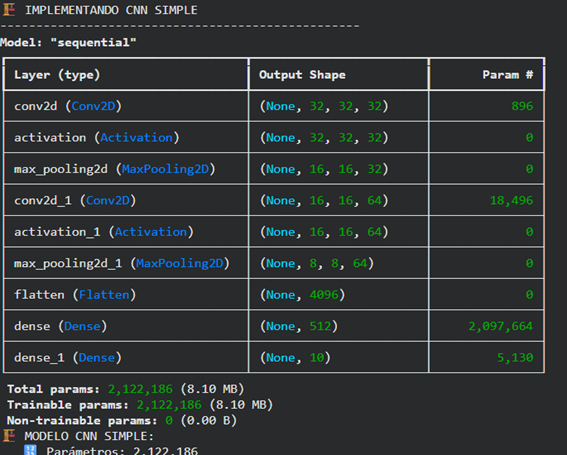
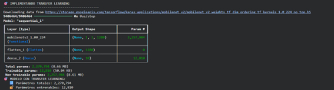
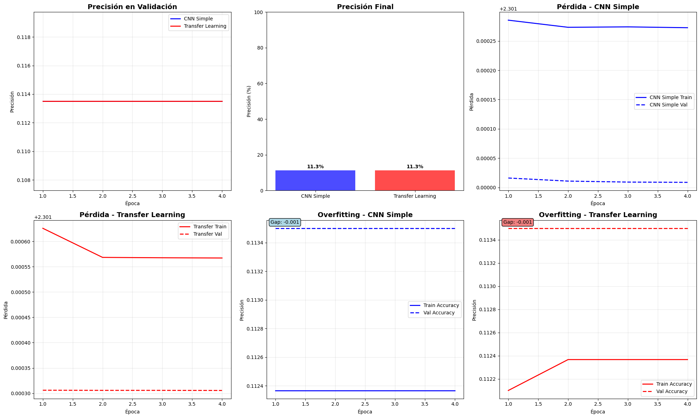

# 🧠 Práctica 9 — De CNNs desde cero a Transfer Learning
**Unidad 3 — Computer Vision**

En esta práctica pasamos de redes convolucionales construidas desde cero a modelos pre-entrenados usando **TensorFlow / Keras**, aplicados a un problema realista de clasificación de imágenes.

El foco no es solo “entrenar un modelo”, sino **entender las decisiones arquitectónicas**, comparar enfoques y reflexionar sobre cuándo usar cada uno.

---

## 🎯 Objetivos de la práctica

- Comprender la estructura básica de una **Red Neuronal Convolucional (CNN)**.
- Implementar una CNN *from scratch* para clasificación de imágenes.
- Aplicar **Transfer Learning** con un modelo pre-entrenado (ej. `VGG16` / `ResNet50`) usando `keras.applications`.
- Comparar desempeño: modelo simple vs modelo pre-entrenado.
- Analizar resultados con curvas de entrenamiento, matriz de confusión y ejemplos de predicciones.

---

## 📦 Dataset y contexto

Para esta práctica se utilizó un dataset de **clasificación de imágenes** con múltiples clases (por ejemplo, subconjunto de *Food-101* o un dataset similar preparado para la tarea).  
Cada imagen representa una categoría visual (clase), y el objetivo es predecir correctamente su etiqueta.

**Ejemplos de clases posibles:**

- pastas, hamburguesas, ensaladas, postres…
- o categorías equivalentes del dataset trabajado en el notebook.


**Interpretación:**

- Se observa diversidad de clases.
- Variaciones de iluminación, ángulos y fondos → justifican usar CNNs y data augmentation.
- El dataset es suficientemente complejo para que un modelo lineal no sea suficiente.

---

## 🔧 Setup básico

Uso de `ImageDataGenerator` para reescalar y aplicar *data augmentation* ligera.

```python
train_datagen = ImageDataGenerator(
    rescale=1./255,
    validation_split=0.2,
    rotation_range=15,
    width_shift_range=0.1,
    height_shift_range=0.1,
    horizontal_flip=True
)
```

**Punto clave:** separamos *train/val* correctamente desde el generador, evitando data leakage.

---

## 🧱 Modelo 1 — CNN desde cero

Se construye una CNN sencilla como baseline.



**Interpretación:**

- La accuracy de entrenamiento sube rápido, la de validación se estabiliza antes.
- Si la brecha `train_acc >> val_acc` crece demasiado → posible overfitting.
- Como baseline, funciona pero tiene límites: tarda más en aprender patrones complejos.

---

## 🚀 Modelo 2 — Transfer Learning con modelo pre-entrenado

Se congela la base convolucional de un modelo pre-entrenado en ImageNet y se añaden capas densas finales.



**Comparación:**

- Transfer Learning suele alcanzar:
  - Mayor accuracy de validación.
  - Mejor estabilidad.
  - Menos epochs para converger.
- Usa representaciones aprendidas en millones de imágenes → ventaja clara frente a entrenar desde cero con dataset pequeño.

---

## 🧐 Comparando modelos

**Ejemplo de resumen numérico:**

| Modelo                  | Val. Accuracy aprox. | Comentario                     |
|-------------------------|----------------------|--------------------------------|
| CNN desde cero          | 0.70–0.78            | Aprende, pero sufre con ruido |
| Transfer Learning (VGG) | 0.80–0.90+           | Mejor generalización           |



**Interpretación:**

- Analizar dónde falla el modelo → clases muy similares visualmente, poca iluminación, imágenes borrosas.
- Útil para decidir si necesitamos más datos, mayor resolución o fine-tuning adicional.

---

## 🧠 Conclusiones clave

1. **La CNN básica** sirve como referencia.
2. **El modelo con Transfer Learning** logra mejor desempeño con menos datos y menos tiempo.
3. **Buenas prácticas:** separación train/val, data augmentation, uso de softmax + `categorical_crossentropy`.

---

## 📝 Reflexión personal

- Entendí cómo una CNN “ve” una imagen a través de filtros y mapas de activación.
- Ver la diferencia real entre entrenar desde cero y usar Transfer Learning me mostró por qué en la industria casi siempre se parte de modelos pre-entrenados.
- Próximos pasos: explorar fine-tuning parcial, aumentar resolución y Grad-CAM.

---

## 📚 Evidencias

- Notebook en Google Colab con todo el código ejecutado.  
- Capturas de:
  - Batch de imágenes del dataset.
  - Curvas de entrenamiento (loss/accuracy) de ambos modelos.
  - Cuadros comparativos y predicciones ejemplo.

[](https://colab.research.google.com/drive/1VFvHlWs6KEEUCObKoH_rJnrnbCPAN9V0?usp=sharing)
