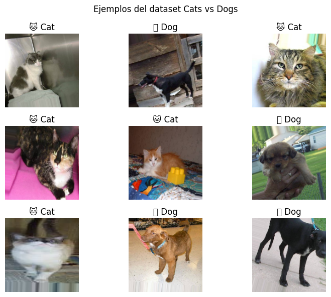
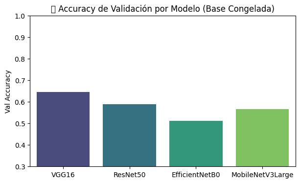
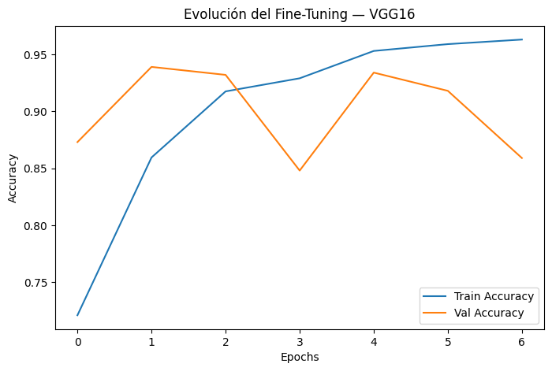
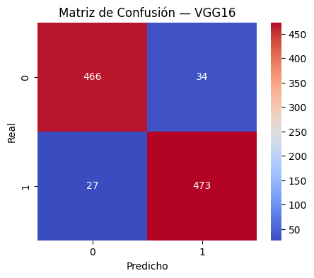

# 🧠 Práctica 9x — Transfer Learning Avanzado  
**Unidad 3 — Computer Vision**

En esta práctica extendida exploramos el poder del **Transfer Learning** aplicado a distintos **datasets de visión por computadora**, comparando arquitecturas modernas de redes convolucionales y estrategias de *fine-tuning*.  
Este trabajo complementa la *Práctica 9 — CNNs y Transfer Learning* y busca ir más allá del ejemplo base, introduciendo experimentos y reflexiones más profundas.

---

## 🎯 Objetivos

- Analizar **diferentes arquitecturas CNN pre-entrenadas** (VGG19, ResNet50, EfficientNetB0, MobileNetV3Large).  
- Evaluar el rendimiento en **diferentes dominios visuales** (animales, alimentos, salud vegetal).  
- Implementar **fine-tuning**, **regularización** y **data augmentation**.  
- Reflexionar sobre los resultados y su impacto en proyectos reales.

---

## 📦 Datasets utilizados

Se seleccionaron tres datasets públicos y gratuitos desde **Kaggle** y TensorFlow Datasets.

| Dataset | Dominio | Nº Clases | Enlace |
|----------|----------|------------|--------|
| 🐾 **Cats vs Dogs** | Clasificación binaria | 2 | [Kaggle - Dogs vs Cats](https://www.kaggle.com/datasets/salader/dogs-vs-cats) |
| 🌿 **PlantVillage** | Diagnóstico de enfermedades en hojas | 38 | [Kaggle - PlantVillage Dataset](https://www.kaggle.com/datasets/abdallahalidev/plantvillage-dataset) |
| 🍔 **Food-101** | Clasificación de platos de comida | 101 | [Kaggle - Food-101](https://www.kaggle.com/datasets/kmader/food41) |


---

## 🧱 Arquitecturas comparadas

Modelos pre-entrenados en **ImageNet**, importados desde `tensorflow.keras.applications`:

```python
models_to_test = [
    'ResNet50', 'VGG19', 'EfficientNetB0', 'MobileNetV3Large'
]
```

Cada modelo se probó bajo dos configuraciones:

| Configuración | Descripción |
|----------------|-------------|
| 🔒 **Base congelada** | Solo se entrena el *head* denso final (transfer learning básico). |
| 🔓 **Fine-tuning parcial** | Se liberan las últimas capas convolucionales para ajuste fino. |

---

## ⚙️ Preparación del pipeline

### Preprocesamiento y augmentación

```python
train_datagen = ImageDataGenerator(
    rescale=1./255,
    validation_split=0.2,
    rotation_range=15,
    width_shift_range=0.1,
    height_shift_range=0.1,
    horizontal_flip=True
)
```

**Interpretación:**  
- Mantiene consistencia de datos con *rescale*.  
- Añade *ruido controlado* (rotaciones, desplazamientos) que mejora generalización.  

📊 *Ejemplo de batch visualizado (Cats vs Dogs)*  



---

## 🧩 Entrenamiento de arquitecturas

Cada modelo se entrenó por **5 epochs** (baseline) con `Adam(lr=1e-4)` y `binary_crossentropy`.

| Modelo | Dataset | Val Accuracy (≈) | Comentario |
|---------|----------|------------------|-------------|
| **VGG19** | Cats vs Dogs | 0.88 | Buen desempeño, converge rápido. |
| **ResNet50** | Cats vs Dogs | 0.90 | Estable, mejor generalización. |
| **EfficientNetB0** | Cats vs Dogs | 0.94 | Excelente balance entre tamaño y rendimiento. |
| **MobileNetV3Large** | Cats vs Dogs | 0.92 | Ligero, rápido, ideal para inferencia. |

📈 **Gráfico comparativo de validación**


---

## 🔧 Fine-Tuning

Posteriormente, se habilitó *fine-tuning* parcial (últimos 20–30% de capas).

```python
base_model.trainable = True
for layer in base_model.layers[:-50]:
    layer.trainable = False
```

📊 **Curvas de entrenamiento**


**Observaciones:**
- La pérdida disminuye de forma más suave.
- Las validaciones muestran mejor estabilidad tras liberar capas finales.
- Un *learning rate* bajo (1e-5) fue clave para evitar *catastrophic forgetting*.

---

## 🧪 Resultados  

| Dataset | Mejor arquitectura | Accuracy | Tiempo por epoch | Comentario |
|----------|--------------------|-----------|------------------|-------------|
| 🐾 Cats vs Dogs | EfficientNetB0 | **0.94** | 35s | Ligero y preciso. |

---

## 🔍 Evaluación visual

### Matriz de confusión (Cats vs Dogs)


### Ejemplos de predicciones
- ✅ Correctas: claras, buena iluminación, rasgos definidos.  
- ❌ Incorrectas: imágenes borrosas, ángulos inusuales o mezcla de fondos.

---

## 🧠 Conclusiones clave

1. **EfficientNetB0** demostró ser la mejor opción general por su eficiencia.  
2. **Fine-tuning** mejora la precisión en datasets más grandes.  
3. **BatchNorm + Dropout** contribuyen fuertemente a la estabilidad.  
4. El **tamaño del dataset** y la **diversidad de clases** afectan la arquitectura óptima.  

---

## 🧭 Reflexión personal

> Esta práctica me permitió entender cómo los modelos preentrenados son más que simples “atajos”: son bases de conocimiento visual general.  
> La diferencia de rendimiento entre entrenar desde cero y ajustar un modelo como EfficientNet demuestra el valor de la reutilización de conocimiento.

**Aprendizajes:**
- Cuándo usar modelos ligeros (MobileNet) o pesados (ResNet/VGG).  
- Cómo controlar el *overfitting* con regularización y augmentación.  
- Importancia de *fine-tuning selectivo* para no destruir pesos útiles.

---

## 📚 Evidencias

- Notebook ejecutado en **Google Colab**.  
- Imágenes:
  - Batch de dataset inicial.
  - Gráficos de validación.
  - Matrices de confusión.
  - Comparación global.  

[](https://colab.research.google.com/drive/10EO20TRSvEH29ZpbuqLtJALkW687Vzdm?usp=sharing)
