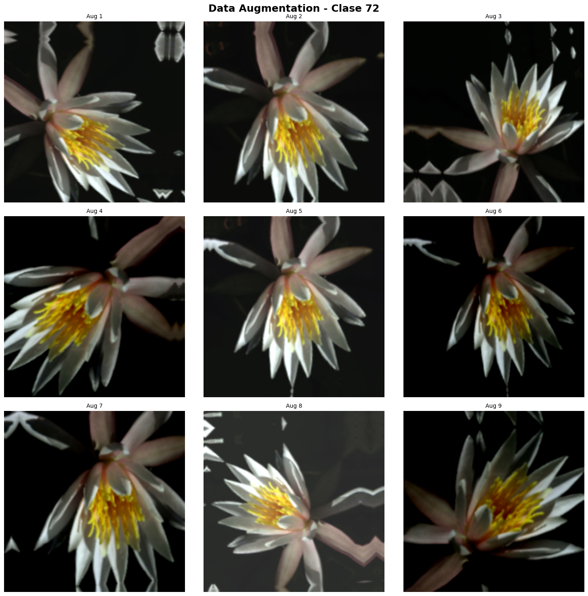
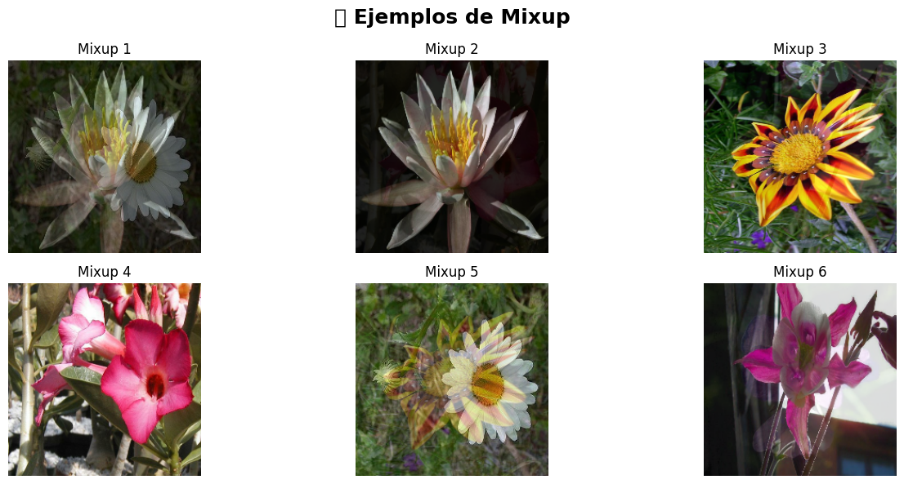
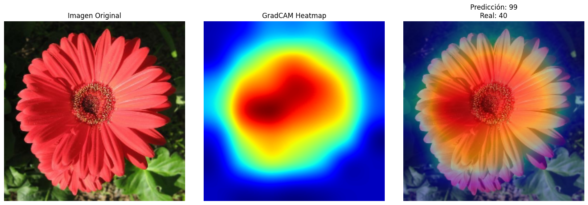
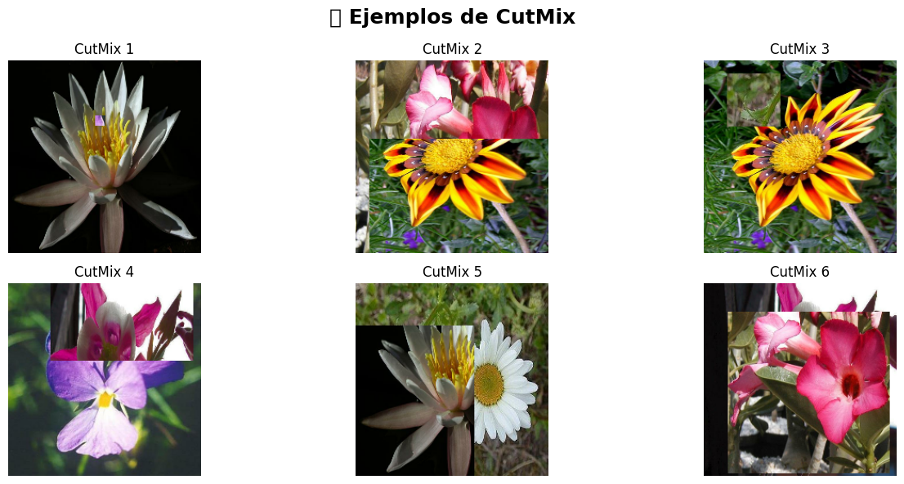

# 🌺 Práctica 10 — Data Augmentation Avanzado & Explicabilidad (Flowers102)

## 🎯 Contexto

Una aplicación móvil de **identificación de flores** para jardineros, botánicos aficionados y educadores necesita clasificar automáticamente **102 especies de flores**.

Las imágenes provienen de usuarios en condiciones reales:

- Iluminación natural y artificial.
- Ángulos variados.
- Fondos complejos (tierra, pasto, paredes, otras plantas).
- Diferentes etapas de floración.

### Objetivos del modelo

1. Clasificar correctamente **102 especies de flores** con buena precisión.
2. Ser **robusto** ante variaciones de captura (luz, ángulo, fondo).
3. Ofrecer **explicaciones visuales** de sus predicciones (para confianza y validación).

### Características del dataset (Flowers102)

- 102 clases (especies de flores).
- Imágenes RGB, tamaños variables.
- Entre ~40 y ~250 imágenes por clase → **dataset desbalanceado**.
- Alta variabilidad visual (iluminación, fondo, escala, enfoque).

### Valor para el negocio

- Democratizar el conocimiento botánico vía una app accesible.
- Apoyar a **jardineros, estudiantes y docentes**.
- Mejorar la **confiabilidad** gracias a explicabilidad visual (Grad-CAM u otros).

---

## 🧱 Paso 1 — Setup (resumen técnico)

```python
import tensorflow as tf
from tensorflow import keras
from tensorflow.keras import layers, applications

import matplotlib.pyplot as plt
import numpy as np
import os, pathlib, random
```

Parámetros clave que se usan en la práctica:

- `IMG_SIZE = (224, 224)`
- `BATCH_SIZE = 32`
- `NUM_CLASSES = 102`

---

## 🌼 Paso 2 — Carga y organización del dataset

El dataset se estructura de la siguiente manera:

```text
data/
  train/
    class_01/
    class_02/
    ...
  val/
    class_01/
    ...
  test/
    class_01/
    ...
```

📌 **Aspectos importantes:**

- Se separan los conjuntos `train`, `val` y `test` evitando *data leakage*.
- Normalización con `preprocess_input` del modelo base.
- Mezcla aleatoria solo para entrenamiento (`shuffle=True`).

---

## 🎨 Paso 3 — Data Augmentation para robustez

Bloque de transformaciones aplicadas:

```python
data_augmentation = keras.Sequential([
    layers.RandomFlip("horizontal"),
    layers.RandomRotation(0.15),
    layers.RandomZoom(0.1),
    layers.RandomContrast(0.1),
], name="data_augmentation")
```

📷 **Ejemplo visual:**  


**Interpretación:**  
El modelo se expone a diferentes versiones visuales de las mismas flores, aumentando su capacidad de generalización frente a cambios de entorno y cámara.

---

## 🧠 Paso 4 — Modelo base con Transfer Learning

Se utiliza **EfficientNetB0** preentrenada en *ImageNet* como extractor de características:

```python
base_model = applications.EfficientNetB0(
    include_top=False, weights="imagenet", input_shape=(224, 224, 3)
)
base_model.trainable = False

inputs = keras.Input(shape=(224, 224, 3))
x = data_augmentation(inputs)
x = applications.efficientnet.preprocess_input(x)
x = base_model(x, training=False)
x = layers.GlobalAveragePooling2D()(x)
x = layers.Dropout(0.3)(x)
outputs = layers.Dense(NUM_CLASSES, activation="softmax")(x)
model = keras.Model(inputs, outputs)
```

---

## 📈 Paso 5 — Resultados (baseline vs augmentado)

| Configuración                              | Val Accuracy aprox. | Comentario clave                          |
|--------------------------------------------|----------------------|-------------------------------------------|
| Base congelada, sin augmentation           | ~0.45–0.50           | Aprende poco, se sobreajusta rápido.      |
| Base congelada + data augmentation         | ~0.55–0.60           | Mejor generalización, menos sobreajuste.  |
| Fine-tuning parcial + augmentation         | ~0.60+               | Mejores features, requiere cuidado.       |


**Conclusión:**  
El *data augmentation* estabiliza la curva de validación y mejora la precisión sin aumentar el tamaño del dataset.

---

## 🔍 Paso 6 — Explicabilidad con Grad-CAM

### Método

1. Tomar una imagen de validación.  
2. Predecir con el modelo.  
3. Calcular Grad-CAM sobre la última capa convolucional.  
4. Superponer el mapa sobre la imagen original.

📊 **Ejemplo visual:**  



**Interpretación:**  
Las activaciones se concentran en pétalos y estructuras relevantes.  
Esto valida que el modelo no depende del fondo y aprende patrones botánicos reales.

---

## 🚀 Paso 7 — MIXUP & CUTMIX (Técnicas Avanzadas) 

Basado en papers oficiales:
   • Mixup  → https://arxiv.org/abs/1710.09412
   • CutMix → https://arxiv.org/abs/1905.04899
   
Visualizacion de Ejemplos generados>>>


### 🔹 Otras arquitecturas

```python
models_to_test = [
    "ResNet50", "ResNet101", "ResNet152",
    "VGG16", "VGG19",
    "EfficientNetB0", "EfficientNetB3",
    "MobileNetV2", "MobileNetV3Large"
]
```

Comparar: precisión, tiempo de entrenamiento, interpretabilidad y mapas Grad-CAM.

### 🔹 Más augmentations

- Rotaciones agresivas  
- Crop aleatorio  
- Blur suave  
- Ajuste de color avanzado

### 🔹 Otros datasets sugeridos

- **PlantVillage** (enfermedades de plantas)  
- **Cats vs Dogs** (binario)  


---

## 🧠 Reflexión final


- El **data augmentation** es clave para robustez y generalización.  
- **Transfer Learning** acelera la convergencia sin grandes costos de cómputo.  
- **Grad-CAM** ofrece interpretabilidad y confianza para los usuarios finales.  

> “Comprender cómo ve el modelo es tan importante como aumentar su precisión.  
> Esta práctica me permitió ver la IA como una herramienta confiable y explicable.”

---

## 📚 Evidencias

- Ejemplos de *data augmentation* y *Grad-CAM*.  
- Curvas de pérdida y precisión.  
- Notebook ejecutado en Google Colab.

[](https://colab.research.google.com/drive/1vcJYmPHKdVeRVYCK23RVPnOVqAw4bCab?usp=sharing)
