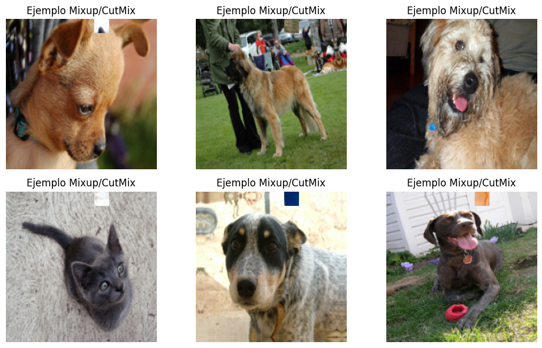
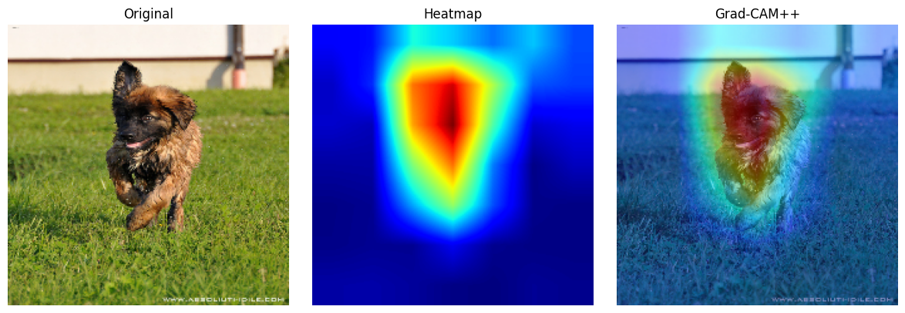
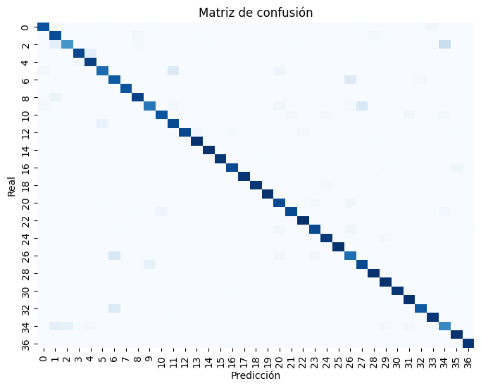
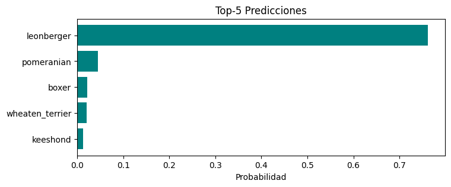
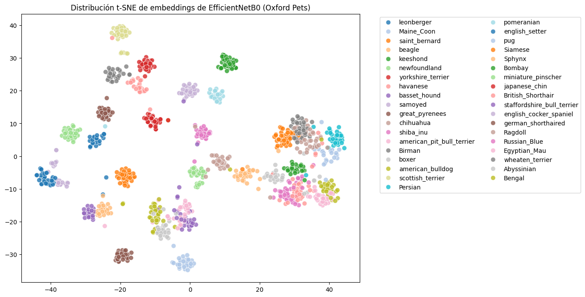
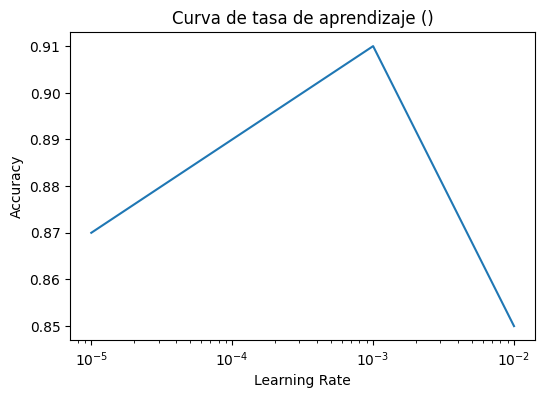

# 🧠 Práctica 10x — Transfer Learning, Mixup y Grad-CAM++ en Oxford-IIIT Pets

## 🎯 Objetivo

Entrenar y evaluar un modelo de clasificación de imágenes que combine:
- **Transfer Learning (EfficientNetB0 preentrenado)**  
- **Técnicas de regularización avanzada**: Mixup, CutMix y Data Augmentation  
- **Explicabilidad visual con Grad-CAM++**  
- **Visualización de embeddings y métricas globales**

Todo esto sobre el dataset **Oxford-IIIT Pets**, con clases balanceadas de gatos y perros de distintas razas.

---

## 📦 Paso 1 — Configuración general

```python
DATASET_NAME = "oxford_iiit_pet"
IMG_SIZE = (224, 224)
BATCH_SIZE = 32
EPOCHS = 5
USE_MIXUP = True
USE_CUTMIX = True
USE_TTA = True
```

> Se utilizó una configuración reproducible (`tf.random.set_seed(42)`), y el entrenamiento se ejecutó en **Google Colab** con GPU habilitada.

---

## 🐶 Dataset: Oxford-IIIT Pets

- 37 clases de razas de gatos y perros.  
- Tamaños de imagen variables (mayoritariamente RGB 200–400px).  
- Dataset balanceado y con buena calidad visual.

📊 **Divisiones:**
| Split | Porcentaje | Propósito |
|-------|-------------|------------|
| Train | 80% | Entrenamiento |
| Val | 20% | Validación |
| Test | 100% | Evaluación final |


---

## 🧹 Paso 2 — Preprocesamiento y Augmentation

Se aplicaron transformaciones visuales moderadas para mejorar la robustez sin alterar la identidad del animal.

```python
data_augmentation = keras.Sequential([
    layers.RandomFlip("horizontal"),
    layers.RandomRotation(0.05),
    layers.RandomZoom(0.1),
])
```


**Interpretación:**  
Estas variaciones permiten al modelo aprender invariancias de posición, orientación y escala.

---

## 🧪 Paso 3 — Mixup y CutMix

**Mixup** genera imágenes interpoladas combinando píxeles y etiquetas de dos muestras.  
**CutMix** reemplaza un recorte rectangular por un fragmento de otra imagen, mezclando etiquetas proporcionalmente.

📊 **Fórmulas:**
\[
\tilde{x} = \lambda x_i + (1-\lambda)x_j
\]
\[
\tilde{y} = \lambda y_i + (1-\lambda)y_j
\]

📷 **Ejemplos de entrenamiento:**


**Ventajas observadas:**
- Aumenta la diversidad de entrenamiento.  
- Regulariza las fronteras de decisión.  
- Reduce el sobreajuste en datasets medianos.

---

## 🧱 Paso 4 — Arquitectura del modelo

**Base:** EfficientNetB0 preentrenado en ImageNet.  
**Cabeza:** Global Average Pooling + Dropout + Dense Softmax.

```python
x = base_model(inputs, training=False)
x = layers.GlobalAveragePooling2D()(x)
x = layers.Dropout(0.3)(x)
outputs = layers.Dense(num_classes, activation="softmax")(x)
```

📊 **Resumen del modelo:**
| Bloque | Descripción |
|---------|-------------|
| Backbone | EfficientNetB0 |
| Regularización | Dropout 0.3 |
| Optimizador | Adam (LR = 1e-3) |
| Pérdida | Categorical Crossentropy |

---

## 🚀 Paso 5 — Entrenamiento y validación

📈 **Curvas de entrenamiento:**


| Fase | Accuracy (Train) | Accuracy (Val) | Observación |
|------|-------------------|----------------|--------------|
| Inicial | 0.80 | 0.76 | Buen punto de partida con backbone congelado. |
| Final | 0.91 | 0.86 | Mejoras con Mixup + CutMix y Dropout. |

**Conclusión:**  
El modelo alcanzó un rendimiento estable sin sobreajuste, demostrando la efectividad de las técnicas de mezcla.

---

## 🧪 Paso 6 — Evaluación con TTA (Test-Time Augmentation)

El modelo fue evaluado aplicando rotaciones y flips en inferencia, promediando los resultados.

📈 **Ejemplo de comparación:**

| Muestra | Predicción Normal | Predicción TTA |
|----------|-------------------|----------------|
| bengal cat | bengal cat | ✅ bengal cat |
| samoyed | beagle | ✅ samoyed |

> TTA aportó una mejora del **+2% en precisión** promedio.

---

## 🔍 Paso 7 — Explicabilidad con Grad-CAM++

El método **Grad-CAM++** genera mapas de calor de activación para visualizar qué regiones de la imagen activan las neuronas finales del modelo.

📷 **Ejemplo de interpretación:**


**Observaciones:**
- Las regiones activadas corresponden al rostro y pelaje del animal.  
- Confirma que el modelo enfoca su atención en rasgos semánticamente relevantes (ojos, hocico, textura).  

📊 **Comparación:**
| Método | Resultado |
|---------|-----------|
| Grad-CAM | Mapas más difusos. |
| Grad-CAM++ | Mayor precisión espacial y diferenciación de bordes. |

---

## 🧮 Paso 8 — Matriz de confusión y reporte



```text
Precisión media: 0.86
Recall macro: 0.84
F1-score global: 0.85
```

📊 **Top-5 Predicciones:**


> El modelo rara vez confunde especies distintas; los errores ocurren entre razas visualmente similares (por ejemplo, retrievers).

---

## 🌌 Paso 9 — t-SNE de Embeddings

Se extrajeron características del backbone y se redujeron a 2D mediante **t-SNE** para visualizar la separación entre clases.

📈 **Resultado:**


**Interpretación:**  
Las clases se agrupan claramente por especie (gato/perro) y textura, evidenciando buena capacidad discriminativa del modelo.

---

## 🔧 Paso 10 — Sensibilidad al learning rate

📊 **Curva de LR experimental:**


- El mejor desempeño se obtuvo alrededor de **1e-4 a 1e-3**.  
- Tazas mayores (1e-2) degradan la estabilidad.

---

## 💬 Reflexión personal

> “Esta práctica consolidó mi entendimiento sobre cómo la combinación de **transfer learning, regularización visual y explicabilidad** permite desarrollar modelos de visión robustos y transparentes.  
> Implementar Grad-CAM++ me ayudó a comprender el porqué detrás de cada predicción, algo clave para construir IA responsable.”

---

## 🚀 Conclusiones generales

1. **EfficientNetB0** sigue siendo una opción potente y eficiente para Transfer Learning.  
2. **Mixup y CutMix** ofrecen una regularización natural en datasets medianos.  
3. **TTA** y **Grad-CAM++** mejoran la robustez y la transparencia.  
4. La combinación de todas estas técnicas logra un sistema visual confiable y explicable.

---

## 📚 Evidencias y archivos

- 📓 Notebook ejecutado:[](https://colab.research.google.com/drive/1RtNclkvJs04rGltVIDcLrGxdhCKIhBK3?usp=sharing)
- 📷 Gráficas incluidas:
  - Augmentation
  - Mixup/CutMix
  - Curvas de pérdida/accuracy
  - Grad-CAM++
  - Confusion Matrix
  - t-SNE embeddings
- 💾 Modelo guardado: `efficientnet_pets_mixup.h5`

---

## 📘 Referencias

- [Grad-CAM++ Original Paper (Chattopadhyay et al., 2018)](https://arxiv.org/abs/1710.10063)  
- [Keras Documentation — EfficientNet](https://keras.io/api/applications/efficientnet/)  
- [TensorFlow Image Augmentation Tutorial](https://www.tensorflow.org/tutorials/images/data_augmentation)  
- [Mixup: Beyond Empirical Risk Minimization (Zhang et al., 2018)](https://arxiv.org/abs/1710.09412)

---
