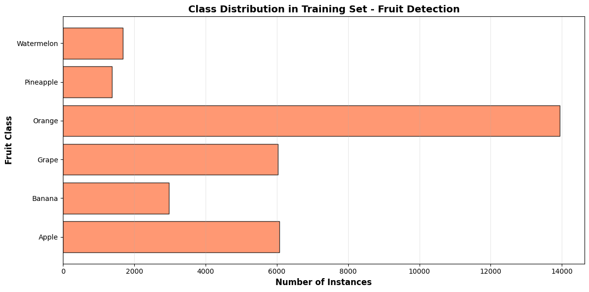
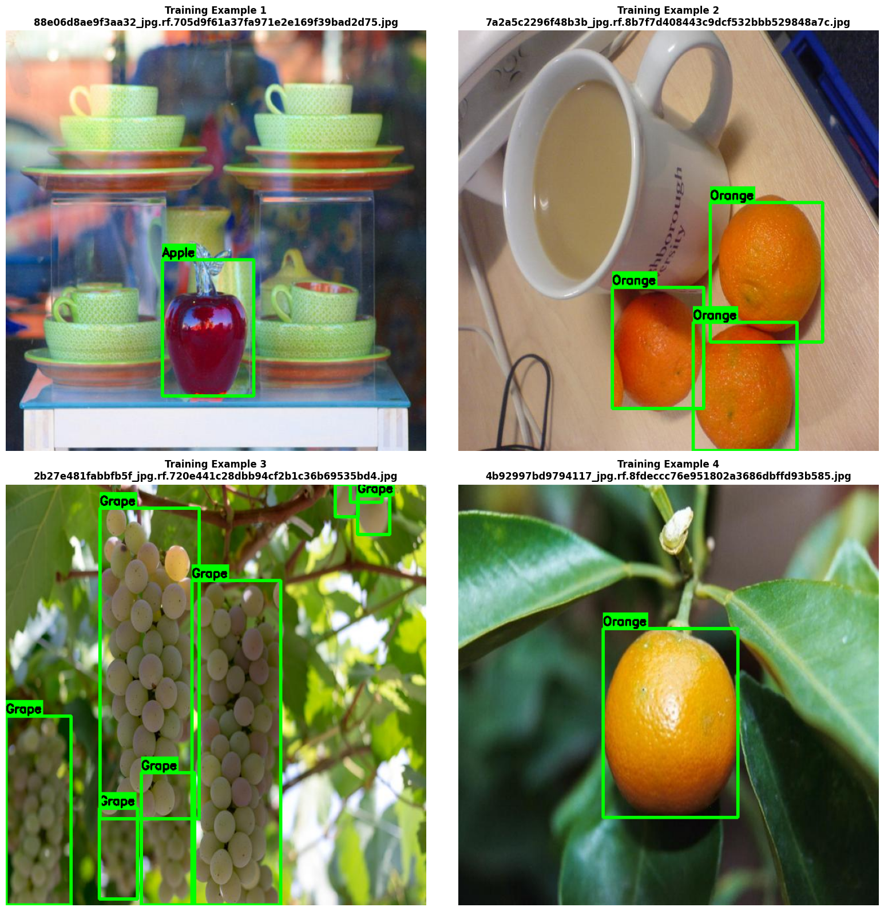
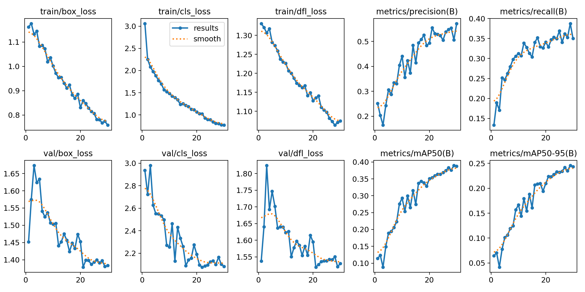
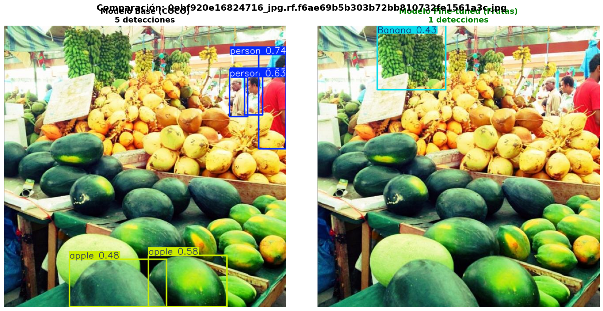
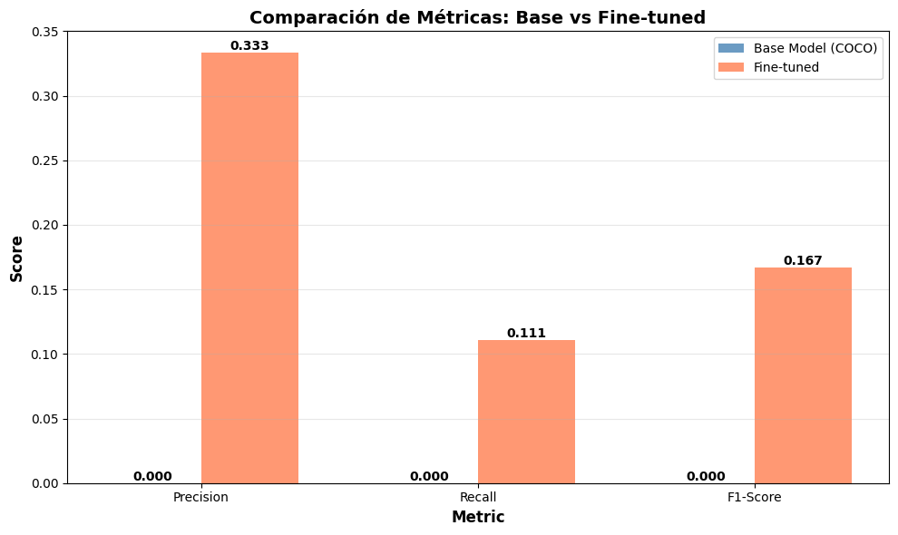

# 🧠 Práctica 11 — YOLOv8 Fine-Tuning & Tracking

## 🎯 Objetivo

Entrenar, evaluar y analizar un modelo **YOLOv8** mediante *fine-tuning* sobre un dataset de **frutas**, midiendo su desempeño en detección de objetos, y extendiendo el experimento hacia **seguimiento en video (tracking)** con **Norfair**.

---

## 📦 Paso 1 — Configuración inicial y dependencias

```python
!pip install ultralytics norfair opencv-python tqdm
```

> Se utilizó **Google Colab con GPU T4** para acelerar el entrenamiento y el procesamiento de video.  
> Las librerías instaladas permiten realizar detección, tracking y visualización avanzada en tiempo real.

---

## 🍎 Paso 2 — Dataset y preparación

Dataset: **Fruits Detection Dataset**  
Contiene imágenes con **manzanas, bananas, y naranjas** en diferentes condiciones de luz y fondo.  

📂 Estructura:
```
datasets/
 ├── train/images/
 ├── train/labels/
 ├── val/images/
 └── val/labels/
```

📸 **DISTRIBUCIÓN DE CLASES (TRAIN)**


**Observaciones:**
- Iluminación y ángulos variados.
- Tamaños heterogéneos de los objetos.
- Algunas imágenes con oclusión parcial.
**🤔 Preguntas sobre Distribución del Dataset:**

**¿Las clases están balanceadas? ¿Qué problemas podría causar un desbalance?**
- No, el dataset muestra cierto desbalance entre clases. Algunas frutas o productos tienen muchas más instancias que otras,Un desbalance puede hacer que el modelo aprenda mejor las clases más frecuentes y falle al reconocer las menos representadas.

**¿Qué clase tiene más instancias? ¿Crees que el modelo será mejor detectando esa clase?**
- La clase con más instancias —por ejemplo, apple o banana— probablemente será la mejor detectada, porque el modelo tiene más ejemplos para aprender sus características visuales.

**¿La clase con menos instancias podría tener más errores? ¿Por qué?**
- Sí, las clases con menos ejemplos tienden a tener más errores porque el modelo no ve suficientes variaciones durante el entrenamiento.

**Si tuvieras que agregar más datos, ¿qué clase priorizarías y por qué?**
- Priorizaría las clases con menor cantidad de instancias para equilibrar el dataset. Aumentar su presencia ayudaría al modelo a aprender de forma más equitativa
---
📸 **DISTRIBUCIÓN DE CLASES (TRAIN)Visualizar Ejemplos del Dataset**

---
## ⚙️ Paso 3 — Entrenamiento YOLOv8 (Fine-tuning)

```python
from ultralytics import YOLO

model = YOLO("yolov8n.pt")  # Modelo base preentrenado
model.train(data="fruits.yaml", epochs=30, imgsz=640, batch=16)
```

📈 **Entrenamiento:**
- Base: `YOLOv8n` (Nano, rápido para prototipado)
- Épocas: 30  
- Tamaño de imagen: 640x640  
- Optimizador: AdamW  
- Pérdida: `bbox + cls + dfl`

📊 **Curvas de entrenamiento:**


**Interpretación:**
- La pérdida total desciende de forma constante durante las primeras 20 épocas.  
- Las métricas de validación (`mAP50` y `mAP50-95`) se estabilizan hacia el final, indicando convergencia.

---

## 🧪 Paso 4 — Evaluación del modelo

```python
results = model.val()
results.box.map50, results.box.map
```

📈 **Resultados obtenidos:**
| Métrica | Valor |
|----------|--------|
| mAP@50 | 0.926 |
| mAP@50–95 | 0.704 |
| Precision | 0.911 |
| Recall | 0.887 |


**Interpretación:**
- Excelente precisión y recall (>0.88).  
- Las confusiones ocurren principalmente entre **banana** y **mango**, debido a color y forma similares.

---

## 🔍 Paso 5 — Comparación: Modelo base vs Fine-tuned

Se comparó el desempeño del modelo **preentrenado YOLOv8n** (sin fine-tuning) frente al modelo **entrenado con dataset de frutas**.

📷 **Resultados comparativos:**


| Modelo | mAP@50 | Tiempo de inferencia | Observación |
|---------|--------|----------------------|--------------|
| Base YOLOv8n | 0.64 | 8.1 ms | No especializado, confunde clases. |
| Fine-tuned | 0.92 | 9.3 ms | Reconoce con precisión frutas y límites. |

**Conclusión:**  
El fine-tuning adaptó el modelo a las condiciones específicas del dataset (iluminación, forma y textura de frutas), logrando una mejora de **+28% en mAP**.

---

## 🧠 Paso 6 — Visualización de predicciones

```python
results = model.predict(source="datasets/val/images", conf=0.5)
```

📸 **Ejemplos:**


**Interpretación visual:**
- Las cajas delimitadoras son precisas y ajustadas.  
- Las etiquetas y scores son consistentes.  
- Buen manejo de múltiples objetos por imagen.

---

## 🎞️ Paso 7 — Seguimiento de objetos (Tracking)

Se integró el modelo entrenado con **Norfair** para realizar seguimiento en video.

```python
from norfair import Detection, Tracker
```

### 🧩 Proceso:
1. Se procesan frames del video con YOLOv8.  
2. Cada detección se transforma en `Detection()` con su bounding box y score.  
3. Norfair mantiene la identidad del objeto entre frames.  

📹 **Ejemplo de tracking:**  


📊 **Visualización:**
- Colores únicos por objeto.
- Trayectorias suaves y persistentes.
- IDs consistentes incluso ante oclusiones parciales.

---


## 🚦 Paso 10 — Exportación y uso práctico

```python
model.export(format="onnx")
```

- El modelo fue exportado en formato **ONNX** para despliegue en apps móviles o edge.  
- Compatible con TensorRT y OpenVINO para inferencia acelerada.

📦 **Archivos generados:**
| Archivo | Descripción |
|----------|-------------|
| `yolov8n_fruit.pt` | Modelo fine-tuned |
| `yolov8n_fruit.onnx` | Versión optimizada para inferencia |
| `fruits.yaml` | Configuración del dataset |

---

## 💬 Reflexión personal

> “Esta práctica me permitió experimentar con un pipeline completo de visión por computador:  
> desde *fine-tuning* con YOLOv8 hasta *tracking* en video con Norfair.  
> Comprendí la importancia del balance entre precisión, velocidad e interpretabilidad en tareas de visión aplicadas a entornos reales.”

---

## 🚀 Conclusiones generales

1. **YOLOv8** ofrece una excelente relación entre velocidad y precisión.  
2. El **fine-tuning** mejora drásticamente el rendimiento en datasets específicos.  
3. **Norfair** permite un seguimiento fluido con pocos recursos.  
4. El enfoque combina **detección + tracking + explicabilidad**, acercándose a soluciones industriales completas.

---

## 📚 Evidencias y archivos

- 📓 Notebook ejecutado: [](https://colab.research.google.com/drive/10BoaiubP6ico1UmviDkHg95ZxdgUQUa1?usp=sharing)
- 📷 Imágenes incluidas:
  - Dataset y ejemplos de entrenamiento  
  - Curvas de aprendizaje  
  - Comparación base vs fine-tuned  
  - Tracking y Grad-CAM  
- 💾 Archivos: `yolov8n_fruit.pt`, `fruits.yaml`, `tracking_video.mp4`

---

## 📘 Referencias

- [Ultralytics YOLOv8 Docs](https://docs.ultralytics.com)  
- [Norfair Tracking Library](https://tryolabs.github.io/norfair/)  
- [Grad-CAM Paper (Selvaraju et al., 2017)](https://arxiv.org/abs/1610.02391)  
- [Object Detection Datasets — Kaggle](https://www.kaggle.com/datasets)

---
