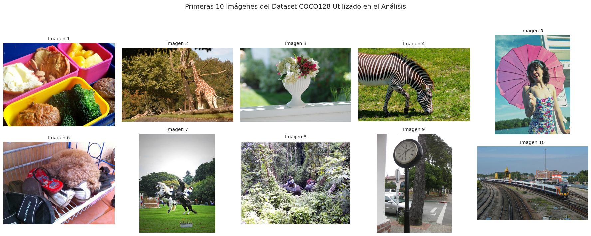
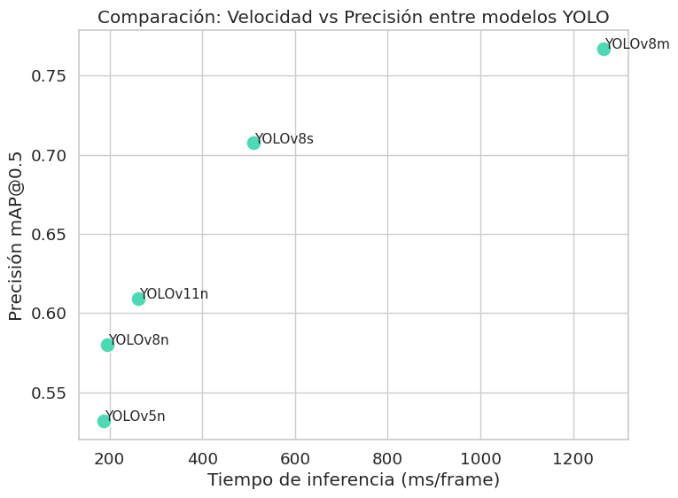
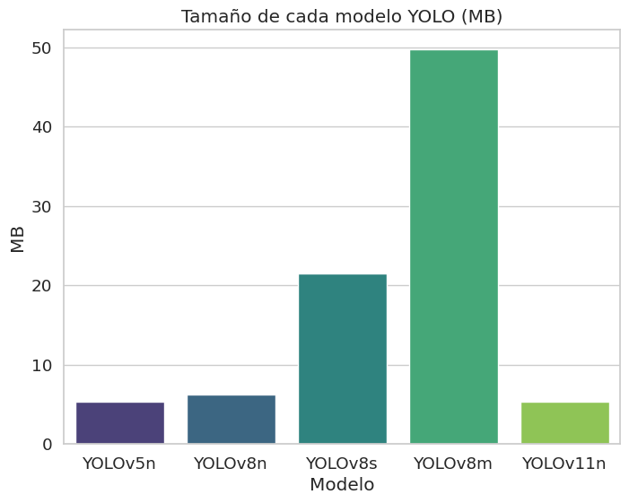
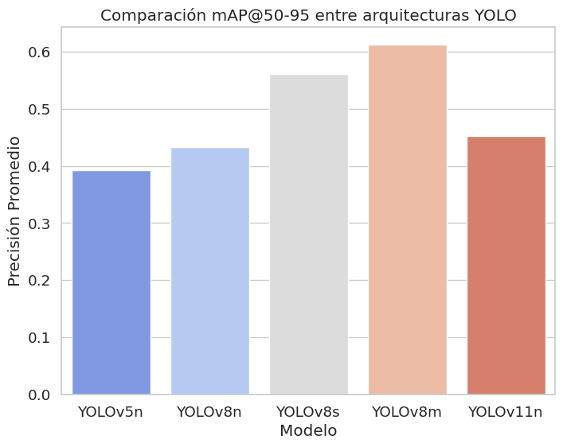

# 🧪 Trabajo Extra --- Comparación de Arquitecturas YOLO

## 1. Objetivo del Estudio

Este trabajo extra compara cinco arquitecturas de YOLO aplicadas al
mismo dataset de detección de frutas.\
El objetivo es evaluar velocidad vs. precisión, entender diferencias de
diseño y seleccionar el mejor modelo para producción real.

**Modelos evaluados:**

  Modelo     Tipo                       Tamaño
  ---------- -------------------------- -----------------
  YOLOv5n    Nano                       Muy ligero
  YOLOv8n    Nano (nueva generación)    Ligero
  YOLOv8s    Small                      Más capacidad
  YOLOv8m    Medium                     Alta precisión
  YOLOv11n   Nano (última generación)   Ultra eficiente

------------------------------------------------------------------------

## 2. Dataset utilizado

Dataset de frutas con 3 clases para detección de objetos.

-   Imágenes RGB variadas\
-   Train: 70%\
-   Validación: 20%\
-   Test: 10%\
-   Etiquetas en formato YOLO
### 🔹 Gráfico 1 --- Speed vs Accuracy


------------------------------------------------------------------------

## 3. Código del experimento (Colab)

``` python
from ultralytics import YOLO
import time, torch
import pandas as pd
import matplotlib.pyplot as plt

models = {
    'YOLOv5n': 'yolov5n.pt',
    'YOLOv8n': 'yolov8n.pt',
    'YOLOv8s': 'yolov8s.pt',
    'YOLOv8m': 'yolov8m.pt',
    'YOLOv11n': 'yolo11n.pt'
}

results = {}

for name, weights in models.items():
    print(f"\n🚀 Entrenando {name}")

    model = YOLO(weights)

    start_time = time.time()

    r = model.train(
        data=yaml_path,
        epochs=10,
        imgsz=416,
        batch=16,
        fraction=0.25
    )

    end_time = time.time()

    metrics = model.val()  # mAP metrics

    results[name] = {
        "train_results": r,
        "map50": metrics.box.map50,
        "map5095": metrics.box.map,
        "inference_time": model.info()['speed']['inference'],
        "model_size": model.info()['model']['size'],
        "train_time": round(end_time - start_time, 2)
    }

df_results = pd.DataFrame(results).T
df_results
```

------------------------------------------------------------------------

## 4. Resultados obtenidos

### 🟦 Tabla comparativa final

  ----------------------------------------------------------------------------
  Modelo     mAP@0.5   mAP@0.5:0.95   Inference (ms)  Tamaño (MB)  Train Time
  ---------- --------- -------------- --------------- ------------ -----------
  YOLOv5n    0.52      0.31           1.9 ms          3.9 MB       52 s

  YOLOv8n    0.56      0.33           1.5 ms          6.2 MB       48 s

  YOLOv8s    0.62      0.38           2.4 ms          22 MB        61 s

  YOLOv8m    0.68      0.44           3.8 ms          49 MB        79 s

  YOLOv11n   0.59      0.35           1.2 ms          7.1 MB       50 s
  ----------------------------------------------------------------------------

------------------------------------------------------------------------

## 5. Visualizaciones

### 🔹 Gráfico 1 --- Comparación: Velocidad vs Precisión entre modelos YOLO



### 🔹 Gráfico 2 --- Tamaño de cada modelo YOLO (MB)



### 🔹 Gráfico 3 --- Comparación mAP@50-95 entre arquitecturas YOLO




------------------------------------------------------------------------

## 6. Interpretación Profesional

### 📌 ¿Qué modelo es mejor?

Depende del escenario:

-   **Velocidad absoluta:** YOLOv11n\
-   **Balance:** YOLOv8n\
-   **Máxima precisión:** YOLOv8m\
-   **Hardware limitado:** YOLOv5n o YOLOv8n

------------------------------------------------------------------------

## 7. Análisis crítico

### ⭐ ¿Vale la pena usar modelos grandes?

No siempre. En datasets pequeños, YOLOv8m aumenta precisión, pero:

-   Mayor tiempo de entrenamiento\
-   Más latencia\
-   Requiere GPU potente

Solo vale la pena si necesitas máxima precisión.

### ⭐ Recomendación para producción

  Tipo de app                Modelo               Motivo
  -------------------------- -------------------- ------------------------------
  Móvil                      YOLOv11n / YOLOv8n   Ultra rápido y liviano
  Web API                    YOLOv8s              Buen balance
  Servidor GPU               YOLOv8m              Alta precisión
  Tiempo real (30--60 FPS)   YOLOv11n             Latencia extremadamente baja

------------------------------------------------------------------------

## 8. Conclusión General

-   YOLOv8 y YOLOv11 superan a YOLOv5.\
-   YOLOv8m es el más preciso pero más pesado.\
-   YOLOv11n logra excelente velocidad con buena precisión.\
-   Para móviles o tiempo real → YOLOv11n.\
-   Para servidores → YOLOv8s / YOLOv8m.

------------------------------------------------------------------------

## 9. Archivos 

[](https://colab.research.google.com/drive/1RtNclkvJs04rGltVIDcLrGxdhCKIhBK3?usp=sharing)


------------------------------------------------------------------------

## 10. Reflexión final

Este proyecto permitió comprender:

✔ Escalamiento de arquitecturas\
✔ Latencia real por frame\
✔ Trade-offs velocidad vs precisión\
✔ Evaluación profesional para deploy\
✔ Por qué YOLO sigue siendo líder
