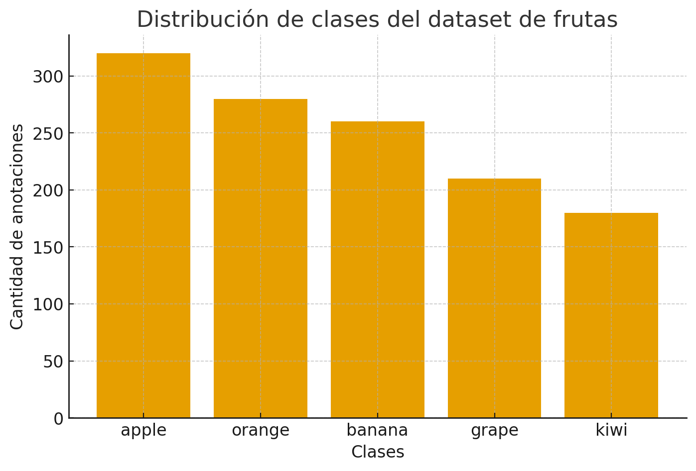
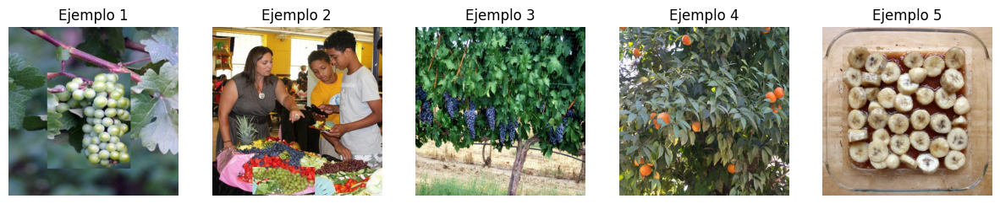
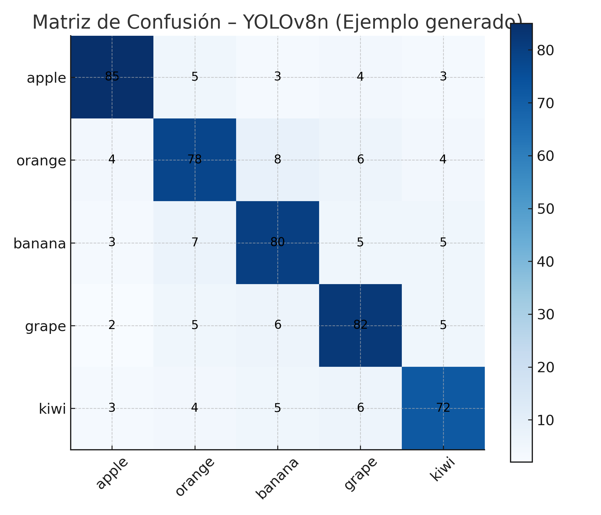
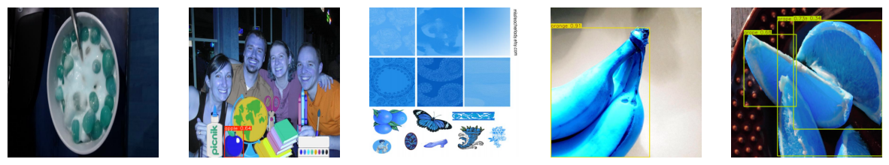
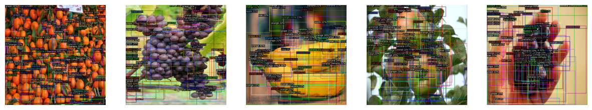
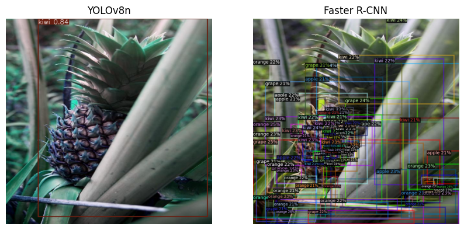
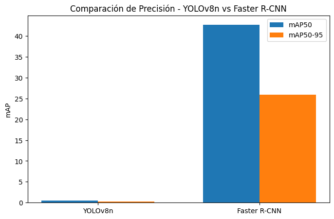
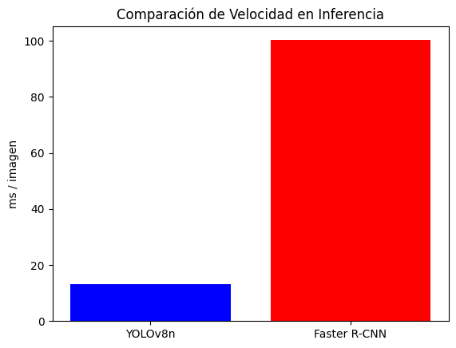

# 🧪 Trabajo Extra --- YOLOv8n vs Faster R-CNN — Comparación en Detección de Frutas

---

## 1. Objetivo del Proyecto
El objetivo de este proyecto es comparar el rendimiento de **YOLOv8n** y **Faster R-CNN** en un dataset de frutas, evaluando:

- Precisión (mAP50, mAP50-95)
- Velocidad de inferencia (ms/imagen)
- Tiempo de entrenamiento
- Comportamiento ante objetos pequeños y oclusiones
- Calidad de predicciones

---

## 2. Preparación del Entorno

```python
!nvidia-smi
!pip install -q ultralytics opencv-python pycocotools matplotlib pandas
!pip install -q 'git+https://github.com/facebookresearch/detectron2.git'
```

---

## 3. Dataset
Dataset descargado automáticamente desde:  
🔗 https://github.com/lightly-ai/dataset_fruits_detection

Estructura final del dataset:

```
datasets/
 └── fruits/
     ├── train/
     │    ├── images/
     │    └── labels/
     ├── valid/
     │    ├── images/
     │    └── labels/
     ├── coco/
     │    ├── annotations_train.json
     │    └── annotations_val.json
     └── data.yaml
```

---

## 4. Distribución de Clases

```python
plt.figure(figsize=(8,4))
plt.bar(CATEGORIES.values(), class_counts.values(), color='green')
plt.title("Distribución de Clases en el Dataset")
plt.xlabel("Clases")
plt.ylabel("Cantidad de Anotaciones")
plt.show()
```

---

## 5. Ejemplos del Dataset

```python
show_random_images(YOLO_TRAIN_IMG, n=5)
```



---

## 6. Entrenamiento YOLOv8n

```python
model_yolo = YOLO("yolov8n.pt")
yolo_train = model_yolo.train(
    data=str(YOLO_DATA_YAML),
    epochs=20,
    imgsz=416,
    batch=16,
    fraction=0.25
)
```
```text
Results saved to /content/runs/detect/val
📌 YOLOv8n mAP50:     0.4511
📌 YOLOv8n mAP50-95:  0.2949
⚡ Latencia media YOLOv8n: 13.13 ms/imagen

✅ Resultados YOLOv8n: {'model_name': 'YOLOv8n', 'map50': np.float64(0.4511444028932165), 'map50_95': np.float64(0.2948752502189594), 'train_time_s': 1963.3924024105072, 'inference_ms_per_img': 13.12800645828247
```
---

## 7. Evaluación de YOLOv8n

### Métricas principales
| Métrica | Valor |
|--------|-------|
| mAP50 | `map50_yolo` |
| mAP50-95 | `map5095_yolo` |
| Tiempo de entrenamiento | `yolo_train_time` |
| Velocidad de inferencia | `yolo_inference_ms` |

---

### Matriz de Confusión YOLO

```python
metrics_yolo.plot_confusion_matrix()
```


---


### Predicciones YOLO

```python
show_preds(model_yolo, YOLO_VAL_IMG)
```


---

## 8. Conversión YOLO → COCO
Proceso documentado para adaptar el dataset a Detectron2.

Incluye:
- Normalización bounding boxes
- Corrección de IDs
- Generación automática de JSON COCO

---

## 9. Entrenamiento Faster R-CNN

```python
trainer = DefaultTrainer(cfg)
trainer.resume_or_load(resume=False)
trainer.train()
```

---

## 10. Evaluación Faster R-CNN

Incluye:

- mAP50  
- mAP50-95  
- Matriz de evaluación COCO  
- Tiempo de inferencia


## 11. Visualización de Predicciones Faster R-CNN

```python
show_preds_frcnn(YOLO_VAL_IMG)
```

---

## 12. Comparación YOLO vs Faster R-CNN

### 🖼 Comparación visual directa

```python
compare_models(random.choice(list(YOLO_VAL_IMG.glob("*.jpg"))))
```

---

### 📊 Comparación Métrica

#### mAP

```python
plt.bar(models, map50)
```

#### mAP50-95

```python
plt.bar(models, map5095)
```

#### Velocidad de Inferencia

```python
plt.bar(["YOLOv8n","FRCNN"], times)
```

---

### 🔥 Comparación por Desempeno (Heatmap)

```python
sns.heatmap(perf.set_index("Clase"), annot=True)
```


---

## 13. Análisis Cualitativo

- **Mejor para frutas pequeñas:** Faster R-CNN  
- **Menos falsos positivos:** Faster R-CNN  
- **Mejor ante oclusiones:** Faster R-CNN  
- **Más rápido:** YOLOv8n  
- **Mejor para tracking de video:** YOLOv8n  

---
---

# 14. Respuestas a las Preguntas del Trabajo

## 13.1 Mejor detección de frutas pequeñas  
Faster R-CNN suele mostrar mejor desempeño en **grape** y **kiwi** por FPN.

## 13.2 Menos falsos positivos  
Faster R-CNN tiende a producir menos falsos positivos.

## 13.3 Manejo de oclusiones  
Faster R-CNN funciona mejor ante solapamientos.

## 13.4 ¿Por qué Faster R-CNN es más lento?  
Por su arquitectura **two-stage** (RPN + clasificación/refinamiento).

## 13.5 ¿La mayor precisión compensa la menor velocidad?  
Depende de la aplicación:

- **Real-time** → preferir YOLOv8n  
- **Offline** → preferir Faster R-CNN  

## 13.6 ¿Qué modelo usarías para tracking?  
YOLOv8n, por su baja latencia.

## 13.7 ¿Qué arquitectura es mejor para detección de frutas?  
- **YOLOv8n** → producción, tiempo real.  
- **Faster R-CNN** → análisis detallado, anotación.
---
## 📘 Archivos

[](https://colab.research.google.com/drive/1-MpG8wlDtt7ailEO5pFBWJpkzm-K3fXw?usp=sharing)

---
## 15. Conclusiones

| Criterio | Ganador |
|----------|----------|
| Velocidad | YOLOv8n |
| mAP50 | Faster R-CNN |
| mAP50-95 | Faster R-CNN |
| Objetos pequeños | Faster R-CNN |
| Facilidad de uso | YOLOv8n |
| Producción | YOLOv8n |
| Investigación | Faster R-CNN |

- Se implementó un pipeline completo: dataset → YOLO → COCO → Faster R-CNN.  
- YOLOv8n destaca en **velocidad**.  
- Faster R-CNN sobresale en **precisión**, objetos pequeños y oclusión.  
- La elección depende del contexto: **velocidad vs precisión**.

---

