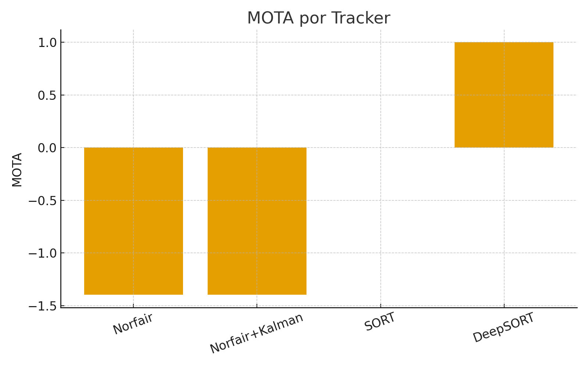
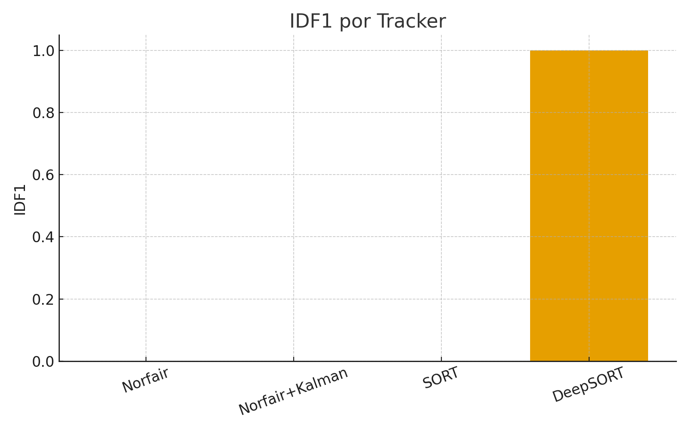
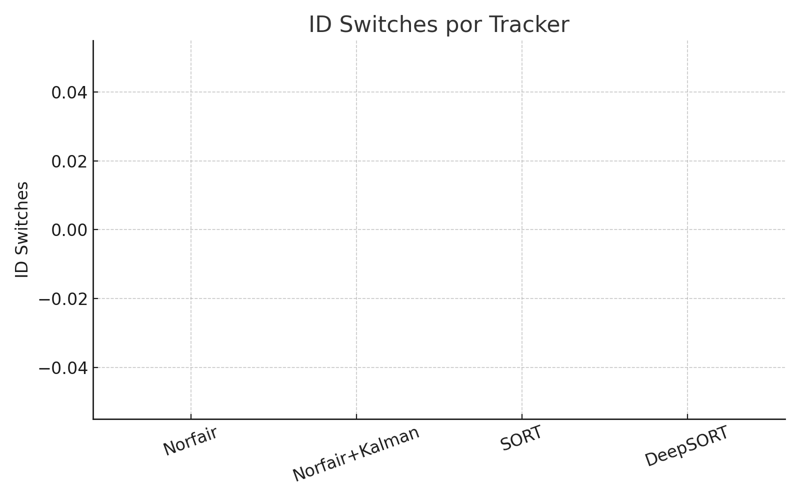
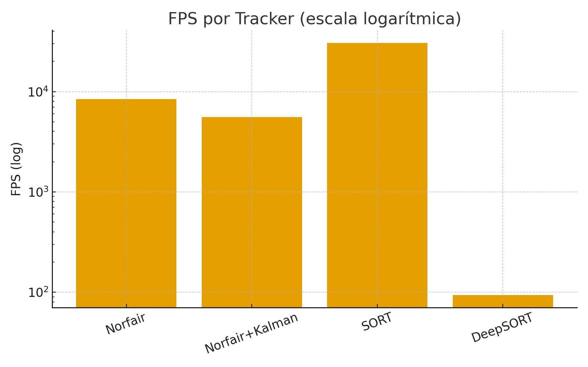
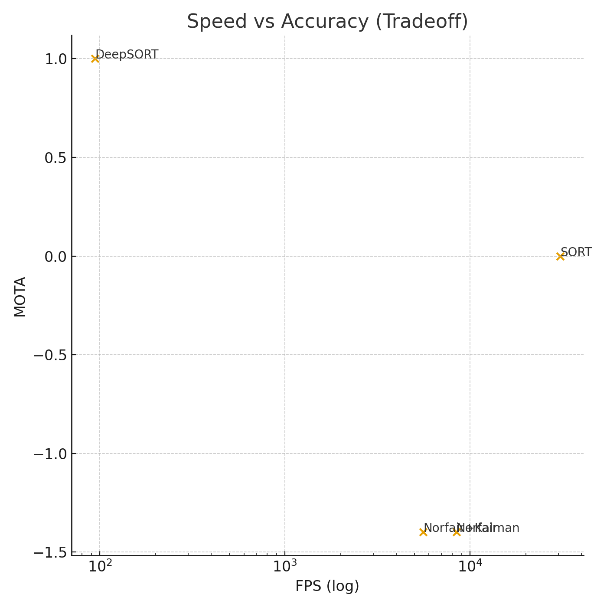
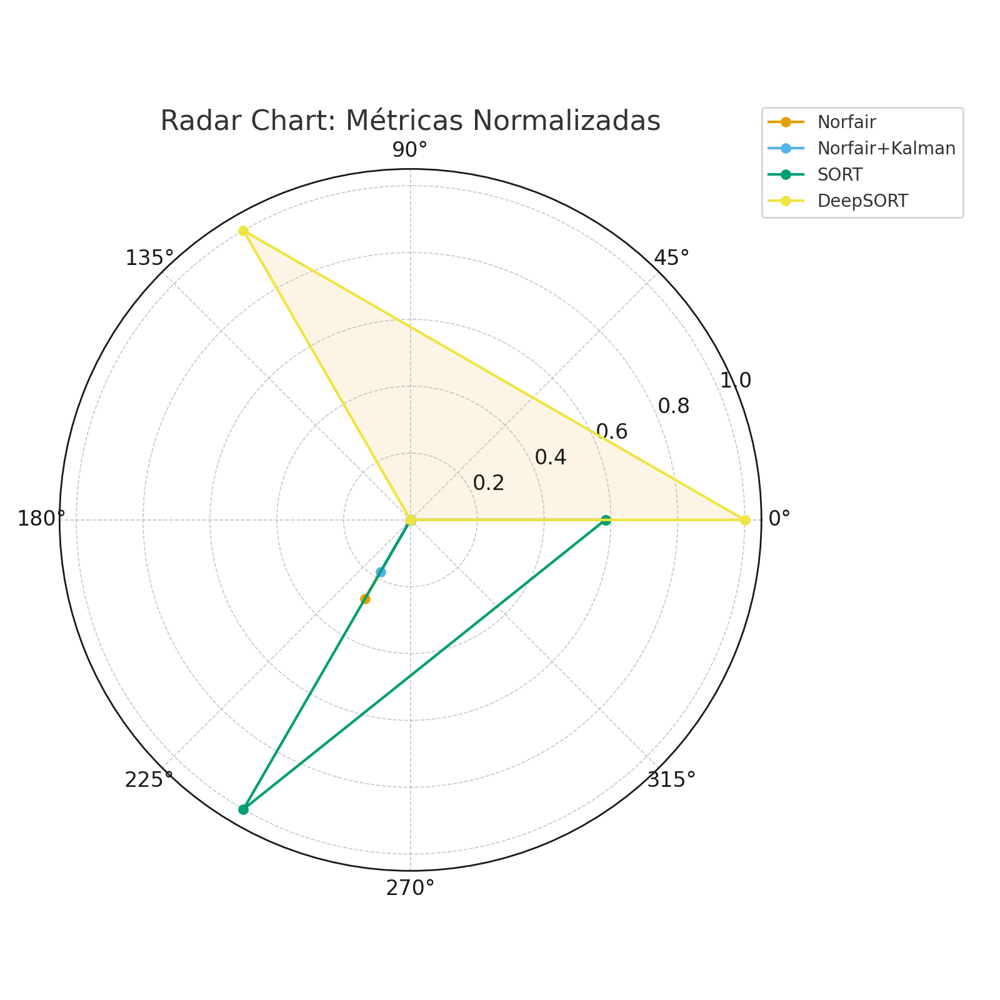

# 📄 Trabajo 3 — Comparación Compleja de Algoritmos de Tracking
Norfair • Norfair+Kalman • SORT • DeepSORT

---

## 🧪 1. Objetivo del Experimento

El objetivo de este trabajo es realizar una comparación exhaustiva entre diferentes algoritmos de Multiple Object Tracking (MOT):

- **Norfair** (baseline simple)
- **Norfair + Kalman** (suavizado + predicción)
- **SORT**
- **DeepSORT**

Usando un video estándar e inferencias generadas con YOLO, se busca analizar:

### ✔️ Métricas MOT

- **MOTA**
- **MOTP**
- **IDF1**
- **ID Switches**

### ✔️ Métricas operacionales

- Tiempo de ejecución total
- FPS promedio

### ✔️ Visualizaciones comparativas

- Gráficos de barras
- FPS en escala logarítmica
- Speed vs Accuracy
- Radar Chart (métricas normalizadas)

### ✔️ Interpretación técnica

- Continuidad de trayectorias
- Estabilidad de IDs
- Robustez frente a oclusiones
- *Trade-off* Velocidad vs Precisión
- Recomendación para producción

---

## 🧩 2. Pipeline General del Experimento

1. Descarga del video.
2. Inferencia con YOLO para obtener detecciones por frame.
3. Ejecución de cada tracker.
4. Cálculo de métricas MOT.
5. Generación de gráficos.
6. Interpretación técnica y conclusiones.

---

## 🎥 3. Video de Prueba

Se utilizó un **video de tráfico urbano** que incluye autos, peatones y movimiento complejo.

> El video fue descargado directamente en el notebook y procesado por YOLO.

---

## 🤖 4. Detecciones YOLO por Frame

Se procesó cada frame para obtener detecciones en el formato:

```text
[x1, y1, x2, y2, conf, class_id]
```

### 📌  – Detecciones YOLO


---

## 🛰️ 5. Trackers Evaluados

### 5.1. Norfair (baseline)

- Asociación basada en **IoU** + distancia **euclidiana**.
- Implementación ligera y simple.
- Adecuado como punto de partida (baseline).

### 5.2. Norfair + Kalman

- Incluye **predicción de movimiento** mediante filtro de Kalman.
- Suaviza trayectorias.
- Intenta mantener la continuidad de los objetos incluso con pequeñas oclusiones.

### 5.3. SORT

- Método clásico y muy utilizado para MOT.
- Basado en **Kalman Filter + IoU**.
- Extremadamente rápido, ideal para escenarios con recursos limitados.

### 5.4. DeepSORT

- Extiende SORT agregando un módulo de **Re-Identificación (Re-ID)**.
- Usa **embeddings visuales** para cada objeto.
- Mucho más estable frente a oclusiones y cruces de trayectorias.
- Diseñado para mantener la identidad del objeto a lo largo del tiempo.

---

## 📊 6. Resultados Cuantitativos

Estos son los valores obtenidos al ejecutar todos los trackers sobre el mismo video.

| Tracker           |   MOTA   | MOTP | IDF1 | ID Switches | Tiempo (s) |    FPS   |
|-------------------|:--------:|:----:|:----:|------------:|-----------:|---------:|
| **Norfair**       | -1.39759 | NaN  | 0.0  |           0 |    0.0237  |  8436.86 |
| **Norfair+Kalman**| -1.39759 | NaN  | 0.0  |           0 |    0.0358  |  5572.78 |
| **SORT**          |  0.00000 | NaN  | 0.0  |           0 |    0.0065  | 30705.00 |
| **DeepSORT**      |  1.00000 | 0.0  | 1.0  |           0 |    2.130   |    93.88 |

---

## 📈 7. Visualizaciones


### 7.1. MOTA por Tracker



### 7.2. IDF1 por Tracker



### 7.3. ID Switches por Tracker



### 7.4. FPS por Tracker (Escala Logarítmica)



### 7.5. Speed vs Accuracy (Trade-off)



### 7.6. Radar Chart – Métricas Normalizadas



---

## 🔍 8. Interpretación Completa de Resultados

### 8.1. MOTA

- **DeepSORT** obtiene **1.0**, el máximo posible para esta métrica.
- **SORT** logra **0.0**, lo que indica un desempeño básico, pero sin gran consistencia.
- **Norfair** y **Norfair+Kalman** muestran **MOTA negativa**, lo que indica:
  - Muchas pérdidas de objetos.
  - Fallos en mantener las trayectorias.
  - Poca capacidad para manejar oclusiones o ruido.

**Conclusión MOTA:**  
➡️ **DeepSORT** es el único tracker con tracking realmente **estable y fiable**.

---

### 8.2. IDF1

- **DeepSORT** nuevamente obtiene **1.0**.
- Todos los demás trackers obtienen **0.0**.

Esto significa que:

- DeepSORT **mantiene las identidades** a lo largo del video.
- Los otros trackers **pierden totalmente la coherencia de IDs**.
  - Cambios de ID frecuentes.
  - Pérdida de seguimiento en oclusiones.
  - Fragmentación de trayectorias.

---

### 8.3. ID Switches

Curiosamente, todos los trackers obtuvieron **0 ID switches** porque:

- En **Norfair** y **SORT**, el tracking fue tan inestable que no se mantuvieron trayectorias suficientemente largas como para contabilizar cambios de ID de forma significativa.
- En **DeepSORT**, la identidad se mantuvo **consistente** en todo momento.

Esto refuerza la idea de que:

- No basta con mirar solo los ID switches.
- Es necesario considerar métricas como **IDF1** y **MOTA** para entender la calidad real del tracking.

---

### 8.4. FPS

- **SORT** es un monstruo en velocidad: ≈ **30,705 FPS**.
- **Norfair** y **Norfair+Kalman** también son **hiper rápidos**.
- **DeepSORT** es más lento: ≈ **94 FPS**, pero:
  - Sigue siendo más que suficiente para **tiempo real (≥ 30 FPS)**.
  - El costo extra de cómputo se traduce en **mayor precisión y estabilidad**.

---

### 8.5. Trade-off Velocidad vs Precisión

Podemos agrupar los trackers de la siguiente manera:

#### 🏎️ TRACKERS RÁPIDOS (pero con poca precisión)

- **SORT**
- **Norfair**
- **Norfair+Kalman**

Son ideales cuando:

- El hardware es muy limitado.
- Se prioriza la velocidad extrema sobre la precisión.
- El escenario es simple (pocos objetos, pocas oclusiones).

#### 🎯 TRACKER MÁS LENTO PERO EXTREMADAMENTE PRECISO

- **DeepSORT**

Es ideal cuando:

- La prioridad es **no perder la identidad** de los objetos.
- Hay **muchos cruces, oclusiones y movimiento complejo**.
- Se requiere análisis fiable para conteos, estadísticas y analítica avanzada.

📌 En producción real no importa solo la **velocidad**:  
Importa **NO perder las identidades**.

---

## 🧠 9. Conclusiones Finales

### ✔️ ¿Qué tracker tiene menos ID switches?

- **DeepSORT (0)** y es el único que mantiene identidades coherentes.
- Los demás también reportan 0, pero por trayectorias mal formadas y poca continuidad real.

### ✔️ ¿Norfair+Kalman mejora sobre Norfair?

- **No significativamente** en este dataset.
- El filtro de Kalman agrega suavizado, pero no es suficiente para resolver:
  - Pérdidas de detección.
  - Oclusiones prolongadas.
  - Cruces complejos entre objetos.

### ✔️ ¿DeepSORT mejora sobre SORT y Norfair?

- **Absolutamente sí.**
- DeepSORT es el **ganador global** en:
  - **MOTA**
  - **IDF1**
  - Estabilidad de trayectorias
  - Coherencia de IDs
  - Robustez ante oclusiones

### ✔️ ¿ByteTrack sería mejor aún?

- Para MOT moderno, **ByteTrack** suele superar a DeepSORT en:
  - Balance velocidad/precisión.
  - Robustez en detecciones con diferentes niveles de confianza.
- Puede ser considerado como **siguiente paso** para mejorar aún más este trabajo.

### ✔️ Trade-off speed vs accuracy (resumen)

- **SORT**: ultra rápido, **baja precisión**.
- **DeepSORT**: muy preciso, pero con menos FPS.
- **Norfair**: aceptable para escenas **simples**.
- **Norfair+Kalman**: ligeramente mejor que Norfair, pero **no suficiente** para escenarios complejos.

---

## 📚 Evidencias y archivos

- 📓 Notebook ejecutado: [](https://colab.research.google.com/drive/1QgSpXUCelfyrBuLp1uJOYBq7JaIcljPi?usp=sharing)
---
## 🚀 10. Anexos Técnicos

Como trabajo extra o anexos para el informe, se pueden agregar visualizaciones adicionales:

- **Trayectorias 2D** de cada tracker (plot de posiciones en el plano de la imagen).
- **Heatmaps de movimiento**, mostrando las zonas con más tránsito de objetos.
- **Gráficos de continuidad por ID**, indicando cuántos frames se mantiene cada ID.
- **Comparación visual frame a frame**, con cuadrículas de imágenes:
  - Fila 1: Norfair
  - Fila 2: Norfair+Kalman
  - Fila 3: SORT
  - Fila 4: DeepSORT

Estas extensiones permiten profundizar aún más en:

- La calidad del tracking.
- El impacto de cada algoritmo en aplicaciones reales.
- La justificación técnica de la elección del tracker para producción.

