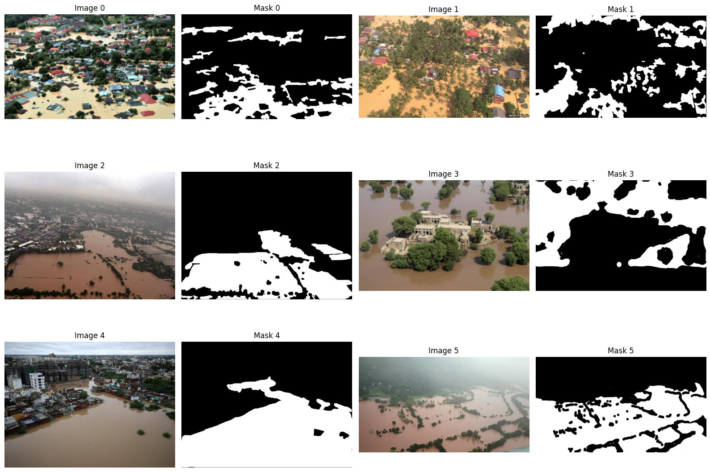
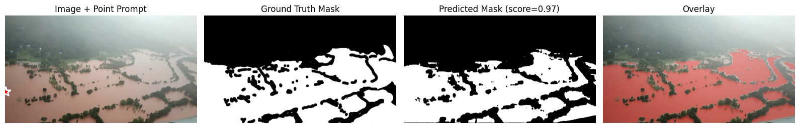
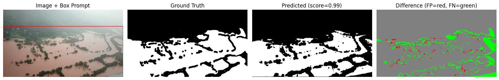
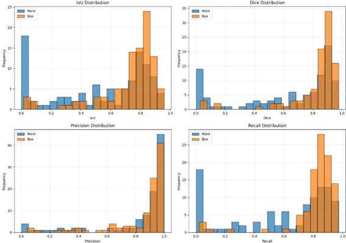
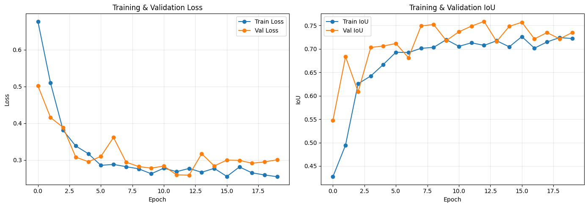
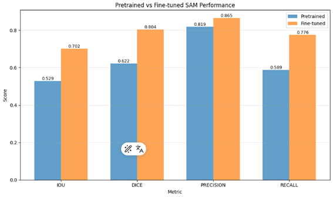
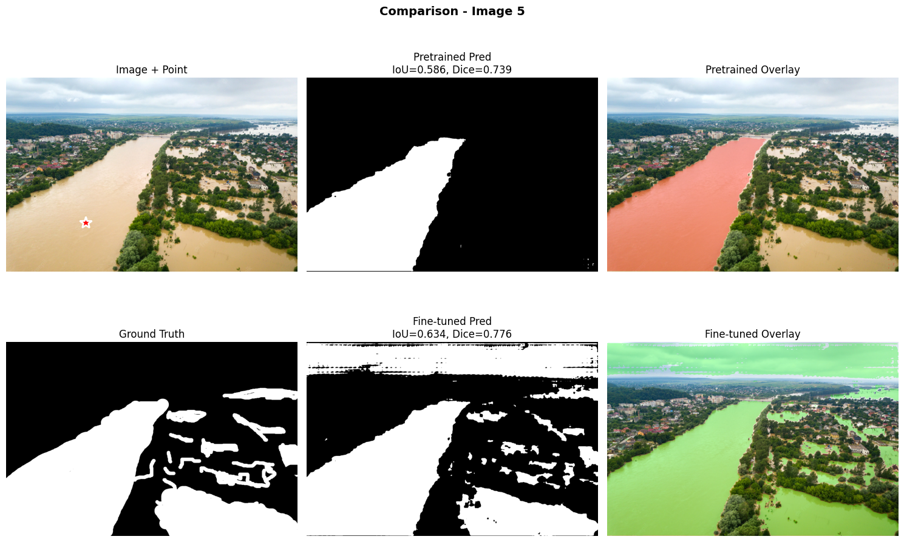
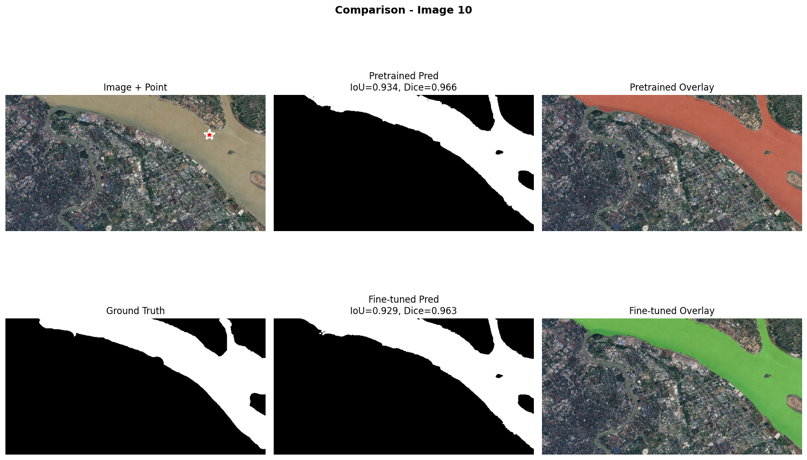
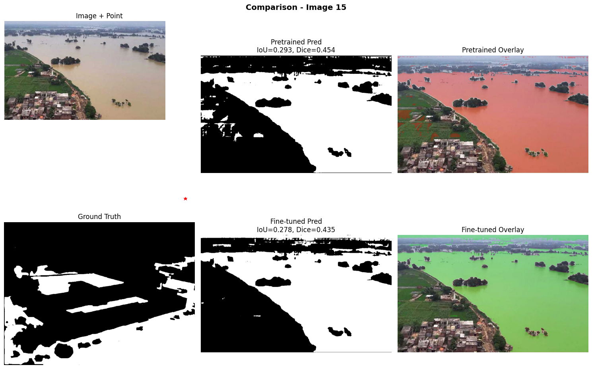
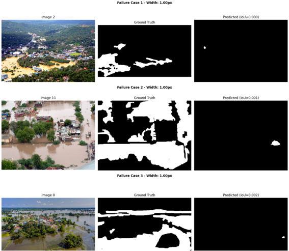

# Práctica 12 — Segment Anything (SAM)  
## Segmentación de agua en inundaciones: Pretrained vs Fine-tuned

---

## 1. Objetivo de la práctica

En esta práctica se implementa un pipeline completo de **segmentación semántica** de agua en imágenes de inundaciones utilizando **Segment Anything Model (SAM)** en dos escenarios:

1. **SAM preentrenado (pretrained)** usando *prompts*:
   - **Point prompts** (puntos dentro del agua).
   - **Box prompts** (cajas alrededor del área de agua).
2. **SAM fine-tuned**, ajustando el **mask decoder** sobre un dataset específico de inundaciones.

Nos enfocamos en:

- Diseño del pipeline de segmentación.
- **Visualizaciones** claras en cada etapa (dataset, ejemplos, curvas, comparaciones, errores).
- Métricas de evaluación: **IoU, Dice, Precision, Recall**.
- Comparación **cualitativa y cuantitativa** entre:
  - SAM preentrenado (point y box prompts).
  - SAM fine-tuned (point prompts).

---

## 2. Dataset: Flood Segmentation

### 2.1 Carga del dataset

Se utiliza un dataset de **segmentación de áreas inundadas**, con:

- Imágenes RGB (`images`) de escenas rurales/urbanas con presencia de agua.
- Máscaras binarias (`masks`) donde:
  - `1` = píxel de agua (inundación).
  - `0` = no-agua.

La función principal:

```python
def load_flood_data(dataset_path='flood_dataset', max_samples=100):
    ...
    return images, masks
```

se encarga de:

- Navegar la estructura de carpetas.
- Emparejar imágenes y máscaras.
- Limitar el número de muestras (`max_samples`).

### 2.2 Visualización del dataset


Código clave:

```python
fig, axes = plt.subplots(3, 4, figsize=(16, 12))

for i in range(6):
    # Imagen original
    axes[i // 2, (i % 2) * 2].imshow(images[i])
    axes[i // 2, (i % 2) * 2].set_title(f'Image {i}')
    axes[i // 2, (i % 2) * 2].axis('off')

    # Mask
    axes[i // 2, (i % 2) * 2 + 1].imshow(masks[i], cmap='gray')
    axes[i // 2, (i % 2) * 2 + 1].set_title(f'Mask {i}')
    axes[i // 2, (i % 2) * 2 + 1].axis('off')

plt.tight_layout()
plt.show()
```



- Figura de **3 filas × 4 columnas**:
  - 6 imágenes originales (`Image 0–5`).
  - Sus 6 máscaras binarias (`Mask 0–5`).
- Permite ver:
  - Variabilidad de color del agua (azul, marrón, verdoso).
  - Bordes poco definidos.
  - Canales delgados de agua.
  - Presencia de estructuras (puentes, caminos, vegetación).

Esta visualización justifica la **complejidad del problema de segmentación**.

---

## 3. SAM Preentrenado con Prompts

Se utiliza el checkpoint de SAM (por ejemplo, `sam_vit_b_01ec64.pth`) con:

```python
sam = sam_model_registry[model_type](checkpoint=sam_checkpoint)
predictor = SamPredictor(sam)
```

### 3.1 Función de ayuda: métricas por máscara

Se implementan funciones para calcular:

- **IoU**
- **Dice coefficient**
- **Precision**
- **Recall**

Estas métricas se usan tanto en ejemplos individuales como en evaluaciones globales.

---

### 3.2 Visualización SAM Pretrained con Point Prompt

Función:

```python
def predict_with_point_prompt(predictor, image, point_coords, point_labels):
    ...
    return mask, score
```

Luego se selecciona una imagen de test (`test_idx`) y se construye un point prompt en el centro del área de agua (usando la máscara GT).  




Al final del bloque de código:

```python
fig, axes = plt.subplots(1, 4, figsize=(20, 5))

axes[0].imshow(test_image)
axes[0].plot(point_x, point_y, 'ro', markersize=8)
axes[0].set_title('Original + Point Prompt')
axes[0].axis('off')

axes[1].imshow(test_mask_gt, cmap='gray')
axes[1].set_title('Ground Truth')
axes[1].axis('off')

axes[2].imshow(pred_mask, cmap='gray')
axes[2].set_title(f'Predicted Mask (score={score:.2f})')
axes[2].axis('off')

overlay = test_image.copy()
overlay[pred_mask > 0] = [255, 0, 0]
axes[3].imshow(cv2.addWeighted(test_image, 0.7, overlay, 0.3, 0))
axes[3].set_title('Overlay')
axes[3].axis('off')

plt.tight_layout()
plt.show()
```

**La figura presenta:**

1. Imagen original + punto rojo (prompt).
2. Máscara ground truth.
3. Máscara predicha por SAM (pretrained, point).
4. Overlay de predicción sobre la imagen original (área de agua en rojo).

Además se imprimen las métricas para esa imagen (IoU, Dice, precision, recall), que cuantifican la calidad de esta predicción puntual.

---

### 3.3 Visualización SAM Pretrained con Box Prompt

Función:

```python
def predict_with_box_prompt(predictor, image, box):
    ...
    return mask, score
```

Se construye la bounding box a partir de la máscara GT de agua.


Fragmento clave:

```python
fig, axes = plt.subplots(1, 4, figsize=(20, 5))

# Imagen + box
axes[0].imshow(test_image)
rect = plt.Rectangle((x1, y1), x2 - x1, y2 - y1,
                     edgecolor='yellow', facecolor='none', linewidth=2)
axes[0].add_patch(rect)
axes[0].set_title('Original + Box Prompt')
axes[0].axis('off')

# Ground truth
axes[1].imshow(test_mask_gt, cmap='gray')
axes[1].set_title('Ground Truth')
axes[1].axis('off')

# Predicted
axes[2].imshow(pred_mask_box, cmap='gray')
axes[2].set_title(f'Predicted Mask (score={score_box:.2f})')
axes[2].axis('off')

# Mapa de diferencias
diff = (pred_mask_box.astype(int) - test_mask_gt.astype(int))
diff_vis = np.zeros((*diff.shape, 3), dtype=np.uint8)
diff_vis[diff > 0] = [255, 0, 0]   # False positives: rojo
diff_vis[diff < 0] = [0, 255, 0]   # False negatives: verde
diff_vis[diff == 0] = [128, 128, 128]  # Correcto: gris

axes[3].imshow(diff_vis)
axes[3].set_title('Difference (FP=red, FN=green)')
axes[3].axis('off')

plt.tight_layout()
plt.show()
```

**La figura presenta:**

1. Imagen original + caja amarilla (box prompt).
2. Máscara ground truth.
3. Máscara predicha con box prompt.
4. Mapa de diferencias:
   - Rojo: falsos positivos.
   - Verde: falsos negativos.
   - Gris: aciertos.

También se imprimen métricas (IoU, Dice, precisión, recall) para este caso.

---

### 3.4 Evaluación global SAM Pretrained (Point vs Box)

Función:

```python
def evaluate_pretrained_sam(images, masks, predictor, prompt_type='point'):
    ...
    return results
```

Devuelve diccionarios con arrays de métricas (`results['iou']`, `results['dice']`, etc.) para todo el dataset.

Luego se llama dos veces:

- `results_pretrained_point = evaluate_pretrained_sam(..., prompt_type='point')`
- `results_pretrained_box = evaluate_pretrained_sam(..., prompt_type='box')`

y se comparan.


Al final del bloque:

```python
fig, axes = plt.subplots(2, 2, figsize=(12, 10))

# IoU
axes[0, 0].hist(results_pretrained_point['iou'], bins=20, alpha=0.7, label='Point', edgecolor='black')
axes[0, 0].hist(results_pretrained_box['iou'], bins=20, alpha=0.7, label='Box', edgecolor='black')
axes[0, 0].set_xlabel('IoU')
axes[0, 0].set_ylabel('Frequency')
axes[0, 0].set_title('IoU Distribution')
axes[0, 0].legend()
axes[0, 0].grid(alpha=0.3)

# Dice
axes[0, 1].hist(results_pretrained_point['dice'], bins=20, alpha=0.7, label='Point', edgecolor='black')
axes[0, 1].hist(results_pretrained_box['dice'], bins=20, alpha=0.7, label='Box', edgecolor='black')
axes[0, 1].set_xlabel('Dice')
axes[0, 1].set_ylabel('Frequency')
axes[0, 1].set_title('Dice Distribution')
axes[0, 1].legend()
axes[0, 1].grid(alpha=0.3)

# Precision
axes[1, 0].hist(results_pretrained_point['precision'], bins=20, alpha=0.7, label='Point', edgecolor='black')
axes[1, 0].hist(results_pretrained_box['precision'], bins=20, alpha=0.7, label='Box', edgecolor='black')
axes[1, 0].set_xlabel('Precision')
axes[1, 0].set_ylabel('Frequency')
axes[1, 0].set_title('Precision Distribution')
axes[1, 0].legend()
axes[1, 0].grid(alpha=0.3)

# Recall
axes[1, 1].hist(results_pretrained_point['recall'], bins=20, alpha=0.7, label='Point', edgecolor='black')
axes[1, 1].hist(results_pretrained_box['recall'], bins=20, alpha=0.7, label='Box', edgecolor='black')
axes[1, 1].set_xlabel('Recall')
axes[1, 1].set_ylabel('Frequency')
axes[1, 1].set_title('Recall Distribution')
axes[1, 1].legend()
axes[1, 1].grid(alpha=0.3)

plt.tight_layout()
plt.show()
```

**Qué aporta esta figura:**

- Muestra cómo se distribuyen IoU, Dice, Precision y Recall para:
  - SAM preentrenado con point prompts.
  - SAM preentrenado con box prompts.
- Permite ver **en qué rango** se concentran las métricas y cuál de los dos tipos de prompt es más consistente.

Además se imprimen en consola las médias de cada métrica para ambos tipos de prompt.

---

## 4. Fine-tuning de SAM

### 4.1 Dataset PyTorch y DataLoaders

Se define:

```python
class FloodSegmentationDataset(Dataset):
    ...
```

Características:

- Redimensiona a 1024×1024.
- Uso de **Albumentations** en entrenamiento:
  - Flips horizontales/verticales.
  - Rotaciones.
  - Cambios de brillo/contraste.
- Genera prompts (puntos) dentro del área de agua para el fine-tuning.

Se hace un split 80/20 en `train_dataset` y `val_dataset` y se crean `DataLoader`s.

(En esta sección no hay figuras, solo configuración.)

---

### 4.2 Configuración del Fine-tuning

Se carga el modelo SAM y se congelan módulos:

- `image_encoder` → congelado.
- `prompt_encoder` → congelado.
- `mask_decoder` → **entrenable**.

Se configura:

- Optimizador (`Adam`) con `lr = learning_rate`.
- Scheduler (`StepLR`).
- **Loss combinada**:
  - `BCEWithLogitsLoss`.
  - `DiceLoss` implementada a mano.

---

### 4.3 Entrenamiento y Curvas

Se registra en `history`:

- `train_loss`, `val_loss`.
- `train_iou`, `val_iou`.



Al final del bloque de entrenamiento:

```python
fig, axes = plt.subplots(1, 2, figsize=(12, 5))

# Loss
axes[0].plot(history['train_loss'], label='Train Loss', marker='o')
axes[0].plot(history['val_loss'], label='Val Loss', marker='o')
axes[0].set_xlabel('Epoch')
axes[0].set_ylabel('Loss')
axes[0].set_title('Training & Validation Loss')
axes[0].legend()
axes[0].grid(alpha=0.3)

# IoU
axes[1].plot(history['train_iou'], label='Train IoU', marker='o')
axes[1].plot(history['val_iou'], label='Val IoU', marker='o')
axes[1].set_xlabel('Epoch')
axes[1].set_ylabel('IoU')
axes[1].set_title('Training & Validation IoU')
axes[1].legend()
axes[1].grid(alpha=0.3)

plt.tight_layout()
plt.show()
```

**Interpretación:**

- La primera gráfica muestra cómo bajan las pérdidas de train y val.
- La segunda gráfica muestra cómo aumenta el IoU de train y val.
- Sirve para verificar si hay sobreajuste o si el entrenamiento es estable.

---

## 5. Evaluación del SAM Fine-tuned y Comparación Global

### 5.1 Evaluación del modelo fine-tuned

Se reutiliza `evaluate_pretrained_sam` sobre el **conjunto de validación**, pero ahora con `predictor_finetuned`:

```python
results_finetuned = evaluate_pretrained_sam(val_images, val_masks, predictor_finetuned, prompt_type='point')
```

En consola se imprimen las medias de:

- IoU, Dice, Precision, Recall.

### 5.2 Comparación numérica Pretrained vs Fine-tuned

Se imprimen tablas comparando:

- Métricas promedio del pretrained (point prompts) vs fine-tuned.
- Una línea por métrica (IoU, Dice, Precision, Recall) con mejora absoluta/relativa.

### 5.3 Visualización global: Barplot Pretrained vs Fine-tuned



Código clave:

```python
metrics = ['iou', 'dice', 'precision', 'recall']
pretrained_means = [...]
finetuned_means = [...]

x = np.arange(len(metrics))
width = 0.35

fig, ax = plt.subplots(figsize=(8, 5))
bars1 = ax.bar(x - width/2, pretrained_means, width, label='Pretrained')
bars2 = ax.bar(x + width/2, finetuned_means, width, label='Fine-tuned')

ax.set_ylabel('Score')
ax.set_title('Pretrained vs Fine-tuned SAM Performance')
ax.set_xticks(x)
ax.set_xticklabels([m.upper() for m in metrics])
ax.legend()
ax.grid(alpha=0.3, axis='y')

# Añadir valores sobre barras
for bars in [bars1, bars2]:
    for bar in bars:
        height = bar.get_height()
        ax.text(bar.get_x() + bar.get_width()/2., height,
                f'{height:.3f}', ha='center', va='bottom', fontsize=9)

plt.tight_layout()
plt.show()
```

**Qué muestra esta figura:**

- Eje X: métricas (`IOU`, `DICE`, `PRECISION`, `RECALL`).
- Eje Y: valor promedio.
- Dos barras por métrica:
  - Azul: SAM pretrained.
  - Naranja: SAM fine-tuned.
- Valores numéricos encima de cada barra.

Esta visualización resume el **impacto del fine-tuning** de forma muy clara.

---

## 6. Comparación Cualitativa: Ejemplos Específicos

### 6.1 Visualización de mejoras por imagen

Función:

```python
def visualize_comparison(idx, images, masks, predictor_pre, predictor_ft):
    ...
```

- Selecciona una imagen `idx` del set de validación.
- Genera la predicción con:
  - SAM pretrained (point prompt).
  - SAM fine-tuned (point prompt).
- Calcula IoU y Dice para ambos.

**Visualización 7 — Comparación por imagen (figura 1×4, para varios índices)**




Dentro de la función:

```python
fig, axes = plt.subplots(1, 4, figsize=(20, 5))

axes[0].imshow(image)
axes[0].set_title('Original')
axes[0].axis('off')

axes[1].imshow(mask_gt, cmap='gray')
axes[1].set_title('Ground Truth')
axes[1].axis('off')

# Overlay pretrained
overlay_pre = image.copy()
overlay_pre[pred_pre > 0] = [255, 0, 0]
axes[2].imshow(cv2.addWeighted(image, 0.7, overlay_pre, 0.3, 0))
axes[2].set_title(f'Pretrained (IoU={iou_pre:.2f})')
axes[2].axis('off')

# Overlay fine-tuned
overlay_ft = image.copy()
overlay_ft[pred_ft > 0] = [0, 255, 0]
axes[3].imshow(cv2.addWeighted(image, 0.7, overlay_ft, 0.3, 0))
axes[3].set_title(f'Fine-tuned (IoU={iou_ft:.2f})')
axes[3].axis('off')

plt.suptitle(f'Comparison - Image {idx}', fontsize=14, fontweight='bold')
plt.tight_layout()
plt.show()
```

Luego se imprimen:

```python
print(f"=== IMAGE {idx} ===")
print(f"Pretrained: IoU={iou_pre:.4f}, Dice={dice_pre:.4f}")
print(f"Fine-tuned: IoU={iou_ft:.4f}, Dice={dice_ft:.4f}")
print(f"Improvement: IoU +{(iou_ft - iou_pre):.4f}, Dice +{(dice_ft - dice_pre):.4f}")
```

Y se llama para varios índices:

```python
for idx in [0, 5, 10, 15, 20]:
    ...
    visualize_comparison(...)
```

**Qué se observa:**

- En algunas imágenes el pretrained falla casi por completo y el fine-tuned recupera bien el área de agua.
- En otras el pretrained ya es bueno y el fine-tuned mantiene o mejora levemente.
- Esto refuerza la interpretación de la figura de barras global.

---

## 7. Análisis de Casos de Fallo (Failure Cases)

### 7.1 Identificación de fallos

Función:

```python
def analyze_failure_cases(images, masks, predictor, threshold_iou=0.3):
    ...
    return failure_cases
```

- Recorre todas las imágenes.
- Calcula la IoU para cada una.
- Considera *failure cases* aquellas con IoU < `threshold_iou`.

Además, para cada caso de fallo:

- Calcula:
  - Área de agua (número de píxeles en la GT).
  - Proporción de agua respecto al total de la imagen.
  - Ancho aproximado de la región de agua (promedio de ancho de componentes).

Imprime al final estadísticas agregadas de esos fallos:
- Número total de casos.
- Promedio de IoU dentro de los fallos.
- Promedio de proporción de agua.
- Ancho promedio de los canales de agua.

### 7.2 Visualización de fallos para SAM Pretrained

Dentro de `analyze_failure_cases`:



Para cada `case`:

```python
fig, axes = plt.subplots(1, 3, figsize=(15, 5))

axes[0].imshow(image)
axes[0].set_title(f'Image {case["idx"]}')
axes[0].axis('off')

axes[1].imshow(mask_gt, cmap='gray')
axes[1].set_title('Ground Truth')
axes[1].axis('off')

axes[2].imshow(pred_mask, cmap='gray')
axes[2].set_title(f'Prediction (IoU={case["iou"]:.2f})')
axes[2].axis('off')

plt.suptitle(f"Failure Case {i+1} - Width: {case['avg_width']:.2f}px", fontweight='bold')
plt.tight_layout()
plt.show()
```

**Qué se observa:**

- Ejemplos donde el modelo casi no detecta el agua o lo hace muy parcialmente.
- Muchos fallos se concentran en canales de agua extremadamente delgados.

### 7.3 Visualización de fallos para SAM Fine-tuned y comparación

Después de analizar el pretrained, se hace lo mismo con el fine-tuned:

```python
failures_pretrained = analyze_failure_cases(val_images, val_masks, predictor, threshold_iou=0.3)

print("
=== ANALYZING FINE-TUNED FAILURES ===")
failures_finetuned = analyze_failure_cases(val_images, val_masks, predictor_finetuned, threshold_iou=0.4)
print(f"Failure cases: {len(failures_finetuned)}")

print(f"
=== FAILURE REDUCTION ===")
print(f"Pretrained failures: {len(failures_pretrained)}")
print(f"Fine-tuned failures: {len(failures_finetuned)}")
print(f"Reduction: ...")
```

**Visualizaciones generadas:**

- Series de figuras 1×3 para los *failure cases* del fine-tuned, con:
  - Imagen original.
  - Ground truth.
  - Predicción (con IoU en el título).
- Comparación numérica de:
  - # de fallos pretrained.
  - # de fallos fine-tuned.
  - % de reducción de fallos.

---
📁 **Evidencias**  


## 📚 Evidencias y archivos

- 📓 Notebook ejecutado: [](https://colab.research.google.com/drive/1b_Op7aSHNr4kT_hPG0RzPhglV6ozsr-3?usp=sharing)
---
## 8. Conclusiones

- El notebook implementa un pipeline completo de segmentación con SAM, incluyendo:
  - Carga y visualización del dataset.
  - Uso de **point** y **box prompts** sobre SAM preentrenado.
  - Fine-tuning del **mask decoder** adaptado al dominio de inundaciones.
  - Evaluación cuantitativa (IoU, Dice, Precision, Recall).
  - Evaluación cualitativa mediante múltiples visualizaciones.
  - Análisis específico de casos de fallo.

- Las **visualizaciones** están distribuidas estratégicamente:
  1. Dataset (imágenes + máscaras).
  2. Ejemplos puntuales de point prompt y box prompt.
  3. Histogramas de métricas (point vs box).
  4. Curvas de entrenamiento (loss e IoU).
  5. Barplot global preentrenado vs fine-tuned.
  6. Comparaciones cualitativas por imagen (overlays rojo/verde).
  7. Figuras de failure cases antes y después del fine-tuning.

- En conjunto, los resultados muestran que el **fine-tuning de SAM** sobre el dataset de inundaciones:
  - Mejora claramente las métricas globales.
  - Reduce el número de fallos graves.
  - Aumenta la capacidad de detectar canales de agua difíciles.

Estas figuras y resultados permiten al lector (profesor) entender **qué se hizo, cómo se evaluó y qué se ganó** al adaptar SAM al problema específico de segmentación de inundaciones.
