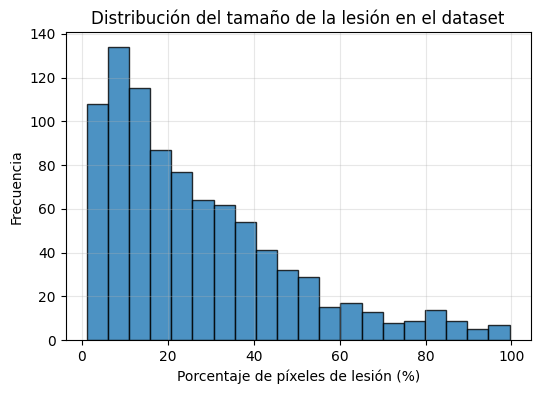
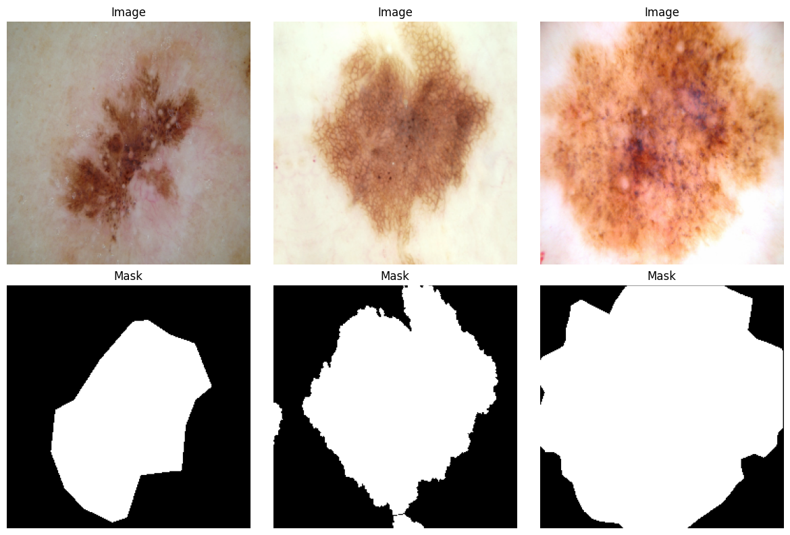
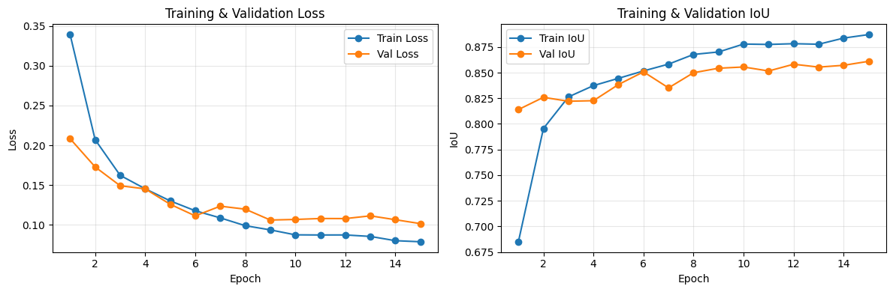
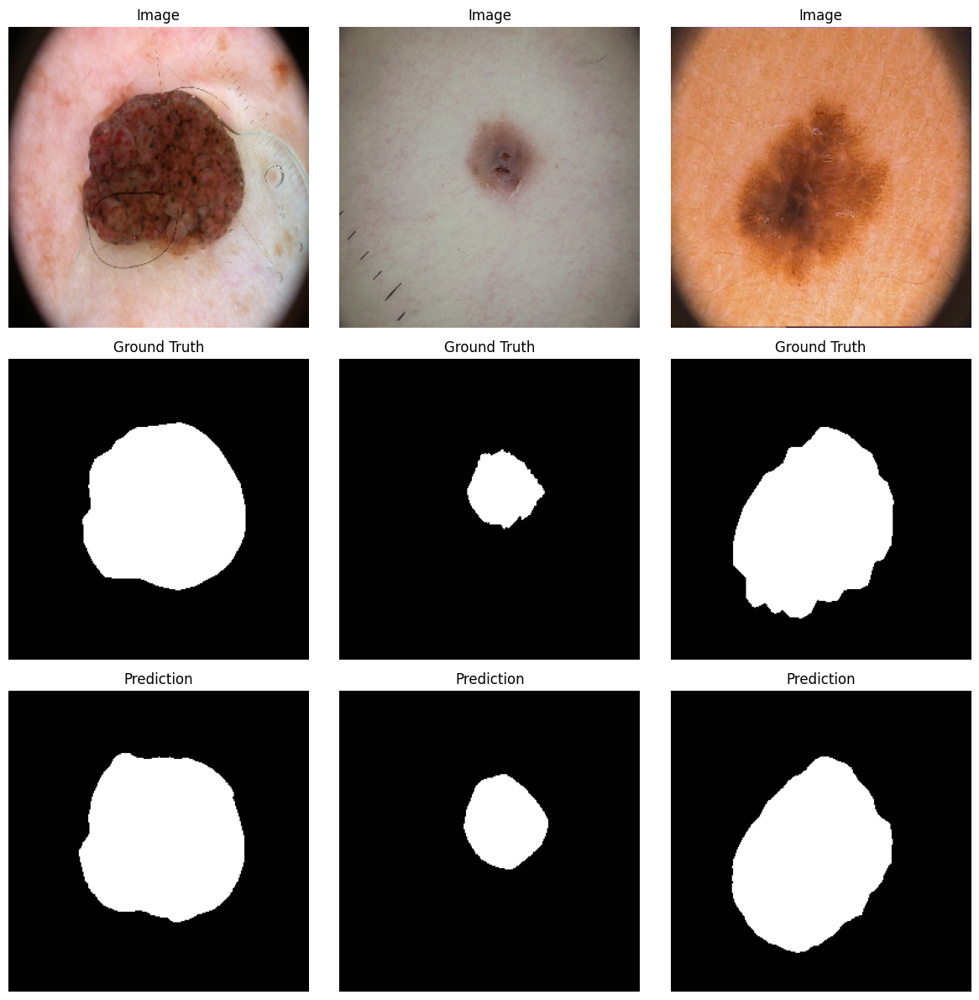
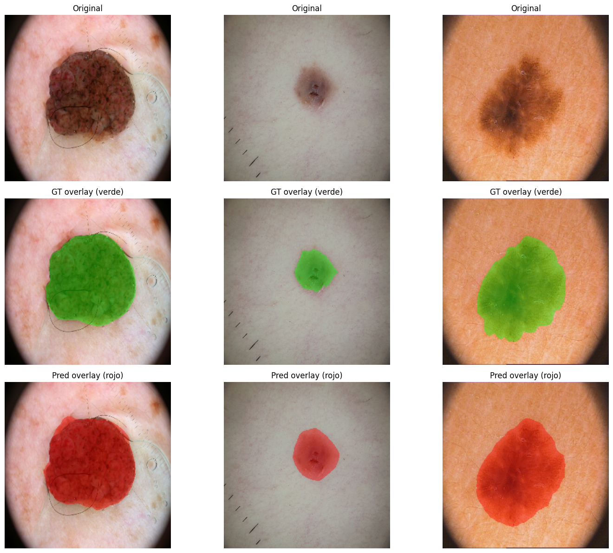
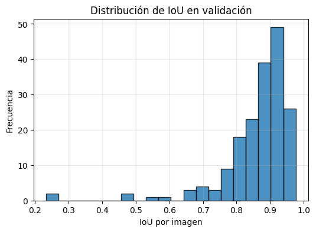
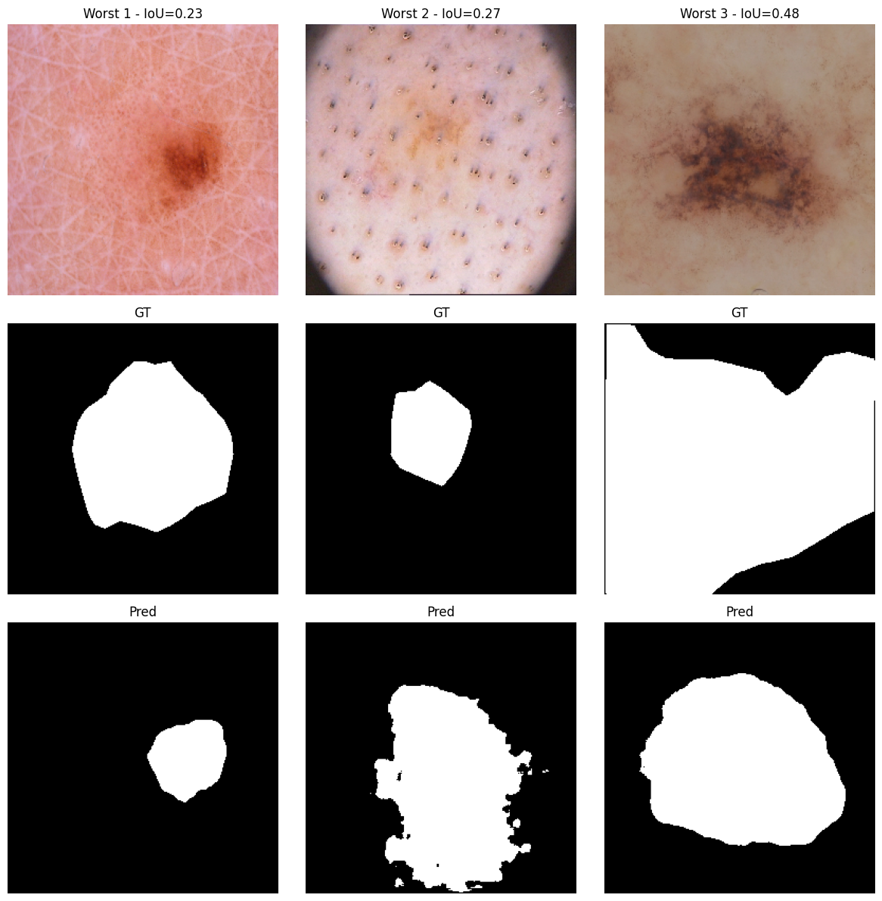
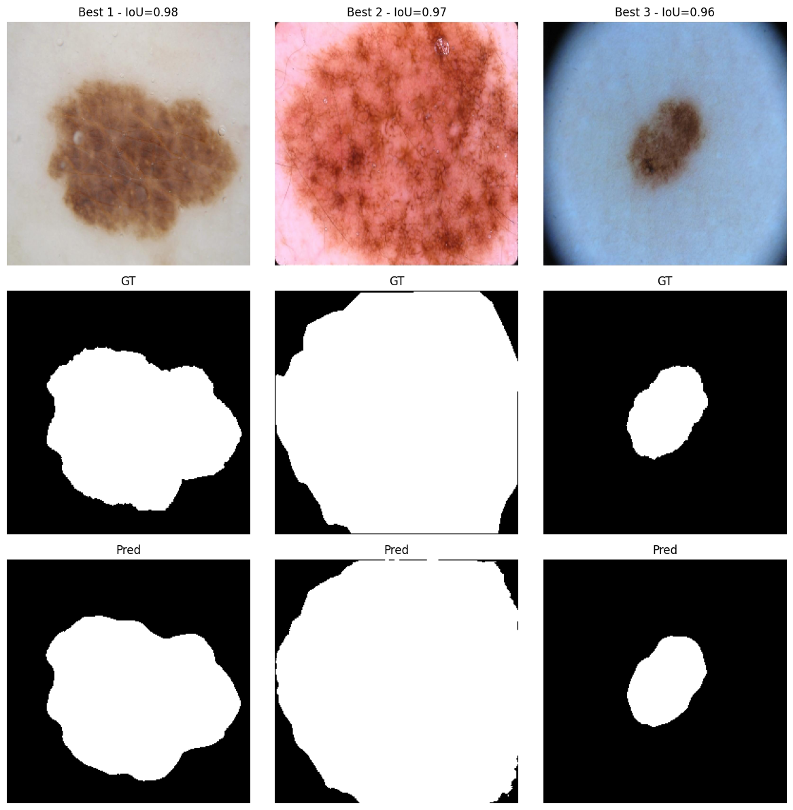

# 🩺 Trabajo Extra — Segmentación de Lesiones Cutáneas con U-Net (ISIC 2016)

## 📌 1. Objetivo del Trabajo
En este trabajo desarrollé un pipeline completo de **segmentación semántica** aplicado al dataset médico **ISIC 2016 (Lesion Segmentation)** usando un modelo **U-Net con ResNet34**.  
El objetivo fue comprender el dataset, entrenar un modelo robusto y evaluar su desempeño mediante visualizaciones avanzadas y métricas especializadas.

---

# 📂 2. Dataset ISIC 2016 — Lesion Segmentation

Cada muestra contiene una imagen dermatoscópica y una máscara binaria:

- **1 → Lesión**
- **0 → Piel sana**

### 🧩 Emparejamiento Imagen–Máscara
```python
mask_dict = {}
for m in all_mask_files:
    base = os.path.basename(m)
    base_no_ext = os.path.splitext(base)[0].replace("_segmentation", "")
    mask_dict[base_no_ext] = m

image_paths, mask_paths = [], []
for img in all_img_files:
    img_id = os.path.splitext(os.path.basename(img))[0]
    if img_id in mask_dict:
        image_paths.append(img)
        mask_paths.append(mask_dict[img_id])
```

---

# 👁️ 3. Exploración Visual del Dataset

## 🔳 3.1 Mosaico de imágenes + máscaras  


### 🧠 Interpretación  
- Variabilidad extrema en lesiones (forma, tamaño, textura).  
- Ruido visual (sombras, vellos, artefactos).  
- Bordes difusos: altamente desafiantes para segmentación.

---

# 📊 4. Distribución del Tamaño de la Lesión

Código que genera la figura:
```python
plt.hist(lesion_percents, bins=20)
```




### Interpretación
- La mayoría de lesiones ocupan entre **5% y 25%** del área.  
- Lesiones <2% → el modelo tiende a fallar por ser muy pequeñas.  
- Algunas >50% → el desafío está en deliminar bien el borde.

---

# 🔧 5. Preparación del Dataset (Albumentations)

### Augmentations:
```python
A.Resize(256,256)
A.HorizontalFlip(p=0.5)
A.ShiftScaleRotate(...)
A.RandomBrightnessContrast(p=0.3)
A.Normalize(...)
```

## 🖼 5.1 Visualización del Batch  




### Interpretación  
- Las máscaras están correctamente alineadas a la imagen.  
- Los augmentations no dañan la estructura anatómica.

---

# 🤖 6. Modelo: U-Net con ResNet34

```python
model = smp.Unet(
    encoder_name="resnet34",
    encoder_weights="imagenet",
    in_channels=3,
    classes=1,
    activation=None
)
```

## 🩸 6.1 Pérdida Combinada (BCE + Dice)

```python
def combined_loss(pred, target, alpha=0.5):
    return alpha * BCE(pred,target) + (1-alpha) * DiceLoss(pred,target)
```

---

# 🏋️‍♂️ 7. Entrenamiento del Modelo

## 📉 7.1 Curvas de Loss e IoU  
Código:
```python
plt.plot(history["train_loss"])
plt.plot(history["val_loss"])
plt.plot(history["train_iou"])
plt.plot(history["val_iou"])
```




### Interpretación  
- Disminución estable de la pérdida.  
- IoU de validación alto y constante.  
- Sin overfitting evidente.

---

# 🎨 8. Predicciones Básicas (Imagen – GT – Pred)

Código:
```python
visualize_predictions(best_model, val_loader)
```




### Interpretación  
- El modelo identifica bien lesiones de tamaño moderado.  
- Fallos en bordes suaves o lesiones muy pequeñas.

---

# 🔥 9. Overlays Avanzados (GT Verde — Pred Rojo)

Código:
```python
visualize_overlays(best_model, val_loader)
```




### Interpretación  
- En casos fáciles, pred ≈ GT.  
- En lesiones difusas, la predicción tiende a ser más pequeña.  
- La iluminación afecta fuertemente el resultado.

---

# 📈 10. Histograma de IoU  

Código:
```python
plt.hist(ious, bins=20)
```




### Conclusión
- IoU medio ≈ **0.82**
- Distribución estrecha: buena consistencia
- Outliers asociados a lesiones muy pequeñas

---

# 🏆 11. Mejores y Peores Casos

Código:
```python
show_best_worst_cases(...)
```

## 🟩 Mejores Casos  




## 🟥 Peores Casos  



### Interpretación  
- **Mejores casos:** lesiones grandes, definidas y bien contrastadas.  
- **Peores casos:** lesiones pequeñas, bordes difusos o ruido excesivo.

---

# 🧮 12. Métricas Finales

| Métrica | Valor |
|--------|--------|
| **IoU medio** | ~0.82 |
| **Dice medio** | ~0.89 |

---

# 🧠 13. Conclusiones

- Modelo U-Net + ResNet34 logra resultados **sólidos y consistentes**.  
- Data augmentation fue crítico para evitar overfitting.  
- Visualizaciones permitieron entender el comportamiento real del modelo.  
- Lesiones pequeñas siguen siendo el desafío principal.

---

# 🚀 14. Trabajo Futuro

- Probar U-Net++, DeepLabV3+, FPN  
- Aumentar resolución (512×512)  
- Aplicar Test-Time Augmentation  
- Cross-validation para mayor robustez  

---

## 📚 Evidencias y archivos

- 📓 Notebook ejecutado: [](https://colab.research.google.com/drive/1nIJGuuOiX3-Pij__bhkI61ikf6ySHPYX?usp=sharing)

---
