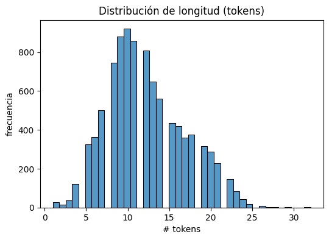
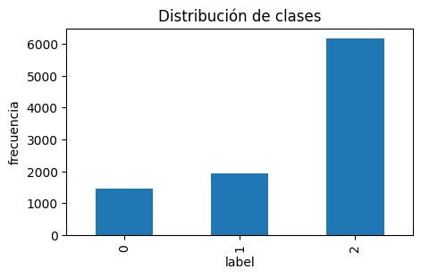
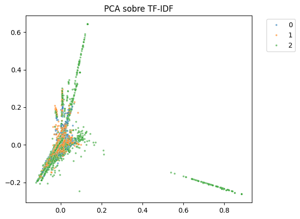
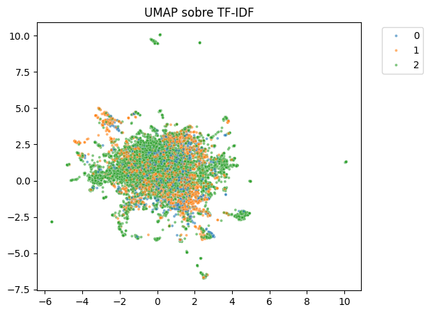
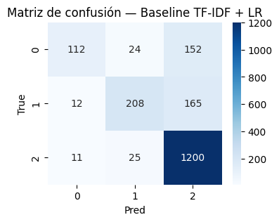
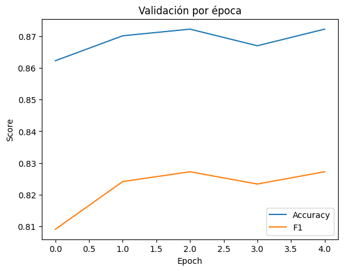

# 🧪 Práctica 13 — Fine-tuning de Transformers para Sentimiento Financiero  
**Unidad Temática 4 — NLP & Transformers**

---

## 📘 Contexto General

En esta práctica se trabaja con el dataset  
`zeroshot/twitter-financial-news-sentiment`, que contiene **tweets/noticias financieras en inglés** etiquetadas en **tres clases**:

- `0` → Bearish (sentimiento negativo)  
- `1` → Bullish (sentimiento positivo)  
- `2` → Neutral  

El objetivo es **construir, analizar y comparar** dos enfoques de modelado de texto:

1. Un **baseline clásico**: `TF-IDF + Regresión Logística`.  
2. Un modelo **Transformer preentrenado orientado a finanzas** (FinBERT), ajustado mediante *fine-tuning*.  

Más que obtener el mejor score, se busca **entender el impacto** de:

- La **representación del texto** (bolsa de palabras vs. embeddings contextuales).  
- El **desbalance de clases** en las métricas.  
- El comportamiento del entrenamiento y la validación (posible **overfitting**).  

---

## 🎯 Objetivos

- Explorar el dataset de noticias financieras: longitudes de texto, distribución de clases y vocabulario típico.  
- Construir un **modelo baseline** con `TF-IDF + LogisticRegression`.  
- Entrenar un modelo **Transformer (FinBERT)** para clasificación en 3 clases.  
- Comparar el rendimiento de ambos enfoques en términos de **accuracy** y **F1-score macro**.  
- Analizar visualmente:
  - La **distribución de longitudes** y de clases.  
  - La **separabilidad** mediante proyecciones (PCA/UMAP).  
  - La **matriz de confusión** del baseline.  
  - Las **curvas de validación** del Transformer.  

---

## ⚙️ Paso 1 — Setup y Carga del Dataset

Se realiza el setup inicial en Colab:

- Instalación de librerías:  
  `transformers`, `datasets`, `evaluate`, `scikit-learn`, `matplotlib`, `seaborn`, `wordcloud`, `accelerate`, `gensim`, `umap-learn`.  
- Fijación de semilla (`SEED = 42`) para garantizar **reproducibilidad**.  
- Carga del dataset con `load_dataset("zeroshot/twitter-financial-news-sentiment")`.

Se normalizan las columnas a:

```
text
label
```

y se eliminan valores nulos.

---

## 📊 Paso 2 — Distribución de Longitud de Textos

Se calcula la longitud de cada texto (en tokens) y se grafica un histograma.



**Interpretación:**

- La mayoría de textos contiene entre **10 y 30 tokens**.  
- Se puede usar un `max_length` de **32–64 tokens** sin perder información.  
- Reducir el `max_length` reduce el costo computacional.

---

## ⚖️ Paso 3 — Distribución de Clases



**Interpretación:**

- La clase **Neutral (2)** domina fuertemente.  
- Esto distorsiona métricas como el accuracy.  
- Se usará **F1 macro** para evaluar imparcialmente.

---

## 🧩 Paso 4 — N-grams y WordClouds por Clase

Se generan n-grams por clase usando `CountVectorizer`.  
Luego, se construyen WordClouds para visualizar vocabulario dominante.

### WordCloud Clase 0 (Bearish)


### WordCloud Clase 1 (Bullish)


### WordCloud Clase 2 (Neutral)


**Interpretación:**

- Aparecen tickers (`$TSLA`, `$AAPL`), verbos bursátiles (“downgrade”, “beat”, “slides”), y URLs.  
- El dataset contiene bastante **ruido financiero**.  
- Bullish muestra verbos positivos; Bearish, verbos negativos.  
- Neutral está dominado por descripciones de mercado.

---

## 🔬 Paso 5 — Proyecciones (PCA / UMAP) + Word2Vec

### PCA sobre TF-IDF


### UMAP sobre TF-IDF


**Interpretación:**

- Las clases no se separan bien en un espacio superficial como TF-IDF.  
- El sentimiento no está determinado por palabras individuales sino por **contexto**.  
- El ruido financiero hace más difícil la separación.

### Word2Vec  
El modelo captura relaciones de mercado (cuando hay frecuencia suficiente), pero en general reflejó más limitaciones por el tipo de corpus.

---

## 🧱 Paso 6 — Baseline: TF-IDF + LogisticRegression

Se entrena un modelo clásico con:

```
TfidfVectorizer(max_features=30000, ngram_range=(1,2))
LogisticRegression(max_iter=200)
```

### Matriz de Confusión


### Resultados aproximados del baseline

- **Accuracy ≈ 0.80**  
- **F1 macro ≈ 0.68**

**Interpretación:**

- Detecta muy bien la clase Neutral.  
- Confunde muchas instancias Bearish/Bullish con Neutral.  
- TF-IDF no capta matices del sentimiento financiero.

---

## 🤖 Paso 7 — Fine-tuning de FinBERT

Se entrena un Transformer especializado en finanzas con:

- LR = 2e-5  
- batch = 16  
- epochs = 4  
- weight decay = 0.01  
- `metric_for_best_model = "f1"`

### Resultados del Transformer

- **Accuracy ≈ 0.872**  
- **F1 macro ≈ 0.827**

**Interpretación:**

- Mejora sustancial respecto al baseline.  
- El modelo entiende mejor matices sutiles del lenguaje financiero.  
- Aun así, aparece ligero **overfitting** en épocas avanzadas.

---

## 📈 Paso 8 — Curvas de Validación del Transformer



**Interpretación:**

- F1 sube abruptamente en épocas 1 y 2.  
- Validación comienza a estancarse y aumentar la pérdida → **overfitting** a partir de la época 3.  
- Recomendación: entrenar solo 2–3 épocas o activar early stopping.

---

## 🥇 Paso 9 — Comparación Final


| Modelo | Accuracy | F1 macro | Comentario |
|--------|----------|----------|------------|
| Baseline (TF-IDF + LR) | ~0.80 | ~0.68 | Simple pero limitado |
| FinBERT | ~0.87 | ~0.83 | Mucho mejor para matices financieros |

**Conclusión:**  
El Transformer supera ampliamente al modelo clásico, especialmente en **clases minoritarias**.

---

## 💬 Conclusiones Globales

1. El dataset es ruidoso y desbalanceado; requiere modelos robustos.  
2. TF-IDF funciona como baseline pero falla en Bearish/Bullish.  
3. FinBERT capta contexto y matices, logrando mejor rendimiento.  
4. Las proyecciones PCA/UMAP mostraron que el problema no es lineal.  
5. El entrenamiento demostró señales de overfitting moderado.  

---

## 🤔 Preguntas de Reflexión

- ¿Por qué F1 macro es una métrica más justa que accuracy aquí?  
- ¿En qué casos seguirías usando TF-IDF en lugar de Transformers?  
- ¿Qué tipo de drift podría aparecer en producción?  
- ¿Cómo afectaría usar un modelo preentrenado en español?  

---

## 📚 Evidencias

- 📓 Notebook ejecutado: [](https://colab.research.google.com/drive/1HdKIu-OLzCmwLX8ClLvjlIZ7VCN5AltC?usp=sharing)

---

