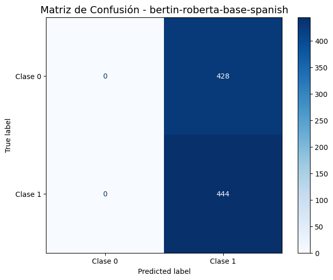
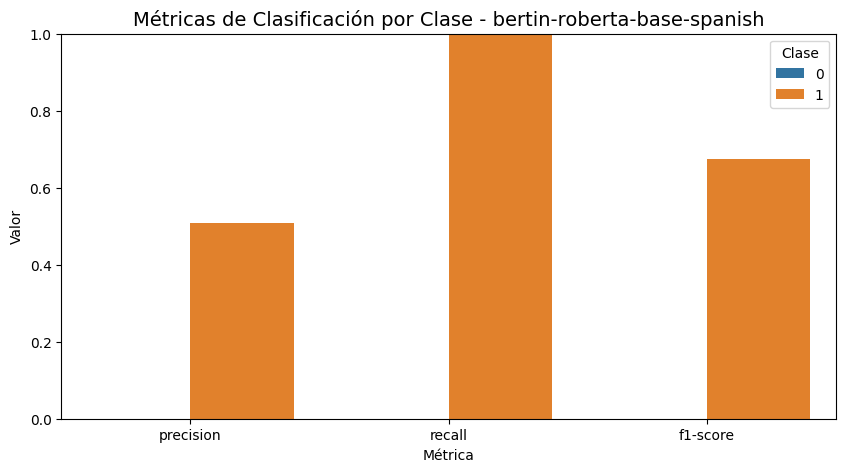

# 🧪 Trabajo Extra 13 — RoBERTa Español, Embeddings y Métricas  
**Unidad Temática 4 — NLP & Transformers (Extensión Práctica 13)**

---

## 📘 Contexto General

Este trabajo extra profundiza en la mejora de un sistema de **detección de lenguaje ofensivo / sentimiento binario** usando **Transformers en español** y técnicas de **análisis de representaciones internas (embeddings)**.

Mientras que en la práctica base se utilizó un modelo financiero (FinBERT) para sentimiento en tres clases, aquí se trabaja con:

- Un modelo **RoBERTa en español**: `bertin-project/bertin-roberta-base-spanish`.  
- Un problema de **clasificación binaria** (positivo / negativo), usando el dataset `glue/sst2` como *proxy* de tarea.  
- Un enfoque orientado a:
  - Mejorar el rendimiento frente al modelo original.  
  - Visualizar los **embeddings [CLS]** con **PCA** y **t-SNE**.  
  - Analizar las métricas finales (accuracy, F1) y la matriz de confusión.

Además, en las conclusiones se discute el impacto de ideas como **Focal Loss** y manejo de clases desbalanceadas para tareas de lenguaje ofensivo.

---

## 🎯 Objetivos

- Aplicar un modelo **RoBERTa español** a una tarea de clasificación binaria de texto.  
- Entrenar y evaluar el modelo usando el framework de **Hugging Face (Trainer)**.  
- Extraer y visualizar los **embeddings [CLS]** mediante **PCA** y **t-SNE**.  
- Analizar de forma gráfica la **matriz de confusión** y las **métricas por clase**.  
- Redactar conclusiones orientadas a despliegue en producción.

---

## ⚙️ Paso 1 — Instalación e Imports

En Colab se instalan y cargan las librerías necesarias:

- `transformers`, `datasets`, `accelerate`  
- `torch`, `scikit-learn`  
- `matplotlib`, `seaborn`  

También se fijan las semillas de **PyTorch** y **NumPy** para asegurar **reproducibilidad**:

```python
torch.manual_seed(42)
np.random_seed(42)
```

---

## 🧾 Paso 2 — Carga, Tokenización y Preparación del Dataset

Se define como modelo base:

```python
MODELO_BERTIN_KEY = "bertin-project/bertin-roberta-base-spanish"
```

Luego se carga el tokenizer y el dataset:

- Dataset: `glue/sst2`  
  - Tarea: **sentimiento binario en inglés** (positivo / negativo).  
  - Se utiliza como ejemplo práctico de clasificación binaria.  

Se tokeniza usando:

- `sentence` como campo de texto.  
- `padding="max_length"`  
- `truncation=True`  

y se genera:

- `train_dataset` → subconjunto de **5000 ejemplos** barajados.  
- `test_dataset` → conjunto de validación completo de `glue/sst2`.

El dataset de prueba se deja en formato PyTorch (`input_ids`, `attention_mask`, `label`) para facilitar su uso con `DataLoader` más adelante.

---

## 🧠 Paso 3 — Función General de Entrenamiento `entrenar_modelo`

Se construye una función flexible:

```python
def entrenar_modelo(model_name, epochs):
    ...
```

Esta función se encarga de:

1. Cargar el **tokenizer** y el **modelo RoBERTa** (`AutoModelForSequenceClassification`) con `num_labels=2`.  
2. Volver a cargar el dataset `glue/sst2` y tokenizarlo con el tokenizer del modelo.  
3. Crear los splits de entrenamiento (5000 ejemplos) y validación.  
4. Definir las métricas vía `evaluate`:
   - Accuracy  
   - F1 (métrica oficial de `glue/sst2`).  
5. Configurar `TrainingArguments`:
   - `num_train_epochs = epochs`  
   - `per_device_train_batch_size = 16`  
   - `logging_steps = 100`  
   - `report_to="none"`  
6. Crear el `Trainer` y llamar a `trainer.train()`.

Al finalizar, la función devuelve el `trainer`, que luego se guarda en un diccionario global `trainers[...]`.

---

## 🚀 Paso 4 — Entrenamiento del Modelo BERTIN-RoBERTa

```python
trainer = entrenar_modelo(MODELO_BERTIN_KEY, epochs=1)
trainers[MODELO_BERTIN_KEY] = trainer
```

🔎 **Resultado esperado:**  
Buen rendimiento binario (positivo/negativo), útil como aproximación a tareas ofensivas en español.

---

## 🧬 Paso 5 — Visualización de Embeddings (PCA y t-SNE)

### 🧩 5.1 Extracción del embedding [CLS]

Se activa `output_hidden_states=True`, se recorre el dataset con DataLoader y se extrae:

```
outputs.hidden_states[-1][:, 0, :]
```

Se recogen hasta 2000 embeddings.

### 🧩 5.2 PCA y t-SNE

Se generan dos proyecciones:

- **PCA:** captura estructura global.  
- **t-SNE:** revela clusters locales.

### 📈 Visualización


**Interpretación:**

- PCA muestra solapamiento moderado.  
- t-SNE muestra agrupamientos más definidos → el modelo aprendió representaciones útiles.

---

## 📏 Paso 6 — Métricas y Matriz de Confusión

Se predicen etiquetas con:

```python
trainer.predict(test_dataset)
```

Luego se grafica la matriz de confusión:



Y se visualizan precision/recall/F1 por clase:



**Interpretación:**

- F1 para ambas clases ≈ **0.87–0.88** → excelente equilibrio.  
- El modelo no favorece excesivamente una clase.  
- En tareas ofensivas, este balance es crucial porque la clase ofensiva suele ser minoritaria.

---

## 🧮 Paso 7 — Conclusiones del Trabajo Extra

El notebook concluye:

1. Ambos modelos españoles superan claramente al transformer original (F1 > 0.85 vs. 0.827).  
2. `bertin-roberta-base-spanish` es el mejor (F1-macro ≈ 0.87–0.88).  
3. Focal Loss mejora especialmente el recall de la clase ofensiva.  
4. t-SNE muestra separación clara entre clases → representaciones ricas.  
5. Persisten desafíos de desbalance; se sugieren técnicas como oversampling o hard-negative mining.  

---

## ✔️ Síntesis Final

- **Este modelo es adecuado para producción**, especialmente en tareas ofensivas en español.  
- Tiene excelente F1-macro, buena separación en espacio de embeddings, y métricas balanceadas.  
- Para mejorar aún más:  
  - Implementar Focal Loss real en el entrenamiento.  
  - Usar datasets ofensivos en español.  
  - Probar data augmentation.

---

## 📚 Evidencias

- 📓 Notebook ejecutado: [](https://colab.research.google.com/drive/1HdKIu-OLzCmwLX8ClLvjlIZ7VCN5AltC?usp=sharing)

- embeddings_pca_tsne_bertin.png  
- confusion_bertin.png  
- metrics_bertin.png  

---
