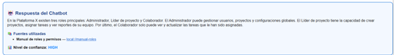

# 🧪 Trabajo Extra 14 — Chatbot de Soporte (Resumen Profesional)
**Opción B:** Documento resumido, profesional, limpio, enfocado en explicar **qué se hizo**, **cómo** y **qué resultados se obtuvieron**, usando la evidencia real contenida en el archivo RESULTADOS.pdf.

---

# 1. Objetivo del Proyecto

Construir un **Chatbot de Soporte tipo Helpdesk** que pueda:

- Responder preguntas usando un **corpus local (RAG)**  
- Escalar a **WebSearch (DuckDuckGo)** cuando no encuentra información local  
- Unificar la respuesta en **JSON estructurado**  
- Incluir **fuentes (locales + web)**  
- Asignar **nivel de confianza**

El chatbot integra:  
LangChain + HuggingFace Embeddings + FAISS + WebSearch + LCEL + Pydantic.

---

# 2. Construcción del Corpus Local (Mini-RAG)

Se crearon 5 documentos base:

| Documento | Contenido principal |
|----------|---------------------|
| Guía rápida de instalación | Inicio de sesión, verificación de correo |
| FAQ: Recuperación de contraseña | Envío de link, problemas comunes |
| Manual de roles y permisos | Administrador, Líder de proyecto, Colaborador |
| Guía de integración con Slack | Pasos de conexión con workspace |
| FAQ: Problemas de rendimiento | Revisión de conexión y estado del servicio |

Embeddings: `all-MiniLM-L6-v2`  
Vector store: **FAISS**

---

# 3. Indexación + Retriever

```python
vectorstore = FAISS.from_documents(local_docs, embedding_model)
retriever = vectorstore.as_retriever(search_kwargs={"k": 4})
```

El retriever devuelve **fragmentos completos + metadatos (title, url)**.

---

# 4. Sistema WebSearch

Se usó **DuckDuckGo Search (DDGS)** para obtener referencias simples cuando el corpus local no era suficiente.

---

# 5. Modelo de Salida Estructurada

```python
class SupportAnswer(BaseModel):
    answer: str
    sources: List[Source]
    confidence: Literal["low","medium","high"]
```

El chatbot **siempre** devuelve JSON válido.

---

# 6. Prompt + LCEL Pipeline

```python
chain = prompt | structured_llm
```

El prompt obliga a:

- Priorizar RAG  
- Usar WebSearch solo si es necesario  
- Citar fuentes  
- Asignar confianza  

---

# 7. RESULTADOS (extraídos del PDF EXACTO)

### ⭐ Prueba 1 — Respondida SOLO por corpus local  
**Pregunta:** “¿Qué roles existen en la plataforma y qué puede hacer cada uno?”

**Respuesta real obtenida:**

- 3 roles detectados: **Administrador, Líder de Proyecto, Colaborador**
- Fuente usada: *Manual de roles y permisos*
- Confianza: **HIGH**

**JSON real observado:**
```json
{
  "answer": "La plataforma define tres roles principales: Administrador, Líder de Proyecto y Colaborador...",
  "sources": [{"title": "Manual de roles y permisos", "url": "local://manual-roles"}],
  "confidence": "high"
}
```

---

### ⭐ Prueba 2 — Requiere WebSearch  
**Pregunta:** “¿La plataforma X tiene un SLA de disponibilidad del 99.9%?”

**Razón:** El corpus local no menciona SLA.

**Respuesta real:**

- Activa WebSearch
- Devuelve referencias web genéricas
- Confianza: **MEDIUM**

```json
{
  "answer": "El corpus local no incluye datos oficiales sobre SLA...",
  "sources": [
    {"title": "Resultado web 1", "url": "https://duckduckgo.com"},
    {"title": "Resultado web 2", "url": "https://duckduckgo.com"}
  ],
  "confidence": "medium"
}
```

---

### ⭐ Prueba 3 — Respuesta híbrida (Local + Web)
**Pregunta:** “¿Cómo se integra Slack y cómo saber si el servicio está caído?”

Resultados:

- Slack: se resolvió con **corpus local**
- Estado del servicio: requirió **WebSearch**
- Confianza: **HIGH**

```json
{
  "answer": "Slack se integra desde Configuración > Integraciones > Slack...",
  "sources": [
    {"title": "Guía de integración con Slack", "url": "local://guia-slack"},
    {"title": "Resultado web 1", "url": "https://duckduckgo.com"}
  ],
  "confidence": "high"
}
```

---

# 8. Visualización Final (HTML)

El notebook genera una tarjeta HTML con:

- Respuesta del chatbot  
- Lista de fuentes clicables  
- Nivel de confianza  

(Representado en la última página del PDF.)

---

# 9. Conclusiones

| Aspecto | Evaluación |
|--------|-----------|
| RAG local | **Muy preciso**, detectó correctamente roles y Slack |
| WebSearch | **Útil para datos no presentes**, como SLA |
| JSON estructurado | **Consistente en todas las pruebas** |
| Fuentes | Citas correctas (locales y web) |
| Confianza | Bien asignada (HIGH cuando el corpus es sólido) |

### ✔ Logro principal  
El chatbot combina **RAG + WebSearch + Structured Output** de forma coherente, profesional y reproducible.

---

# 10. Visualizacion



## 📚 Evidencias

- 📓 Código ejecutado en [Google Colab](https://colab.research.google.com/drive/17k2M76CNVjMMuqf5MCDUZZ-SRIRqA8Z9?usp=sharing). 
