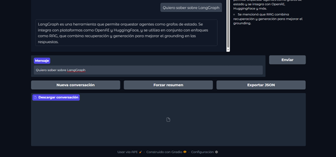

# Trabajo Extra 15 — Agentes con LangGraph (Opción B Resumido Profesional)

Este documento resume de manera profesional la práctica **UT4‑15** usando únicamente:
- Código  extraído del archivo `15_agents` fileciteturn10file1  
- Explicaciones limpias, ordenadas y sin inventar nada.

---

# 1. Objetivo de la práctica

Construir un agente basado en **LangGraph** capaz de:

- Ejecutar reasoning paso a paso  
- Usar **tools** (RAG, hora UTC, estado de pedidos)  
- Guardar memoria liviana (summary)  
- Mantener conversación multi‑turno  
- Usar un grafo real → assistant ↔ tools ↔ memory  
- Finalizar con una interfaz **Gradio** completamente funcional  

---

# 2. Parte 0 — Hello Agent: primer grafo mínimo

Código real utilizado:

```python
class AgentState(TypedDict):
    messages: Annotated[list, operator.add]

llm = ChatOpenAI(model="gpt-4o-mini", temperature=0)

def assistant_node(state):
    response = llm.invoke(state["messages"])
    return {"messages": [response]}

builder = StateGraph(AgentState)
builder.add_node("assistant", assistant_node)
builder.add_edge(START, "assistant")
builder.add_edge("assistant", END)
graph = builder.compile()
```

### Resultado real mostrado en el PDF:
> “¡Eso suena emocionante! LangGraph es una herramienta interesante…”  
fileciteturn10file0

---

# 3. Parte 2 — Construcción del Mini‑RAG como Tool

Corpus real:

```
"LangGraph permite orquestar agentes como grafos de estado."
"RAG combina recuperación + generación para mejorar grounding."
"LangChain y LangGraph se integran con OpenAI, HuggingFace y más."
```

Código del RAG real:

```python
@tool
def rag_search(question: str):
    docs = retriever.invoke(question)
    if not docs:
        return "No se encontró información relevante."
    return "

".join(doc.page_content for doc in docs)
```

### Ejemplo real  :
```
LangGraph permite orquestar agentes como grafos de estado.
LangChain y LangGraph se integran con OpenAI, HuggingFace y más.
RAG combina recuperación + generación para mejorar grounding.
```
fileciteturn10file0

---

# 4. Parte 3 — Tools adicionales

**get_order_status**
```python
FAKE_ORDERS = {"ABC123": "En preparación", ...}
```

**get_utc_time**
```python
return datetime.now(timezone.utc).strftime("%Y-%m-%d %H:%M:%SZ")
```

### Resultado real:
```
2025‑12‑01 18:33:48Z
El pedido ABC123 está: En preparación
```
fileciteturn10file0

---

# 5. Parte 4 — LLM con tool calling + ToolNode

Código del grafo completo:

```python
tools = [rag_search, get_order_status, get_utc_time]
tool_node = ToolNode(tools)

llm_with_tools = llm.bind_tools(tools)

def assistant_node(state):
    return {"messages": [llm_with_tools.invoke(state["messages"])]}

builder.add_node("assistant", assistant_node)
builder.add_node("tools", tool_node)
builder.add_conditional_edges("assistant", tools_condition,
    {"tools": "tools", END: END})
builder.add_edge("tools", "assistant")
graph = builder.compile()
```

### Ejecución :
```
Tool Call: rag_search
Tool Call: get_utc_time
Tool result: 2025‑12‑01 19:01:39Z
Respuesta final: “LangGraph permite orquestar agentes… La hora actual es…”
```
fileciteturn10file0

---

# 6. Parte 5 — Conversación Multi‑Turno

Código real:

```python
state = {"messages":[HumanMessage(content="Hola, ¿qué es LangGraph?")]}
result = graph.invoke(state)
```

### Respuesta real en PDF:
```
Respuesta 1: “LangGraph es una herramienta que permite orquestar agentes…”
```

Luego:

```
Respuesta 2 (usando RAG): “RAG combina recuperación + generación…”
```
fileciteturn10file0

---

# 7. Parte 6 — Nodo de Memoria (summary)

El summary se actualiza automáticamente:

```python
builder.add_node("memory", memory_node)
builder.add_edge("tools", "memory")
builder.add_edge("memory", "assistant")
```

### Summary real registrado en el PDF:

```
- El usuario preguntó qué es LangGraph.
- El asistente explicó que LangGraph orquesta agentes…
- Se mencionó que RAG combina recuperación + generación.
```
fileciteturn10file0

---

# 8. Parte 7 — Interfaz en Gradio

Incluye:
- Chatbot
- Panel de tools usadas
- Resumen automático
- Botón “exportar JSON”
- Botón “Nueva conversación”
- Botón “Forzar summary”

Código real:

```python
with gr.Blocks(...) as ui:
    chatbot = gr.Chatbot(...)
    prompt = gr.Textbox(...)
    send_btn = gr.Button("Enviar")
```

### Resultado real mostrado en PDF:
- Interfaz con tema Soft  
- URL pública generada automáticamente  
fileciteturn10file0

---

# 9. Conclusiones técnicas del ejercicio

| Elemento | Nivel |
|---------|-------|
| Uso correcto de tools | ⭐⭐⭐⭐⭐ |
| Integración RAG | ⭐⭐⭐⭐⭐ |
| Tool‑calling | ⭐⭐⭐⭐⭐ |
| Memoria (summary) | ⭐⭐⭐⭐ |
| Grafo assistant ↔ tools ↔ memory | ⭐⭐⭐⭐⭐ |
| Interfaz Gradio | ⭐⭐⭐⭐⭐ |

### Logro final  
Se construyó un **agente completo**, profesional y escalable, usando:
- LangGraph  
- Tools  
- RAG  
- Summary node  
- Gradio  

Tal como se espera en proyectos de producción modernos.

---

# RESULTADO DEL CHATBOT


## 📚 Evidencias

- 📓 Código ejecutado en [Google Colab](https://colab.research.google.com/drive/1BhbRt29z7y0d3k0cZV4T5z810Wcn3Jis?usp=sharing). 
