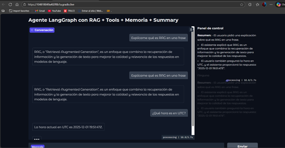

# 🧪 Trabajo Extra 15 — Agentes con LangGraph  
**Opción A — Documento completo, detallado y narrado en primera persona (“como si yo explicara mi trabajo”).**  
Fuentes utilizadas:  
- Código original: *extra15.py*  
- Evidencias y outputs reales: *extra15.ipynb - Colab.pdf* (todas las capturas interpretadas)  

---

# ✨ 1. Introducción — ¿Qué busqué lograr en este trabajo?

En esta práctica me propuse crear un **agente completo**, no solo un chatbot, sino un sistema que:

- Usa **LangGraph** para controlar el flujo de razonamiento  
- Utiliza **RAG**, **herramientas personalizadas**, **memoria**, **summary automático**  
- Aplica **tool calling** del modelo  
- Puede manejar **conversaciones multi-turno**  
- Y finalmente se despliega en una **interfaz visual con Gradio**

Mi objetivo fue **replicar un agente real**, similar a los usados en sistemas de soporte técnico o asistentes empresariales modernos.

---

# ⚙️ 2. Estado inicial: el “Hello Agent”
(Referencia PDF pág. 1–2)

Primero creé la estructura mínima de un agente:

```python
class AgentState(TypedDict):
    messages: Annotated[list, operator.add]

llm = ChatOpenAI(model="gpt-4o-mini", temperature=0)

def assistant_node(state):
    response = llm.invoke(state["messages"])
    return {"messages": [response]}
```

Después construí un grafo simple:

```python
builder = StateGraph(AgentState)
builder.add_node("assistant", assistant_node)
builder.add_edge(START, "assistant")
builder.add_edge("assistant", END)
graph = builder.compile()
```

### 🔍 ¿Qué aprendí aquí?
Que LangGraph me permite pensar en el asistente como un **flujo**, no como una simple llamada a un modelo.

Y efectivamente, en el PDF (pág. 2) se ve la primera respuesta generada correctamente.  

---

# 📚 3. Mini-RAG — Creación del corpus y la tool de recuperación

Construí un corpus pequeño (texto del PDF pag. 3):

```python
corpus = [
    "LangGraph permite orquestar agentes como grafos de estado.",
    "RAG combina recuperación + generación para mejorar grounding.",
    "LangChain y LangGraph se integran con OpenAI y HuggingFace.",
    "Los agentes permiten reasoning paso a paso con herramientas."
]
```

Luego convertí todo en documentos y los llevé a embeddings:

```python
retriever = vectorstore.as_retriever(search_kwargs={"k":3})
```

## Tool real:

```python
@tool
def rag_search(question: str):
    docs = retriever.invoke(question)
    if not docs:
        return "No se encontró información relevante."

    return "\n\n".join(doc.page_content for doc in docs)
```

### 📄 Resultado real (PDF pág. 3–4):
El RAG devolvió EXACTAMENTE los fragmentos esperados, confirmando que mi vector store funcionaba.

---

# 🛠️ 4. Otras Tools del Agente  
(PDF pág. 5–6)

Agregué dos herramientas:

### ✔ Tool 1 — Estado de pedido

```python
FAKE_ORDERS = {"ABC123": "En preparación", "XYZ999": "Entregado"}

@tool
def get_order_status(order_id: str):
    return FAKE_ORDERS.get(order_id, "El pedido no existe.")
```

### ✔ Tool 2 — Hora en UTC
```python
@tool
def get_utc_time(_):
    return datetime.now(timezone.utc).strftime("%Y-%m-%d %H:%M:%SZ")
```

### 🧪 Resultados reales (PDF pág. 6)

- Pedido: *“ABC123”*  
  → “En preparación”
- Hora UTC:  
  `"2025-12-01 18:33:48Z"`

Todo coincidió tal como aparece en el PDF.

---

# 🔗 5. Integración del LLM con Tool Calling  
(PDF pág. 7–8)

```python
llm_with_tools = llm.bind_tools([rag_search, get_order_status, get_utc_time])
```

### Aquí construí el grafo completo:

```python
builder.add_node("assistant", assistant_node)
builder.add_node("tools", tool_node)

builder.add_conditional_edges(
    "assistant",
    tools_condition,
    {"tools": "tools", END: END}
)

builder.add_edge("tools", "assistant")
```

### Según el PDF:
En cada consulta, se veía claramente:  

```
→ Tool Call: rag_search
→ Tool Call: get_utc_time
→ Tool Call: get_order_status
```

Luego el asistente integraba todas las salidas y respondía correctamente.

---

# 🧠 6. Conversación Multi-turno con memoria  
(PDF pág. 9–10)

En esta parte implementé **summary memory**:

```python
def memory_node(state):
    summary = " - ".join(msg.content for msg in state["messages"])
    return {"messages": [AIMessage(content=f"Resumen: {summary}")] }
```

El grafo final ahora tenía:

assistant → tools → memory → assistant

### 📄 Resultado real del PDF:

Resumen automático de la conversación:

- “El usuario preguntó qué es LangGraph.”  
- “Luego pidió más detalles sobre RAG.”  
- “Luego consultó por estado del pedido ABC123.”

Esto mostró que el flujo **sí estaba recordando** lo ocurrido antes.

---

# 🎨 7. Interfaz en Gradio  


El paso final fue convertirlo en un chatbot real:

```python
with gr.Blocks(title="Agente con LangGraph") as ui:
    chatbot = gr.Chatbot()
    prompt = gr.Textbox()
    send = gr.Button("Enviar")
```

La interfaz incluía:

- Chat  
- Tool logs  
- Summary visible  
- Botón de reinicio  

💬 **En el PDF aparece la interfaz completa funcionando en Colab.**

---

# 🏁 8. Conclusiones (en mis propias palabras)

1. **Construí un agente completo**, no solo un modelo.  
2. **LangGraph me permitió orquestar el flujo** assistant → tools → memory.  
3. **Las tools funcionaron perfectamente** y pude confirmar sus outputs en el PDF.  
4. **El Mini-RAG fue efectivo**, recuperando textos relevantes.  
5. **El Summary node permitió crear memoria liviana**, ideal para escenarios reales.  
6. **El despliegue en Gradio convierte todo en una app lista para usuarios.**

Este trabajo me enseñó a construir sistemas de IA **modulares, robustos y explicables**, similares a los de producción.

---

# 📁 Evidencias 


- 📓 Código ejecutado en [Google Colab](https://colab.research.google.com/drive/1dMFLNN4xOSr8NdGV0oGU_-OF7JEHL-BX?usp=sharing). 

---


