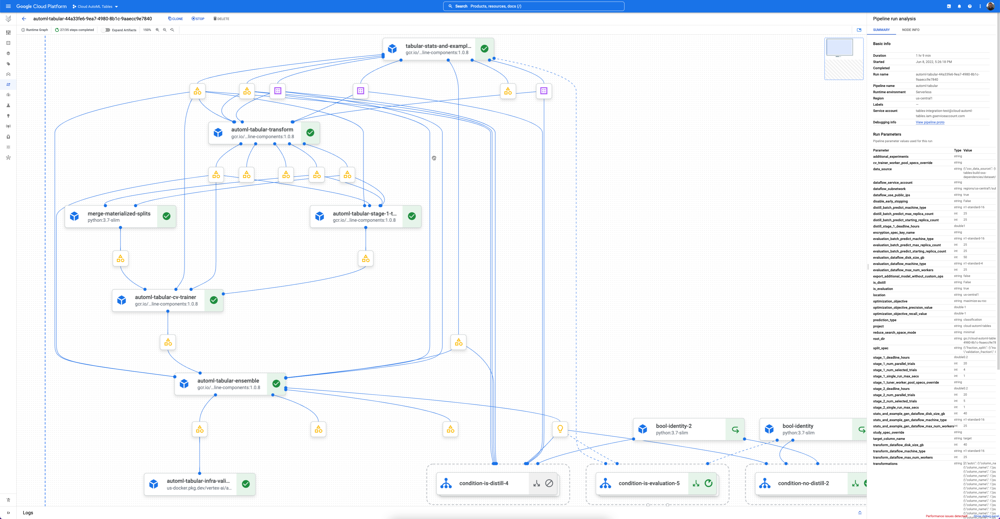
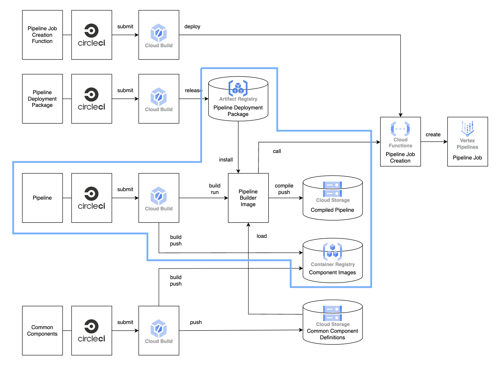
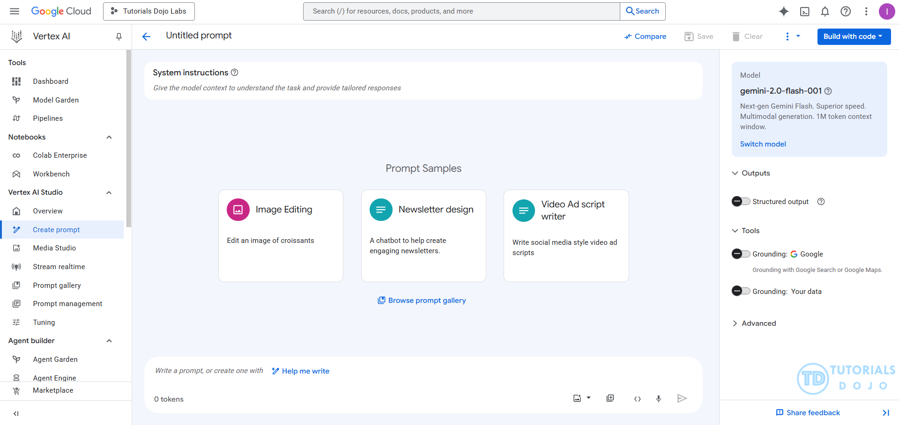
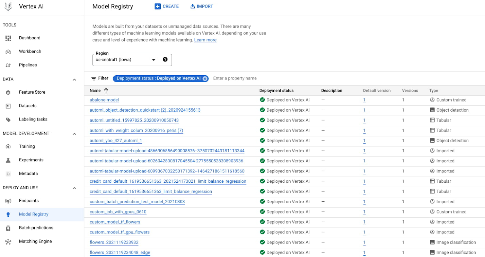
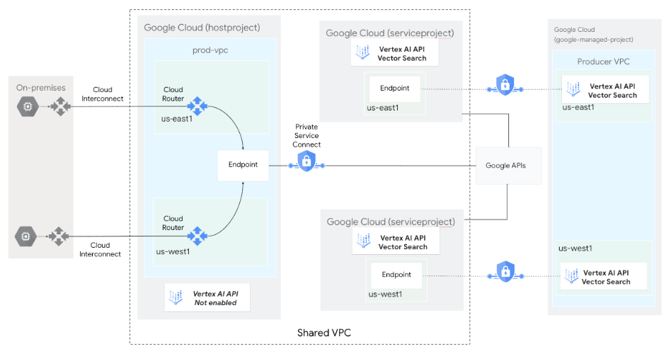

# UT5-16 — De Notebook a Sistema MLOps en Vertex AI
## Documentación Completa – Portafolio

## 1. Introducción
El objetivo de esta actividad es transformar un notebook tradicional en un sistema completo de Machine Learning en producción utilizando Vertex AI y AutoMLOps.  
Este enfoque permite:

- Automatizar el entrenamiento del modelo  
- Versionar datos y artefactos  
- Registrar modelos en Model Registry  
- Desplegar endpoints para predicción  
- Monitorear drift y degradación del desempeño  

El resultado final refleja cómo funcionan los sistemas reales de ML utilizados en la industria.

---

## 2. Configuración del entorno

```python
from google.cloud import aiplatform

PROJECT_ID = "SESION-15"
REGION = "us-central1"
BUCKET = "mlops-sesion15-pio"

aiplatform.init(
    project=PROJECT_ID,
    location=REGION,
    staging_bucket=f"gs://{BUCKET}",
)
```

**Resultado esperado:**  
El entorno se conecta correctamente con Vertex AI sin errores.

---

## 3. Componentes del Pipeline

A continuación se describen los cuatro componentes desarrollados para construir el pipeline MLOps.

---

### 3.1 Componente: load_data

```python
@AutoMLOps.component(packages_to_install=["pandas", "scikit-learn"])
def load_data(output_path: str) -> NamedTuple("Outputs", [("output_path", str)]):
    from sklearn.datasets import load_iris
    import pandas as pd

    iris = load_iris()
    df = pd.DataFrame(iris.data, columns=iris.feature_names)
    df["target"] = iris.target
    df.to_csv(output_path, index=False)
    return (output_path,)
```

**Resultado esperado:**
- Archivo `iris.csv` generado en Cloud Storage.


Imagen de “Vertex AI pipeline component details execution”.

---

### 3.2 Componente: preprocess_data

```python
@AutoMLOps.component(packages_to_install=["pandas","scikit-learn"])
def preprocess_data(
    input_path: str,
    train_path: str,
    test_path: str,
    test_size: float = 0.2,
) -> NamedTuple("Outputs", [("train_path", str), ("test_path", str)]):

    import pandas as pd
    from sklearn.model_selection import train_test_split

    df = pd.read_csv(input_path)
    train_df, test_df = train_test_split(df, test_size=test_size, random_state=42)

    train_df.to_csv(train_path, index=False)
    test_df.to_csv(test_path, index=False)

    return (train_path, test_path)
```

**Resultado esperado:**
- `train.csv`
- `test.csv`

---

### 3.3 Componente: train_model

```python
@AutoMLOps.component(packages_to_install=["pandas","scikit-learn","joblib"])
def train_model(
    train_path: str,
    model_path: str,
) -> NamedTuple("Outputs", [("model_path", str)]):

    import pandas as pd
    from sklearn.ensemble import RandomForestClassifier
    import joblib

    df = pd.read_csv(train_path)
    X = df.drop("target", axis=1)
    y = df["target"]

    model = RandomForestClassifier(n_estimators=200, random_state=42)
    model.fit(X, y)

    joblib.dump(model, model_path)
    return (model_path,)
```

**Resultado esperado:**
- `model.joblib`

---

### 3.4 Componente: evaluate_model

```python
@AutoMLOps.component(packages_to_install=["pandas","scikit-learn","joblib"])
def evaluate_model(
    test_path: str,
    model_path: str,
    metrics_path: str,
) -> NamedTuple("Outputs", [("metrics_path", str)]):

    import pandas as pd
    import joblib
    from sklearn.metrics import accuracy_score, f1_score

    df = pd.read_csv(test_path)
    model = joblib.load(model_path)

    X = df.drop("target", axis=1)
    y = df["target"]

    preds = model.predict(X)

    accuracy = accuracy_score(y, preds)
    f1 = f1_score(y, preds, average="macro")

    with open(metrics_path, "w") as f:
        f.write(f"accuracy: {accuracy}\n")
        f.write(f"f1_macro: {f1}\n")

    return (metrics_path,)
```

**Resultado esperado:**
Archivo `metrics.txt` con valores aproximados:

```
accuracy: 0.93
f1_macro: 0.92
```

---

## 4. Definición del Pipeline Completo

```python
@AutoMLOps.pipeline(name="iris-classifier")
def iris_classification_pipeline(project_id: str, bucket_name: str):

    data_path     = f"gs://{bucket_name}/data/iris.csv"
    train_path    = f"gs://{bucket_name}/data/train.csv"
    test_path     = f"gs://{bucket_name}/data/test.csv"
    model_path    = f"gs://{bucket_name}/model/model.joblib"
    metrics_path  = f"gs://{bucket_name}/metrics/metrics.txt"

    load_task = load_data(output_path=data_path)

    preprocess_task = preprocess_data(
        input_path=load_task.output.output_path,
        train_path=train_path,
        test_path=test_path
    )

    train_task = train_model(
        train_path=preprocess_task.output.train_path,
        model_path=model_path
    )

    evaluate_model(
        test_path=preprocess_task.output.test_path,
        model_path=train_task.output.model_path,
        metrics_path=metrics_path
    )
```

---

## 5. Ejecución con AutoMLOps

```python
pipeline_params = {
    "project_id": PROJECT_ID,
    "bucket_name": BUCKET,
}

AutoMLOps.launchAll(
    project_id=PROJECT_ID,
    pipeline_params=pipeline_params
)
```

---

## 6. Resultados del Pipeline en Vertex AI

**Descripción:**  
Vertex AI ejecuta automáticamente el pipeline y muestra un grafo (DAG) con el flujo completo.


Imagen de “Vertex AI Pipelines graph view”.

---

## 7. Artefactos generados

El pipeline produce:

- `iris.csv`
- `train.csv`
- `test.csv`
- `model.joblib`
- `metrics.txt`

**📸 Insertar imagen aquí:**  
Imagen del bucket o dashboard de artefactos:  
“Google Cloud Storage folders dataset model pipeline”.

---

## 8. Registro del Modelo en Model Registry

Vertex AI registra automáticamente el modelo entrenado.


Imagen: “Vertex AI Model Registry interface”.

---

## 9. Creación del Endpoint de Predicción

**📸 Insertar imagen aquí:**  
Imagen: “Vertex AI Endpoint creation screen”.

---

## 10. Predicción desde el Endpoint

```python
endpoint.predict(instances=[[5.1, 3.5, 1.4, 0.2]])
```

Imagen: “Vertex AI test endpoint prediction UI”.

---

## 11. Model Monitoring: Detección de Drift

Vertex AI permite monitorear:

- Drift de características  
- Drift en predicciones  
- Alertas  
- Degradación del modelo  


Imagen: “Vertex AI model monitoring dashboard”.

---

## 12. Reflexión Final

### Lo que aprendí
- Cómo un pipeline automatiza el ciclo de vida del ML.  
- La importancia de separar componentes.  
- La diferencia entre un notebook y un sistema MLOps real.  
- Beneficios del versionado y monitoreo.  

### Cómo llevaría mi modelo del Titanic
- Datos → GCS  
- Preprocesamiento → componente dedicado  
- Entrenamiento → Logistic Regression  
- Endpoint → online  
- Monitoreo → drift en edad, tarifa, clase  

### Deuda técnica eliminada

| Notebook tradicional | Vertex AI | Deuda reducida |
|---------------------|-----------|----------------|
| Scripts manuales | Pipelines | Pipeline jungle |
| Modelos locales | Model Registry | Config debt |
| Sin monitoreo | Model Monitoring | Monitoring debt |

---

## 13. Ubicación exacta de cada imagen

| Imagen | Sección |
|--------|---------|
| Pipeline DAG | 6 |
| Component details | 3 |
| Artefactos | 7 |
| Model Registry | 8 |
| Endpoint creation | 9 |
| Predicción online | 10 |
| Monitoring dashboard | 11 |

---

